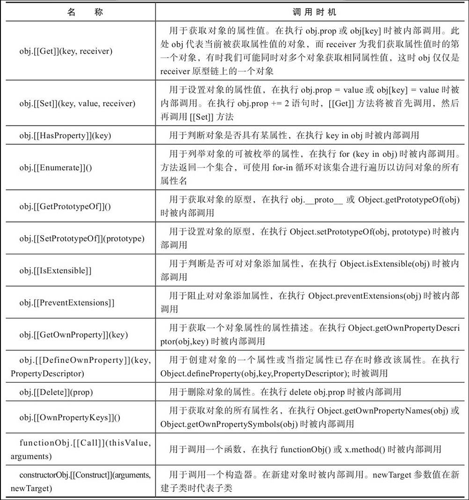

## 新增的html标签

以下只列出自己未曾见过的标签

`figure`, `embed`, `mark`, `ruby`, `rt`, `rp`, `wbr`, `details`, `datalist`, `datagrid`, `output`, `source`, `dialog`

## 增强的script标签

新增 `defer`与 `async` 属性

当使用这两个属性时，在浏览器发出下载该脚本文件的请求，开始脚本文件的下载工作后，立即继续执行页面的加载工作。脚本文件下载完毕时触发一个onload事件，我们可以通过监听该事件及指定事件处理函数来指定当脚本文件下载完毕时所需要执行的一些处理。这两个属性的区别仅在于何时执行onload事件处理函数。

async在下载完毕就执行script标签的onload事件，所以多个按照顺序加载的脚本不会顺序执行，先加载完毕先执行。

当使用defer属性时，脚本文件下载完毕后，并不立即执行该脚本文件的onload事件处理函数，而是等到页面全部加载完毕后，才执行该脚本文件的onload事件处理函数，所以如果页面中使用多个外部脚本文件，且均为这些外部脚本文件使用defer属性，则在页面加载完毕后按这些外部脚本文件的引用顺序来执行这些外部脚本文件的onload事件处理函数。

<mark>由于外部脚本文件的下载工作也属于整个页面的加载工作中的一部分，所以外部脚本文件的onload事件处理函数将始终在浏览器窗口对象（window对象）的onload事件处理函数或页面的body元素的onload事件处理函数之前首先被执行</mark>

## 解构赋值可以进行变量值交换

数组

```javascript
let
    a = 1,
    b = 2,
    c =3;

[a,b,c] = [c,b,a];

console.log(a);      //浏览器控制台中输出3
console.log(b);      //浏览器控制台中输出2
console.log(c);      //浏览器控制台中输出1
```

对象（记得加`()`）

```javascript
let
    apple = 1,
    orange = 2,
    pear =3;

// 报错
{apple,orange, pear} = {apple: '大苹果',orange: '大桔子',pear: '大梨'};

// 修改为
({apple,orange, pear} = {apple: '大苹果',orange: '大桔子',pear: '大梨'});
```

## 标签化的模板字符串（应用场景...我也不知道，了解下也不错）

```javascript
fn `h${1}e${2}l${3}`

// 等价于
fn(["h","e","l"],1,2,3);
```

## 关于模块化

概念这个东西一看就明白，实际应用中建议减少 `export default` 方式的导出

## 创建Promise对象序列

在axios源码中，请求拦截器与响应拦截器处理处使用了这个技能

```html
<!DOCTYPE html>
<head>
<meta charset="UTF-8">
<title>创建Promise对象序列</title>
</head>
<script language=javascript>
var result=document.getElementById("result");
var file=document.getElementById("file");
var allData="";
function getData(file){ 
    return new Promise((resolve, reject)=>{  
        let reader = new FileReader();
        //将文件以文本形式读入页面
        reader.readAsText(file);
        reader.onload =function()
        {
            allData+=this.result+"<br/>";
            resolve();
        }
        reader.onerror=()=>reject()
    });
}
function get(file){
    return getData(file).catch((err)=>{        
        alert("读取文件失败");
        throw err;
    });
}
function getSequence(){
    let files=[];
    for(let i=0;i<document.getElementById("file").files.length;i++){
        files.push(document.getElementById("file").files[i]);
    }
    let sequence=Promise.resolve();
    files.forEach((file)=>{
        sequence = sequence.then(()=>get(file));
    });
    return sequence;
}
//将文件以文本形式读入页面
function read()
{
    Promise.resolve().then(()=>getSequence()).then(()=>{
        let result=document.getElementById("result");
        result.innerHTML=allData;
    }).catch(()=>console.log("读取文件发生错误")).finally(()=>
    console.log("读取文件完毕"));
}
</script>
<p>
    <div ></div>
    <label>请选择一个文件：</label>
    <input type="file" id="file" multiple />
    <input type="button" value="读取文件" onclick="read()"/>
</p> 
<div name="result" id="result"  style="white-space:pre">
      <!-- 这里用来显示读取结果 -->
</div>  
</body> 
</html>
```

## 代理（Proxy）与反射（Reflect）

```html
<!DOCTYPE html>
<html>
<head>
    <meta charset="UTF-8">
    <title>代理及反射使用示例</title>
</head>
<body>
</body>
<script>
var obj = new Proxy({}, {
    get: function (target, key, receiver) {
        console.log(`getting ${key}!`);
        return Reflect.get(target, key, receiver);
    },
    set: function (target, key, value, receiver) {
        console.log(`setting ${key}!`);
        return Reflect.set(target, key, value, receiver);
    }
});
obj.count=1;//控制台输出“setting count!”
++obj.count;
/*控制台输出:
getting count!
setting count!
*/
</script>
</html>
```

这里对于`receiver`参数有一个大胆的猜测，当 a对象委托继承自b对象，b对象存在属性prop，a对象不存在，那么通过 `a.prop` 访问时会执行代理中的get方法，此时receiver是a对象，target则是b对象

ECMAScript 2015标准中为对象定义的内置方法



ECMAScript 2015标准为对象划定了一个清楚的边界线，你可以通过代理来使用任何JavaScript代码重写对象边界线内的这些内置方法。

`Proxy` 第一个参数 `target`对象, 第二个参数`handler`对象

`target`：需要重写内部属性的对象
`handler`：需要重写哪些内置的对象方法

处理器对象（handler）的方法可以重载一个代理的内部方法，在重载完毕之后，需要使用反射对象（Reflect）来获取重载之后的方法

```javascript
var target = {};
var handler = {
    set: function (target, key, value, receiver) {
        console.log(`setting ${key}!`);
        return Reflect.set(target, key, value, receiver);
    }
};
var proxy = new Proxy(target, handler);
proxy.name="test";//浏览器控制台中输出“setting name!”
```

## WeakSet与WeakMap对象

Set与Map有一个问题就是：维持内部元素的强引用，例如其中存放了DOM元素，当页面DOM元素已经被清除，但是Set与Map对其引用还存在，所以内存回收机制并不会自动回收DOM元素所占内存。

```html
<!DOCTYPE html>
<html>
<head>
<meta charset="UTF-8">
<title>WeakSet集合使用示例</title>  
<style>
div{
    width:200px;
    height:200px;
    float:left;
}
div#divA{
    background-color:red;
}
div#divB{
    background-color:pink;
}
div#divC{
    background-color:yellow;
}
</style>
</head>
<body>
<div >第一个元素</div>
<div >第二个元素</div>
<div >第三个元素</div>
<input type="button" value="移除元素" onclick="removeElem()" />
</body>
<script>
var set=new WeakSet();
document.querySelectorAll("div").forEach(function(div){
    set.add(div);
});
var map=new WeakMap();
var index=0;
var words=["第一个元素","第二个元素","第三个元素"];
document.querySelectorAll("div").forEach(function(div){
    i=new String(index);
    map.set(div,words[index]);
    index+=1;
});
function removeElem(){
     console.log(map);//WeakMap集合中存在divA元素 

    //浏览器控制台中输出“第一个元素“ 
    console.log(map.get(document.getElementById("divA")));
    var div=document.getElementById("divA");
    document.body.removeChild(div);
    setTimeout(function(){
        console.log(map);//WeakMap集合中不存在divA元素
        //浏览器控制台中输出undefined 
        console.log(map.get(document.getElementById("divA")));
    },10*1000);
}
</script>
</html>
```
