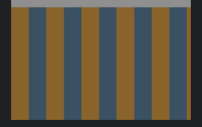
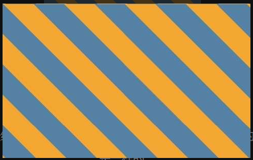

## 1. 半透明边框

默认情况下，背景会延伸到边框所在的区域下层，要想实现半透明边框使用 `background-clip: padding-box;` 即可

```css
border: 10px solid hsla(0,0%,100%,.5);
background: white;
background-clip: padding-box;
```

## 2. 多重边框

### 2.1 box-shadow方案

第四个参数：扩张半径（通过指定正值或负值，可以让投影面积加大或者减小。一个正值的扩张半径加上两个为零的偏移量以及为零的模糊值，得到的“投影”其实就像一道实线边框，**它支持逗号分隔语法，我们可以创建任意数量的投影**）

```css
background:yellowgreen;
box-shadow:0 0 0 10px #655,
           0 0 0 15px deeppink,
           0 2px 5px 15px rgba(0,0,0,.6);
```

### 2.2 outline方案

```css
background:yellowgreen;
border:10px solid #655;
outline:5px solid deeppink;
```

## 3. 灵活的背景定位

### 3.1 background-position

它允许我们指定背景图片距离任意角的偏移量，只要我们在偏移量前面指定关键字

```css
background:url(code-pirate.svg) no-repeat #58a;
background-position:right 20px bottom 10px;
```

### 3.2 background-origin

`border-box, padding-box, content-box`

通常背景的`background-position`是以`padding-box`的左上角为 top left，

```css
padding:10px;
background:url("code-pirate.svg") no-repeat #58a
            bottom right; /* 或 100% 100% */
background-origin:content-box;
```

### 3.3 calc()

```css
background:url("code-pirate.svg") no-repeat;
background-position: calc(100% -20px) calc(100% -10px); // top left
```

## 4. 边框内圆角


使用单个元素的实现方式

```css
background:tan;
border-radius:.8em;
padding:1em;
box-shadow:0 0 0 .6em #655;
outline:.6em solid #655;
```

注意：`box-shadow` 的扩张半径需要比 (<svg xmlns="http://www.w3.org/2000/svg" width="11.875ex" height="2.847ex" viewBox="0 -1008.3 5248.9 1258.3" xmlns:xlink="http://www.w3.org/1999/xlink" aria-hidden="true" style=""><defs><path id="MJX-34-TEX-N-28" d="M94 250Q94 319 104 381T127 488T164 576T202 643T244 695T277 729T302 750H315H319Q333 750 333 741Q333 738 316 720T275 667T226 581T184 443T167 250T184 58T225 -81T274 -167T316 -220T333 -241Q333 -250 318 -250H315H302L274 -226Q180 -141 137 -14T94 250Z"></path><path id="MJX-34-TEX-N-221A" d="M95 178Q89 178 81 186T72 200T103 230T169 280T207 309Q209 311 212 311H213Q219 311 227 294T281 177Q300 134 312 108L397 -77Q398 -77 501 136T707 565T814 786Q820 800 834 800Q841 800 846 794T853 782V776L620 293L385 -193Q381 -200 366 -200Q357 -200 354 -197Q352 -195 256 15L160 225L144 214Q129 202 113 190T95 178Z"></path><path id="MJX-34-TEX-N-32" d="M109 429Q82 429 66 447T50 491Q50 562 103 614T235 666Q326 666 387 610T449 465Q449 422 429 383T381 315T301 241Q265 210 201 149L142 93L218 92Q375 92 385 97Q392 99 409 186V189H449V186Q448 183 436 95T421 3V0H50V19V31Q50 38 56 46T86 81Q115 113 136 137Q145 147 170 174T204 211T233 244T261 278T284 308T305 340T320 369T333 401T340 431T343 464Q343 527 309 573T212 619Q179 619 154 602T119 569T109 550Q109 549 114 549Q132 549 151 535T170 489Q170 464 154 447T109 429Z"></path><path id="MJX-34-TEX-N-2212" d="M84 237T84 250T98 270H679Q694 262 694 250T679 230H98Q84 237 84 250Z"></path><path id="MJX-34-TEX-N-31" d="M213 578L200 573Q186 568 160 563T102 556H83V602H102Q149 604 189 617T245 641T273 663Q275 666 285 666Q294 666 302 660V361L303 61Q310 54 315 52T339 48T401 46H427V0H416Q395 3 257 3Q121 3 100 0H88V46H114Q136 46 152 46T177 47T193 50T201 52T207 57T213 61V578Z"></path><path id="MJX-34-TEX-N-29" d="M60 749L64 750Q69 750 74 750H86L114 726Q208 641 251 514T294 250Q294 182 284 119T261 12T224 -76T186 -143T145 -194T113 -227T90 -246Q87 -249 86 -250H74Q66 -250 63 -250T58 -247T55 -238Q56 -237 66 -225Q221 -64 221 250T66 725Q56 737 55 738Q55 746 60 749Z"></path><path id="MJX-34-TEX-N-2217" d="M229 286Q216 420 216 436Q216 454 240 464Q241 464 245 464T251 465Q263 464 273 456T283 436Q283 419 277 356T270 286L328 328Q384 369 389 372T399 375Q412 375 423 365T435 338Q435 325 425 315Q420 312 357 282T289 250L355 219L425 184Q434 175 434 161Q434 146 425 136T401 125Q393 125 383 131T328 171L270 213Q283 79 283 63Q283 53 276 44T250 35Q231 35 224 44T216 63Q216 80 222 143T229 213L171 171Q115 130 110 127Q106 124 100 124Q87 124 76 134T64 161Q64 166 64 169T67 175T72 181T81 188T94 195T113 204T138 215T170 230T210 250L74 315Q65 324 65 338Q65 353 74 363T98 374Q106 374 116 368T171 328L229 286Z"></path><path id="MJX-34-TEX-I-1D45F" d="M21 287Q22 290 23 295T28 317T38 348T53 381T73 411T99 433T132 442Q161 442 183 430T214 408T225 388Q227 382 228 382T236 389Q284 441 347 441H350Q398 441 422 400Q430 381 430 363Q430 333 417 315T391 292T366 288Q346 288 334 299T322 328Q322 376 378 392Q356 405 342 405Q286 405 239 331Q229 315 224 298T190 165Q156 25 151 16Q138 -11 108 -11Q95 -11 87 -5T76 7T74 17Q74 30 114 189T154 366Q154 405 128 405Q107 405 92 377T68 316T57 280Q55 278 41 278H27Q21 284 21 287Z"></path></defs><g stroke="currentColor" fill="currentColor" stroke-width="0" transform="matrix(1 0 0 -1 0 0)"><g data-mml-node="math"><g data-mml-node="mo"><use xlink:href="#MJX-34-TEX-N-28"></use></g><g data-mml-node="msqrt" transform="translate(389, 0)"><g transform="translate(853, 0)"><g data-mml-node="mn"><use xlink:href="#MJX-34-TEX-N-32"></use></g></g><g data-mml-node="mo" transform="translate(0, 148.3)"><use xlink:href="#MJX-34-TEX-N-221A"></use></g><rect width="500" height="60" x="853" y="888.3"></rect></g><g data-mml-node="mo" transform="translate(1964.2, 0)"><use xlink:href="#MJX-34-TEX-N-2212"></use></g><g data-mml-node="mn" transform="translate(2964.4, 0)"><use xlink:href="#MJX-34-TEX-N-31"></use></g><g data-mml-node="mo" transform="translate(3464.4, 0)"><use xlink:href="#MJX-34-TEX-N-29"></use></g><g data-mml-node="mo" transform="translate(4075.7, 0)"><use xlink:href="#MJX-34-TEX-N-2217"></use></g><g data-mml-node="mi" transform="translate(4797.9, 0)"><use xlink:href="#MJX-34-TEX-I-1D45F"></use></g></g></g></svg>) 大

## 5. 条纹背景

### 水平条纹

分析下如下代码

* 等于0表示取前面的最大值
* 默认是 repeat 的

```css
background:linear-gradient(#fb3 33.3%, #58a 0, #58a 66.6%, yellowgreen 0);
/* 等价于：background:linear-gradient(#fb3 33.3%, #58a 33.3%, #58a 66.6%, yellowgreen 66.6%); */
background-size:100% 45px;
```


### 垂直条纹

```css
background:linear-gradient(to right, /* 或 90deg */
              #fb3 50%, #58a 0);
background-size:30px 100%;
```



### 斜向条纹

<svg xmlns="http://www.w3.org/2000/svg" width="25.31ex" height="2.398ex" viewBox="0 -1008.3 11187 1060" xmlns:xlink="http://www.w3.org/1999/xlink" aria-hidden="true" style=""><defs><path id="MJX-28-TEX-N-32" d="M109 429Q82 429 66 447T50 491Q50 562 103 614T235 666Q326 666 387 610T449 465Q449 422 429 383T381 315T301 241Q265 210 201 149L142 93L218 92Q375 92 385 97Q392 99 409 186V189H449V186Q448 183 436 95T421 3V0H50V19V31Q50 38 56 46T86 81Q115 113 136 137Q145 147 170 174T204 211T233 244T261 278T284 308T305 340T320 369T333 401T340 431T343 464Q343 527 309 573T212 619Q179 619 154 602T119 569T109 550Q109 549 114 549Q132 549 151 535T170 489Q170 464 154 447T109 429Z"></path><path id="MJX-28-TEX-N-D7" d="M630 29Q630 9 609 9Q604 9 587 25T493 118L389 222L284 117Q178 13 175 11Q171 9 168 9Q160 9 154 15T147 29Q147 36 161 51T255 146L359 250L255 354Q174 435 161 449T147 471Q147 480 153 485T168 490Q173 490 175 489Q178 487 284 383L389 278L493 382Q570 459 587 475T609 491Q630 491 630 471Q630 464 620 453T522 355L418 250L522 145Q606 61 618 48T630 29Z"></path><path id="MJX-28-TEX-N-31" d="M213 578L200 573Q186 568 160 563T102 556H83V602H102Q149 604 189 617T245 641T273 663Q275 666 285 666Q294 666 302 660V361L303 61Q310 54 315 52T339 48T401 46H427V0H416Q395 3 257 3Q121 3 100 0H88V46H114Q136 46 152 46T177 47T193 50T201 52T207 57T213 61V578Z"></path><path id="MJX-28-TEX-N-35" d="M164 157Q164 133 148 117T109 101H102Q148 22 224 22Q294 22 326 82Q345 115 345 210Q345 313 318 349Q292 382 260 382H254Q176 382 136 314Q132 307 129 306T114 304Q97 304 95 310Q93 314 93 485V614Q93 664 98 664Q100 666 102 666Q103 666 123 658T178 642T253 634Q324 634 389 662Q397 666 402 666Q410 666 410 648V635Q328 538 205 538Q174 538 149 544L139 546V374Q158 388 169 396T205 412T256 420Q337 420 393 355T449 201Q449 109 385 44T229 -22Q148 -22 99 32T50 154Q50 178 61 192T84 210T107 214Q132 214 148 197T164 157Z"></path><path id="MJX-28-TEX-N-221A" d="M95 178Q89 178 81 186T72 200T103 230T169 280T207 309Q209 311 212 311H213Q219 311 227 294T281 177Q300 134 312 108L397 -77Q398 -77 501 136T707 565T814 786Q820 800 834 800Q841 800 846 794T853 782V776L620 293L385 -193Q381 -200 366 -200Q357 -200 354 -197Q352 -195 256 15L160 225L144 214Q129 202 113 190T95 178Z"></path><path id="MJX-28-TEX-N-2248" d="M55 319Q55 360 72 393T114 444T163 472T205 482Q207 482 213 482T223 483Q262 483 296 468T393 413L443 381Q502 346 553 346Q609 346 649 375T694 454Q694 465 698 474T708 483Q722 483 722 452Q722 386 675 338T555 289Q514 289 468 310T388 357T308 404T224 426Q164 426 125 393T83 318Q81 289 69 289Q55 289 55 319ZM55 85Q55 126 72 159T114 210T163 238T205 248Q207 248 213 248T223 249Q262 249 296 234T393 179L443 147Q502 112 553 112Q609 112 649 141T694 220Q694 249 708 249T722 217Q722 153 675 104T555 55Q514 55 468 76T388 123T308 170T224 192Q164 192 125 159T83 84Q80 55 69 55Q55 55 55 85Z"></path><path id="MJX-28-TEX-N-34" d="M462 0Q444 3 333 3Q217 3 199 0H190V46H221Q241 46 248 46T265 48T279 53T286 61Q287 63 287 115V165H28V211L179 442Q332 674 334 675Q336 677 355 677H373L379 671V211H471V165H379V114Q379 73 379 66T385 54Q393 47 442 46H471V0H462ZM293 211V545L74 212L183 211H293Z"></path><path id="MJX-28-TEX-N-2E" d="M78 60Q78 84 95 102T138 120Q162 120 180 104T199 61Q199 36 182 18T139 0T96 17T78 60Z"></path><path id="MJX-28-TEX-N-36" d="M42 313Q42 476 123 571T303 666Q372 666 402 630T432 550Q432 525 418 510T379 495Q356 495 341 509T326 548Q326 592 373 601Q351 623 311 626Q240 626 194 566Q147 500 147 364L148 360Q153 366 156 373Q197 433 263 433H267Q313 433 348 414Q372 400 396 374T435 317Q456 268 456 210V192Q456 169 451 149Q440 90 387 34T253 -22Q225 -22 199 -14T143 16T92 75T56 172T42 313ZM257 397Q227 397 205 380T171 335T154 278T148 216Q148 133 160 97T198 39Q222 21 251 21Q302 21 329 59Q342 77 347 104T352 209Q352 289 347 316T329 361Q302 397 257 397Z"></path><path id="MJX-28-TEX-N-30" d="M96 585Q152 666 249 666Q297 666 345 640T423 548Q460 465 460 320Q460 165 417 83Q397 41 362 16T301 -15T250 -22Q224 -22 198 -16T137 16T82 83Q39 165 39 320Q39 494 96 585ZM321 597Q291 629 250 629Q208 629 178 597Q153 571 145 525T137 333Q137 175 145 125T181 46Q209 16 250 16Q290 16 318 46Q347 76 354 130T362 333Q362 478 354 524T321 597Z"></path><path id="MJX-28-TEX-N-38" d="M70 417T70 494T124 618T248 666Q319 666 374 624T429 515Q429 485 418 459T392 417T361 389T335 371T324 363L338 354Q352 344 366 334T382 323Q457 264 457 174Q457 95 399 37T249 -22Q159 -22 101 29T43 155Q43 263 172 335L154 348Q133 361 127 368Q70 417 70 494ZM286 386L292 390Q298 394 301 396T311 403T323 413T334 425T345 438T355 454T364 471T369 491T371 513Q371 556 342 586T275 624Q268 625 242 625Q201 625 165 599T128 534Q128 511 141 492T167 463T217 431Q224 426 228 424L286 386ZM250 21Q308 21 350 55T392 137Q392 154 387 169T375 194T353 216T330 234T301 253T274 270Q260 279 244 289T218 306L210 311Q204 311 181 294T133 239T107 157Q107 98 150 60T250 21Z"></path><path id="MJX-28-TEX-N-37" d="M55 458Q56 460 72 567L88 674Q88 676 108 676H128V672Q128 662 143 655T195 646T364 644H485V605L417 512Q408 500 387 472T360 435T339 403T319 367T305 330T292 284T284 230T278 162T275 80Q275 66 275 52T274 28V19Q270 2 255 -10T221 -22Q210 -22 200 -19T179 0T168 40Q168 198 265 368Q285 400 349 489L395 552H302Q128 552 119 546Q113 543 108 522T98 479L95 458V455H55V458Z"></path></defs><g stroke="currentColor" fill="currentColor" stroke-width="0" transform="matrix(1 0 0 -1 0 0)"><g data-mml-node="math"><g data-mml-node="mn"><use xlink:href="#MJX-28-TEX-N-32"></use></g><g data-mml-node="mo" transform="translate(722.2, 0)"><use xlink:href="#MJX-28-TEX-N-D7"></use></g><g data-mml-node="mn" transform="translate(1722.4, 0)"><use xlink:href="#MJX-28-TEX-N-31"></use><use xlink:href="#MJX-28-TEX-N-35" transform="translate(500, 0)"></use></g><g data-mml-node="msqrt" transform="translate(2722.4, 0)"><g transform="translate(853, 0)"><g data-mml-node="mn"><use xlink:href="#MJX-28-TEX-N-32"></use></g></g><g data-mml-node="mo" transform="translate(0, 148.3)"><use xlink:href="#MJX-28-TEX-N-221A"></use></g><rect width="500" height="60" x="853" y="888.3"></rect></g><g data-mml-node="mo" transform="translate(4353.2, 0)"><use xlink:href="#MJX-28-TEX-N-2248"></use></g><g data-mml-node="mn" transform="translate(5409, 0)"><use xlink:href="#MJX-28-TEX-N-34"></use><use xlink:href="#MJX-28-TEX-N-32" transform="translate(500, 0)"></use><use xlink:href="#MJX-28-TEX-N-2E" transform="translate(1000, 0)"></use><use xlink:href="#MJX-28-TEX-N-34" transform="translate(1278, 0)"></use><use xlink:href="#MJX-28-TEX-N-32" transform="translate(1778, 0)"></use><use xlink:href="#MJX-28-TEX-N-36" transform="translate(2278, 0)"></use><use xlink:href="#MJX-28-TEX-N-34" transform="translate(2778, 0)"></use><use xlink:href="#MJX-28-TEX-N-30" transform="translate(3278, 0)"></use><use xlink:href="#MJX-28-TEX-N-36" transform="translate(3778, 0)"></use><use xlink:href="#MJX-28-TEX-N-38" transform="translate(4278, 0)"></use><use xlink:href="#MJX-28-TEX-N-37" transform="translate(4778, 0)"></use><use xlink:href="#MJX-28-TEX-N-31" transform="translate(5278, 0)"></use></g></g></g></svg>

条纹宽度近似为 15px

```css
background:linear-gradient(45deg,
              #fb3 25%,#58a 0,#58a 50%,
              #fb3 0,#fb3 75%,#58a 0);
background-size:42.426406871px 42.426406871px;
```



`repeating-linear-gradient()`

```css
background:repeating-linear-gradient(45deg,
              #fb3,#58a 30px);
```

等价于

```css
background:linear-gradient(45deg,
              #fb3,#58a 30px,
              #fb3 30px,#58a 60px,
              #fb3 60px,#58a 90px,
              #fb3 90px,#58a 120px,
              #fb3120px,#58a 150px, ...);
```

优化后斜条纹编写方式

```css
background:repeating-linear-gradient(45deg,
              #fb3,#fb3 15px,#58a 0,#58a 30px);
```

直接指明宽度为15px，还可以随时改变角度

### 同色系条纹

```css
background:#58a;
background-image:repeating-linear-gradient(30deg,
                    hsla(0,0%,100%,.1),
                    hsla(0,0%,100%,.1)15px,
                    transparent 0,transparent 30px);
```

等价于

```css
background:#58a;
/* 支持情况可能存在问题 */
background-image:repeating-linear-gradient(30deg,
                    hsla(0,0%,100%,.1) 0 15px,
                    transparent 15px 30px);
```


