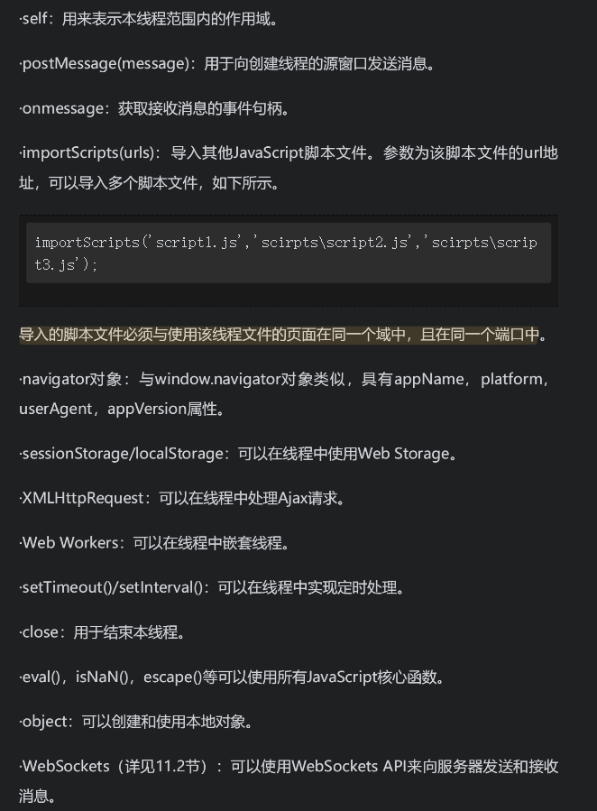

## Fetch API

就是Promise风格的ajax调用，xhr则是回调函数风格的ajax调用

返回的response对象存在 `json、text、arrayBuffer、blob、formData 等方法对返回数据进行处理`，比起xhr的方式，好处在于这些方法让非文本化的数据使用起来更加简单

## web workers 处理线程

难点就是通信的实现以及数据的管理问题

里面引入了 `SharedWorker`，这是我陌生的。

### 线程嵌套

就是将一个很复杂，繁琐的，需要大量计算任务的工作，拆分成多个子线程进行协作，最终返回运算结果。

### 线程中可用的变量、函数等



### SharedWorker

* 多页面共享同一个子线程
* 子线程可以使用变量存储数据，后续可以将这份数据在不同页面进行流通

## Service Worker实现离线应用程序

特征：

* 管理的是对应域下面的资源（若对应域下的资源中请求其他源、域的资源，那么也能进行响应及缓存）
* 可以缓存资源，拦截请求
* 多页面通信

[这里](https://www.yuque.com/docs/share/91ef2cbb-f569-4b7b-8036-71eb3f05373a)有一个实际的例子

注意：

* 由于service worker都是异步操作，所以 xhr的同步方式以及 localstorage 等同步操作不被支持使用

## 通信API

### 跨文档消息传输

#### 简单的示例

可以跨源

`otherWindow.postMessage` 发送消息

`window.addEventListener('message', handler)` 接受消息

主页面

```html
<!DOCTYPE html>
<html>
<head>
<meta charset="UTF-8">
<title>跨域通信示例</title>
<script type="text/javascript">
// (1) 监听message事件
window.addEventListener("message", function(ev) {
  // (2) 忽略指定URL地址之外的页面传过来的消息
  if (ev.origin != "http:// www.blue-butterfly.net") {
    return;
  }
  // (3) 显示消息
  alert("从"+ev.origin + "那里传过来的消息:\n\"" + ev.data + "\"");
}, false);
function hello() 
{
  var iframe = window.frames[0];
  // (4) 传递消息
  iframe.postMessage("你好", "http://www.blue-butterfly.net/test/");
}
</script>
</head>
<body>
<h1>跨域通信示例</h1>
<iframe width="400" src=http://www.blue-butterfly.net/test/ 
　onload="hello()">
</iframe>
</body>
</html>
```

iframe页面

```html
<!DOCTYPE html>
<html>
<head>
<meta charset="UTF-8">
<script type="text/javascript">
window.addEventListener("message", function(ev) 
{
    if (ev.origin != "http://Lulingniu") 
    {
        return;
    }
    document.body.innerHTML = "从"+ev.origin + "那里传来的消息。<br>\""
       + ev.data + "\"";
    // (5) 向主页面发送消息
    ev.source.postMessage("你好。这里是" + this.location, ev.origin);
}, false);
</script>
</head>
<body></body>
</html>
```

#### 通道通信

通道通信机制提供了一种在多个源（在HTML 5中，如果两个页面的URL地址位于不同的域中，或使用不同的端口号，则这两个页面属于不同的源）之间进行通信的方法，这些源之间通过端口（port）进行通信，从一个端口中发出的数据将被另一个端口接收。

**MessageChannel对象与MessagePort对象**

<span style="color: pink;">在创建MessageChannel对象的同时，两个端口将被同时创建，其中一个端口被本页面使用，而另一个端口将通过父页面被发送到其另一个iframe元素的子页面中。</span>

子页面1

```html
<!DOCTYPE html>
<html>
<head>
<meta charset="UTF-8">
<title>通道通信示例-子页面1</title>
<script type="text/javascript">
function window_onload(){
    var mc, portMessageHandler;
    mc = new MessageChannel();

    // 向父页面发送端口及消息
    window.parent.postMessage('子页面1已加载完毕',
    'http://localhost/test/代码清单11-4.html',[mc.port2]);

    // 定义本页面中端口接收到消息时的事件处理函数中的内容
    portMessageHandler = function(portMsgEvent){
        alert( portMsgEvent.data );
    }

    // 定义本页面中端口接收到消息时的事件处理函数
    mc.port1.addEventListener('message', portMessageHandler, false);

    // 打开本页面中的端口,开始监听
    mc.port1.start();
}
</script>
</head>
<body onload="window_onload()">
</body>
</html>
```

主页面

```html
<!DOCTYPE html>
<html>
<head>
<meta charset="UTF-8">
<title>通道通信示例</title>
<script type="text/javascript">
function window_onload(){
    var iframes, messageHandler;

    iframes = window.frames;

    // 定义接收到消息时的事件处理函数中的内容
    messageHandler = function(messageEvent){
        if( messageEvent.ports.length > 0 ){
            // 将端口转发给第二个iframe元素中的页面
            iframes[1].postMessage(messageEvent.data,
            'http:// localhost/test2/代码清单11-5.html',
            messageEvent.ports);
        }
    }

    // 开始对第一个iframe元素中的页面进行监听
    window.addEventListener('message',messageHandler,false);
}
</script>
</head>
<body onload="window_onload()">
<h1>通道通信示例</h1>
<iframe style="display:none" 
src="http://localhost/test1/代码清单11-3.html">
</iframe>
<iframe style="display:none" 
src="http://localhost/test2/代码清单11-5.html">
</iframe>
</body>
</html>
```

子页面2

```html
<!DOCTYPE html>
<html>
<head>
<meta charset="UTF-8">
<title>通道通信示例-子页面2</title>
<script type="text/javascript">
function window_onload(){
     // 定义接收到消息时的事件处理函数中的内容
    var messageHandler = function(messageEvent){
        messageEvent.ports[0].postMessage(
            '子页面2已接收到消息:'+messageEvent.data
        );
    }
     // 定义接收到消息时的事件处理函数
    window.addEventListener('message',messageHandler,false);
}
</script>
</head>
<body onload="window_onload()">
</body>
</html>
```

### WebSockets通信

一个开源库[socket.io-client](https://socket.io/docs/v4/client-api/)

* 由于是监听的事件，所以后端需要实现前端约定的事件以及参数解析的方法
* 不要单独使用，最好是与后端一起使用同一套框架（例如使用服务端的[socket.io-server](https://socket.io/docs/v4/server-api/)）

已经做过一个websocket的项目，一个数据大屏项目。封装的websocket代码如下（包含心跳与重连）

```javascript
/**
 * @description: 包含心跳与重连的ws
 * @param {*} url 连接地址
 * @param {*} cb 接受到消息的回调函数
 * @return {*} 返回值是ws的close方法，方便在页面的onUnmounted时调用进行手动关闭
 */
export default function createWebSocket(url, cb) {
  // 避免ws重复连接
  let lockReconnect = false

  // ws对象
  let ws = null

  //心跳检测
  const heartCheck = {
    timeout: 60000 * 5, // 5分钟发一次心跳
    timeoutObj: null,
    serverTimeoutObj: null,
    reset() {
      clearTimeout(this.timeoutObj)
      clearTimeout(this.serverTimeoutObj)
      return this
    },
    start() {
      this.timeoutObj = setTimeout(() => {
        ws.send('ping')

        this.serverTimeoutObj = setTimeout(() => {
          //如果超过一定时间还没重置，说明后端主动断开了
          //如果onclose会执行reconnect，我们执行ws.close()就行了.如果直接执行reconnect 会触发onclose导致重连两次
          ws.close()
        }, this.timeout)
      }, this.timeout)
    },
  }

  const reconnect = (url, cb) => {
    if (lockReconnect) {
      return
    }

    lockReconnect = true

    const timer = setTimeout(function () {
      clearTimeout(timer)

      //没连接上会一直重连，设置延迟避免请求过多
      createWebSocket(url, cb)
      lockReconnect = false
    }, 1000)
  }

  const init = () => {
    // 监听窗口关闭事件，当窗口关闭时，主动去关闭websocket连接，防止连接还没断开就关闭窗口，server端会抛异常。
    window.onbeforeunload = function () {
      ws.close()
    }

    ws.onclose = function () {
      reconnect(url, cb)
    }

    ws.onerror = function () {
      reconnect(url, cb)
    }

    ws.onopen = function () {
      heartCheck.reset().start() //心跳检测重置
    }

    ws.onmessage = function (event) {
      //如果获取到消息，心跳检测重置，拿到任何消息都说明当前连接是正常的
      heartCheck.reset().start()

      // pong是与后端约定的心跳连接，证明还活着，不等于pong说明是正常数据
      if (event.data != 'pong') {
        try {
          cb && cb(JSON.parse(event.data))
        } catch (err) {
          console.error(err)
        }
      }
    }
  }

  try {
    ws = new WebSocket(url)
    init()
    return ws
  } catch (err) {
    reconnect(url, cb)
  }
}

```

### Server-Sent Events API

一种从服务器端发送到客户端的单向通信机制

无需与客户端进行交互，只是服务器端往客户端隔一定时间推送数据。

客户端：

* `EventSource`初始化事件源对象并监听 `onmessage` 事件

服务端：

* 设置 `header` 的 `Content-Type: text/event-stream` 以及 `Cache-Control: no-cache`（禁用浏览器缓存，因为信息是实时的）

### BroadcastChannel API

允许在窗口、标签、Iframe、Web Worker与Service Worker中进行通信。消息被发送给一个指定通道，可以被派送到该通道的所有侦听器

<span style="color: red;">Broadcast Channel API只允许同源通信</span>

文件代码

```html
<!DOCTYPE html>
<html>
<head>
<meta charset="UTF-8">
<title>BroadcastChannel API使用示例</title>
</head>
<body>
<h1>BroadcastChannel API使用示例</h1>
<div id="result"></div>
<input type="text" id="msg"/>
<input type="button"  value="发送消息" onclick="sendMsg()"/>
</body>
<script type="text/javascript">
const testChannel = new BroadcastChannel('test');
testChannel.onmessage = function(e) {
    if(e.data.cmd=="msg")
        document.getElementById("result").innerHTML+="接收到消息："+
        e.data.message+"<br/>";
};
function sendMsg(){
     testChannel.postMessage({cmd: 'msg', 
     message:document.getElementById("msg").value});
}
</script>
</html>
```

在浏览器打开两个窗口加载这个文件，你就能跨窗口通信

MessageChannel Api：一对一
BroadcastChannel Api：一对多
