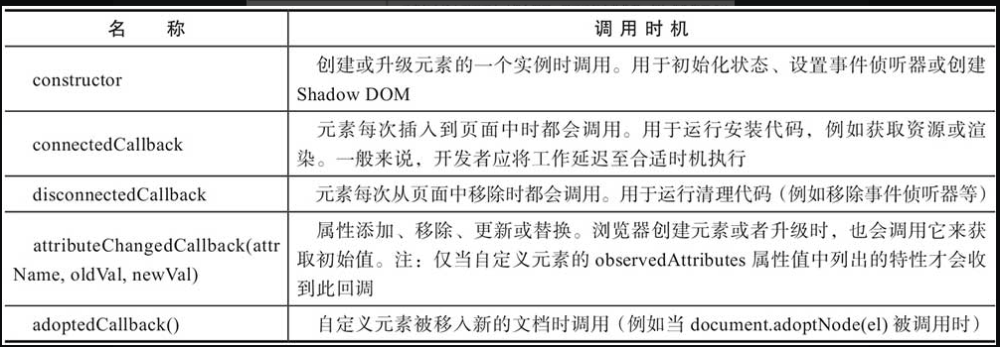

## web组件

组成

* 模板
* Shadow DOM
* 自定义元素
* HTML导入

### template元素定制客户端模板

* 调用模板时可以将模板内容动态插入页面中。未被调用时，这段内容不会被渲染
* 在模板被调用之前，模板中的内容不会有副作用。脚本不会被运行，图像不会被加载，视频或音频不会被播放。因此应该注意的是：模板不可能被预渲染，这意味着你不能预执行任何代码片段，不能预加载视频、音频等。任何代码都将在模板被调用时执行
* 在调用之前，模板中的内容并不看作为页面DOM树中的内容。使用document.getElementById方法或document.querySelector方法不能获取到模板中的任何内容（但是可以获取到模板元素本身）
* 模板可以被书写在head标签中、body标签中或framset标签中的任何地方，可以在模板中书写任何允许被放置在这些标签中的任何内容。当然，模板也可以被放置在table或select等元素内部

```html
<!DOCTYPE html>
<html>
<head>
    <meta charset="UTF-8">
    <title>定义模板内容</title>
</head>
<body>
<table>
<tr>
        <td>第一行第一列</td>
        <td style="text-align:center">第一行第二列</td>
        <td>第一行第三列</td>
</tr>
<tr>
        <td>第二行第一列</td>
        <td id="td1">
            <template id="mytemplate">
            
            <div class="comment"></div>
            </template>
        </td>
        <td>第二行第三列</td>
</tr>
<tr>
        <td>第三行第一列</td>
        <td style="text-align:center">第三行第二列</td>
        <td>第三行第三列</td>
</tr>
</table>
</body>
<script>
let t = document.getElementById('mytemplate');
//指定img元素的src属性值
t.content.getElementById('img').src = 'tyl.jpg';
document.getElementById("td1").appendChild(t.content.cloneNode(true));
</script>
</html>
```

<span style="color: pink;">模板嵌套时，那么外层模板激活并不会激活内层模板，还是需要手动激活内层才行</span>

### Shadow DOM 组件

* 隔离DOM：组件的DOM是独立的（例如，document.querySelector()不会返回组件Shadow DOM中的节点）
* 作用域CSS：Shadow DOM内部定义的CSS在其作用域内。样式代码不会被泄漏，页面样式也不会渗入到Shadow DOM内部
* 简化CSS：作用域DOM意味着你可以在Shadow DOM内部使用简单的CSS选择器，更通用的id/类名称，而无须担心与页面样式产生的命名冲突
* 效率：你可以将页面看成是多个DOM块，而不是一个大的全局性页面

宿主元素：原本页面中的dom元素

影子根元素：附加在宿主元素上的节点

有些特定元素无法创建影子根（textarea、input等表单元素以及一些自封闭的元素 img、br等）

#### slot：插槽（占位）

```html
<!DOCTYPE html>
<html>
<head>
    <meta charset="UTF-8">
    <title>分别定义每个slot元素中所显示内容的样式</title>
</head>
<body>
<div id="nameComponent" is="better-button">
<div slot='first'>示例文字1</div>
<div slot='second'>示例文字2</div>
<div slot='three'>示例文字3</div>
</div>
<template id="nameComponentTemplate">
<div style="background:pink; padding: 1em;">
        <div style="color: red;">
            <slot name="first"></slot>
        </div>
        <div style="color: yellow;">
            <slot name="second"></slot>
        </div>
        <div style="color: blue;">
            <slot name="three"></slot>
        </div>
    </div>
</template>
</body>
<script>
// mode: 'open' 目的是为了能够在页面的DOM树及脚本文件中访问该影子根节点
let host = document.getElementById('nameComponent').attachShadow(
{mode: 'open'});
let template = document.getElementById('nameComponentTemplate');
host.appendChild(template.content);
template.remove();
</script>
</html>
```

#### 定义宿主元素的样式

```html
<!DOCTYPE html>
<html>
<head>
<title>在Shadow DOM中定义CSS样式</title>
</head>
<body>
<div class="div1"><h3>实际运行示例:</h3></div>
<div class="div2"><h3>Host标题</h3></div>
<script>
let root = document.getElementById('div2').attachShadow({mode: 'open'});
root.innerHTML = '<style>:host{background-color:pink;} 
h3{ color: red; }</style><h3>Shadow DOM标题</h3>';
</script>
</body>
</html>
```

* 父页面中为宿主元素定义的样式较之在元素中定义的：host规则具有更高的特异性。也就是说，外部样式优先

#### 基于情境设置样式

```html
<!DOCTYPE html>
<html>
<head>
<title>根据组件的环境进行主题化</title>
</head>
<body class="darktheme">
<div class="div1"><h3>实际运行示例:</h3></div>
<div class="div2"><h3>Host标题</h3></div>
<script>
let root = document.getElementById('div2').attachShadow({mode: 'open'});
root.innerHTML = '<style>:host-context(.darktheme) {
color: white;background: black;}</style><h3>Shadow DOM标题</h3>';
</script>
</body>
</html>
```

`:host-context(选择器)` 可以用于主题化，但是使用css变量创建样式钩子是更好的方法

#### 为分布式节点（插槽）设定样式

```html
<!DOCTYPE html>
<html>
<head>
<title>为分布式节点设定样式</title>
</head>
<body>
<div class="div">
    <h2 slot="h2">组件标题</h2>
    <span slot="title"  class="title">        
        由<span class="author">陆凌牛</span>创建
    </span>
</div>
<template id="myTemplate">
<style>
::slotted(h2) {
    margin: 0;
    font-weight: 300;
    color: red;
}
::slotted(.title) {
    color: orange;
}
::slotted(.title .author) {
    color: green;
}
</style>
<div>
    <slot name="h2"></slot>
    <slot name="title"></slot>
</div>
</template>
<script>
let root = document.getElementById('div').attachShadow({mode: 'open'});
let template = document.getElementById('myTemplate');
root.appendChild(template.content);
template.remove();
</script>
</body>
</html>
```

#### 组件外部为组件设定样式

使用元素名称作为选择器

```html
<!DOCTYPE html>
<html>
<head>
<title>使用元素名称为组件设定样式</title>
<style>
div {
    background-color: blue;
    color:red; /*注意:继承的CSS属性可跨越shadow DOM边界*/
}
</style>
</head>
<body>
<div id="host"></div>
<script>
let root= document.getElementById('host').attachShadow({mode:'open'});
root.innerHTML = '<div>示例文字</div>';
</script>
</body>
</html>
```

* 大多数情况下`shadow dom`中定于的样式优先级高于外部样式，但是使用`:host`的方式则外部宿主样式高于内部样式

#### 使用css变量创建样式钩子

组件开发者创建“样式占位符”以便组件使用者进行替换

```html
<!DOCTYPE html>
<html>
<head>
<title>使用CSS变量创建样式钩子</title>
<style>
div[theme=darkTheme] {
    margin-bottom: 32px;
    --component-bg: black;
    --component-color: white;
}
</style>
</head>
<body>
<div id="host" theme="darkTheme"></div>
<script>
let root= document.getElementById('host').attachShadow({mode:'open'});
root.innerHTML = '<style>:host([theme=darkTheme]) {
background: var(--component-bg);
color: var(--component-color);} 
:host{border-radius:10px;padding:10px;}

</style><div>示例文字</div>';
</script>
</body>
</html>
```

#### 注意

1. 尽量不要创建闭合影子根

```javascript
let div = document.createElement('div');
let shadowRoot = div.attachShadow({mode: 'closed'}); //创建闭合影子根
```

2. slot元素的slotChange事件

在示例页面中有一个包含一个slot元素的空组件及一个测试按钮，同时监听该slot元素的slotchange事件。用户单击测试按钮时将在页面中为该slot元素添加一个对应的分布式节点div元素，这将改变该组件的light DOM，从而触发slot元素的slotchange事件

```html
<!DOCTYPE html>
<html>
<head>
<title>slotchange事件捕捉示例</title>
</head>
<body>
<div ></div>
<input type='button' onclick='test()' value='测试按钮'/></div>
<script>
let root = document.getElementById('div').attachShadow({mode: 'open'});
root.innerHTML="<div><slot name='testDiv' id='testDiv'></slot></div>";
var slot=root.getElementById('testDiv');
slot.addEventListener('slotchange', function(e){
     console.log('light dom被改变!');
});
function test(){
    let div=document.createElement("div");
    div.slot="testDiv";
    div.innerHTML="示例文字";
    document.getElementById("div").appendChild(div);
}
</script>
</body>
</html>
```

### 自定义元素

#### 见码识意

```html
<!DOCTYPE html>
<html>
<head>
<title>扩展其他自定义元素</title>
<style>
fancy-drawer{
    background-color:gray;
    color:white;
    display:block;
    width:200px;
    height:200px;
}
</style>
<script>
class AppDrawer extends HTMLElement {
    //一个针对open属性的getter/setter
    get open() {
        return this.hasAttribute('open');
    }

    set open(val) {
        //为元素添加open属性
        if (val) {
            this.setAttribute('open', '');
        } else {
            this.removeAttribute('open');
        }
        this.toggleDrawer();
    }
    //可以定义构造器函数
    constructor() {
        //定义构造器函数时总是首先调用super()!
        super();
        //对<app-drawer>设置一个click监听器.
        this.addEventListener('click', e => {
            this.toggleDrawer();
        });
    }

    toggleDrawer() {
       if(!this.open){
           this.innerHTML="抽屉被打开";
           this.setAttribute('open', '');
       }
       else{
          this.innerHTML="抽屉被关闭";
          this.removeAttribute('open');
       }
    }
}
class FancyDrawer extends AppDrawer {
    //一个针对color属性的getter/setter
    get backgroundColor() {
        return this.hasAttribute('backgroundColor');
    }

    set backgroundColor(val) {
        //为元素添加width属性
        this.setAttribute('backgroundColor', val);
    }
    toggleDrawer() {
         super.toggleDrawer();
         if(!this.open) 
             this.style.backgroundColor="gray";
         else
             this.style.backgroundColor=
                 this.getAttribute('backgroundColor');
    }
}
customElements.define('fancy-drawer',FancyDrawer);
</script>
</head>
<body>
<fancy-drawer backgroundColor="blue">抽屉被关闭</fancy-drawer>
</body>
</html>
```

#### 自定义元素响应

就是在不同的生命周期运行特定的代码



```html
<!DOCTYPE html>
<html>
<head>
<title>观察自定义元素特殊生命周期钩子回调函数的调用</title>
<style>
app-drawer{
    background-color:blue;
    color:white;
    display:block;
    width:200px;
    height:200px;
}
</style>
<script>
class AppDrawer extends HTMLElement {
    //一个针对open属性的getter/setter
    get open() {
        return this.getAttribute('open');
    }

    set open(val) {
        //为元素设置open属性
        this.setAttribute('open',val);
        this.toggleDrawer();
    }
    //可以定义构造器函数
    constructor() {
        //定义构造器函数时总是首先调用super()!
        super();
        console.log("constructor方法被调用");
        //对<app-drawer>设置一个click监听器.
        this.addEventListener('click', e => {
            //如果禁用则返回
            if (this.disabled) {
                return;
            }
            this.toggleDrawer();
        });
    }
    static get observedAttributes() {return ['open']; }
    connectedCallback() {
        console.log("connectedCallback方法被调用");
    }
    disconnectedCallback() {
        console.log("disconnectedCallback方法被调用");
    }
    attributeChangedCallback(attrName, oldVal, newVal) {
        console.log("attributeChangedCallback方法被调用");
        console.log("attrName:"+attrName);
        console.log("oldVal:"+oldVal);
        console.log("newVal:"+newVal);
    }
    toggleDrawer() {
        if(this.open=="false"){
            this.innerHTML="抽屉被打开";
            this.setAttribute('open', 'true');
        }
        else{
            this.innerHTML="抽屉被关闭";
            this.setAttribute('open', 'false');
        }
    }
}

customElements.define('app-drawer', AppDrawer);
</script>
</head>
<body>
<app-drawer id="myAppDrawer" open="false">抽屉被关闭</app-drawer>
<input type="button" value="移除元素" onclick="removeElem()" />
<script>
function removeElem(){
    let myAppDrawer=document.getElementById("myAppDrawer");
    myAppDrawer.remove();
}
</script>
</body>
</html>
```

#### 自定义元素属性

```html
<!DOCTYPE html>
<html>
<head>
<title>为自定义元素添加禁用属性</title>
<style>
app-drawer{
    background-color:blue;
    color:white;
    display:block;
    width:200px;
    height:200px;
}
app-drawer[disabled] {
    background-color:gray;
}
</style>
<script>
class AppDrawer extends HTMLElement {
    //一个针对open属性的getter/setter
    get open() {
        return this.hasAttribute('open');
    }

    set open(val) {
        //为元素添加open属性
        if (val) {
            this.setAttribute('open', '');
        } else {
            this.removeAttribute('open');
        }
        this.toggleDrawer();
    }

    //一个针对disabled属性的getter/setter
    get disabled() {
        return this.hasAttribute('disabled');
    }

    set disabled(val) {
        //为元素添加disabled属性
        if (val) {
            this.setAttribute('disabled', '');
        } else {
            this.removeAttribute('disabled');
        }
    }

    //可以定义构造器函数
    constructor() {
        //定义构造器函数时总是首先调用super()!
        super();
        //对<app-drawer>设置一个click监听器.
        this.addEventListener('click', e => {
            //如果禁用则返回
            if (this.disabled) {
                return;
            }
            this.toggleDrawer();
        });
    }

    toggleDrawer() {
        if(!this.open){
            this.innerHTML="抽屉被打开";
            this.setAttribute('open', '');
        }
        else{
            this.innerHTML="抽屉被关闭";
            this.removeAttribute('open');
        }
    }
}

customElements.define('app-drawer', AppDrawer);
</script>
</head>
<body>
<app-drawer>抽屉被关闭</app-drawer>
<input type="button" value="禁用元素" onclick="disableElem()"/>
<script>
function disableElem(){
    // 这里似乎可以直接 `ele.disabled = true`吧，直接调用类的 `set disabled` 方法
    document.querySelector("app-drawer").setAttribute("disabled","");
}
</script>
</body>
</html>
```

#### 创建使用 shadow dom 的元素

```html
<!DOCTYPE html>
<html>
<head>
<title>在自定义元素中使用Shadow DOM</title>
<script>
window.customElements.define('x-foo-shadowdom', class extends HTMLElement
 {
    constructor() {
        super(); //在构造函数中总是先调用super()
        //为元素附加一个影子根
        let shadowRoot = this.attachShadow({mode: 'open'});
        shadowRoot.innerHTML ='<b>我来自于组件内部!</b><slot></slot>';
    }
});
</script>
</head>
<body>
<x-foo-shadowdom>
    <p><b>用户的</b>自定义文字</p>
</x-foo-shadowdom>
</body>
</html>
```

#### <span style="color: pink;">❗使用template创建自定义元素</span>

* template
* shadow dom
* 自定义元素

```html
<!DOCTYPE html>
<html>
<head>
<title>使用模板创建元素</title>
</head>
<body>
<x-foo-shadowdom>
    <p><b>用户的</b>自定义文字</p>
</x-foo-shadowdom>
<template id="x-foo-from-template">
    <style>
    p { color: orange; }
    </style>
    <p>我在Shadow DOM内，也在模板内</p>
    <slot></slot>
</template>
</body>
<script>
window.customElements.define('x-foo-shadowdom', class extends HTMLElement 
{
    constructor() {
        super(); //在构造函数中总是先调用super()
        //为元素附加一个影子根
        let shadowRoot = this.attachShadow({mode: 'open'});
        let t = document.getElementById('x-foo-from-template');
        let instance = t.content.cloneNode(true);
        shadowRoot.appendChild(instance);
    }
});
</script>
</html>
```

#### 指定自定义元素的样式

其实跟平时的html标签的样式设置一样，使用各种选择器即可

```html
<!DOCTYPE html>
<html>
<head>
<title>指定自定义元素的样式</title>
<style>
app-drawer {
    display: flex;
    width:100px;
}
panel-item {
    background: orange;
    transition: opacity 400ms ease-in-out;
    opacity: 0.3;
    flex: 1;
    text-align: center;
    border-radius: 50%;
}
panel-item:hover {
    opacity: 1.0;
    background: rgb(255, 0, 255);
    color: white;
    cursor:pointer;
}
app-panel > panel-item {
    padding: 5px;
    list-style: none;
    margin: 0 7px;
}
</style>

<script>
window.customElements.define('app-drawer', class extends HTMLElement {
    constructor() {
        super(); 
    }
});
</script>
</head>
<body>
<div>
<app-drawer>
    <panel-item>1</panel-item>
    <panel-item>2</panel-item>
    <panel-item>3</panel-item>
</app-drawer>
</div>
</body>
</html>
```

### HTML导入

HTML导入是一种用于加载相关HTML、CSS或JavaScript的强大工具

#### 使用template

主页面

```html
<!DOCTYPE html>
<html>
<head>
<title>在导入文档中使用模板</title>
<link rel="import" href="import1.html">
</head>
<body>
<div ></div>
</body>
<script>
    let link = document.querySelector('link[rel="import"]');
    // 从导入中复制模板元素
    let template = link.import.querySelector('template');
    let content = template.content.cloneNode(true);
    document.querySelector('#container').appendChild(content);
</script>
</html>
```

导入文档`import1.html`

```html
<template>
    <h1>你好</h1>
    <!-- 只有当模板生效后才会去请求图片 -->
    <script>console.log("只有当模板生效后才会被执行");</script>
</template>
```

#### 自定义元素 + shandow dom

主页面

```html
<!DOCTYPE html>
<html>
<head>
<title>在导入文档的脚本代码中定义自定义元素</title>
<link rel="import" href="element.html">
</head>
<body>
<x-foo-shadowdom>
    <p><b>用户的</b>自定义文字</p>
</x-foo-shadowdom>
</body>
</html>
```

导入文档`element.html`

```html
<script>
window.customElements.define('x-foo-shadowdom', class extends HTMLElement
{
    constructor() {
        super(); //在构造函数中总是先调用super()
        //为元素附加一个影子根
        let shadowRoot = this.attachShadow({mode: 'open'});
        shadowRoot.innerHTML ='<b>我来自于组件内部!</b><slot></slot>';
    }
});
</script>
```

#### 依赖管理以及子导入

依赖管理：重复导入的资源只会导入一次！！有效的减少网络请求

子导入：将导入进行更加细腻的拆分，`A <- B <- C ...`


#### HTML导入的要点

* 导入的MIME类型是text/html
* 导入跨域资源需要将该资源设置成可跨域请求
* 来自相同URL地址的导入仅获取和解析一次。这表示导入中的脚本只在第一次导入的时候被执行
* 导入中的脚本按顺序执行，它们不会阻塞主页面的解析过程
* 导入不代表“把内容添加到这里”。它只代表“解析器，去把这个文档取过来，我一会要用”。脚本在导入时被运行，而样式、元素，还有其他资源需要明确地被加入主页面中。这是HTML导入和iframe元素之间的最大区别，后者表示“在这里加载并立即渲染资源
