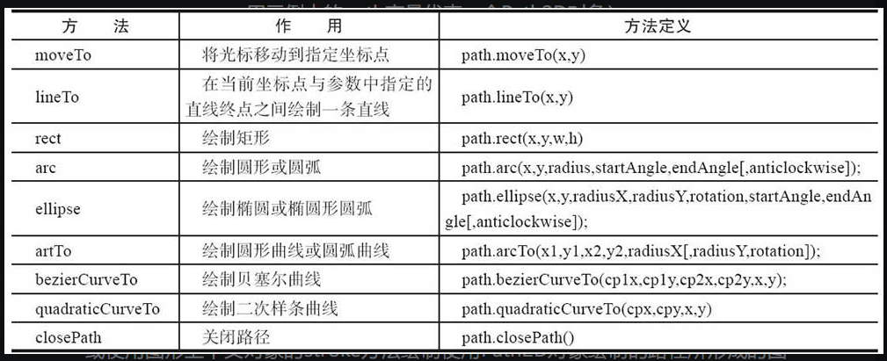
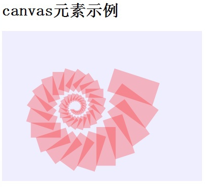
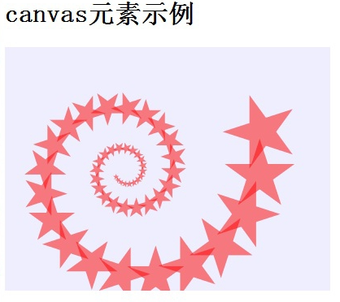
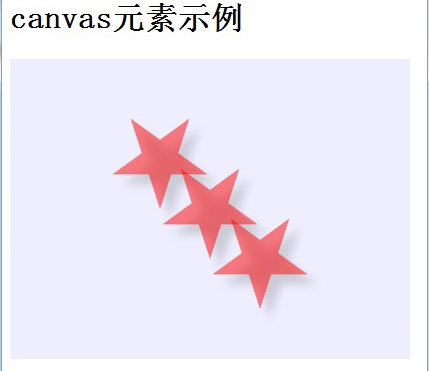
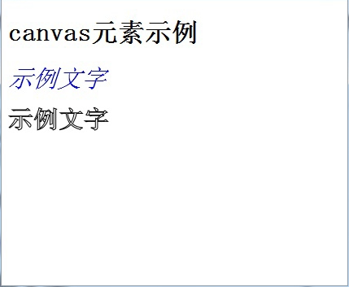
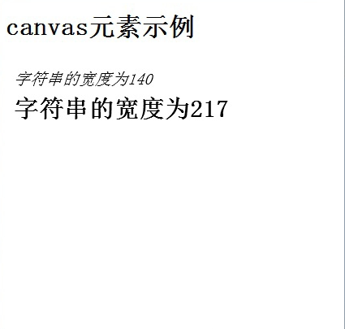
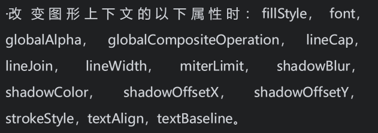

## 绘制图形

> 介绍一个叫做 [`fabricJs`](http://fabricjs.com/) 的库（封装了很多的canvas api）

### 使用路径

由于绘制矩形不需要路径的设置，所以不包含在这个路径栏目中，主要的方法就是`fillRect（填充）`以及`strokeRect（线框）`

#### 绘制圆形

`arc`

```javascript
function draw(id)
{  
    var canvas = document.getElementById(id);  
    if (canvas == null)  
        return false;  
    var context = canvas.getContext('2d');  
    context.fillStyle = "#EEEEFF";  
    context.fillRect(0, 0, 400, 300);  
    var n = 0; 
    for(var i = 0; i < 10; i++) 
    {  
        context.beginPath();  
        context.arc(i * 25, i * 25, i * 10, 0, Math.PI * 2, true);  
        context.closePath();  
        context.fillStyle = 'rgba(255, 0, 0, 0.25)';  
        context.fill();  
    } 
}
```

`ellipse` （椭圆）

```javascript
context.ellipse(i * 25, i * 25, i * 10,i *
20,30,0, Math.PI * 2,true);
```

做一个实验，如果去掉路径的话，那么前者圆就会重复绘制，因为路径。

如果不关闭路径，已经创建的路径会永远保留着。就算用fill方法与stroke方法在页面上将图形已经绘制完毕，路径都不会消失。因此，像上例中那样，如果把“使用路经进行绘制”这个方法进行循环，创建的图形会一次又一次地进行重叠。

#### 绘制直线

* moveTo
* lineTo

```javascript
function draw(id) 
{  
    var canvas = document.getElementById(id);  
    if (canvas == null)  
        return false;  
    var context = canvas.getContext('2d');  
    context.fillStyle = "#EEEEFF";  
    context.fillRect(0, 0, 400, 300);  
    var n = 0;  
    var dx = 150;  
    var dy = 150;  
    var s = 100;  
    context.beginPath();  
    context.fillStyle = 'rgb(100,255,100)';  
    context.strokeStyle = 'rgb(0,0,100)';  
    var x = Math.sin(0);  
    var y = Math.cos(0);  
    var dig = Math.PI / 15 * 11;  
    for(var i = 0; i < 30; i++) 
    {  
        var x = Math.sin(i * dig);  
        var y = Math.cos(i * dig);  
        context.lineTo( dx + x * s,dy + y * s);  
    }     
    context.closePath();  
    context.fill();  
    context.stroke();  
}
```

* 先绘制路径
* 填充内部底色
* 填充线条颜色

这里还有几个属性说一下

* lineJoin（多条线段，拐角处的处理方式）：miter、round、bevel
* lineCap（线段的顶点的处理形式）: butt、round、square
* setLineDash（设置线段是否出现虚线的形式）

#### 绘制曲线

* arcTo
* moveTo

```javascript
function draw(id) 
{  
    var canvas = document.getElementById(id);  
    if (canvas == null)  
        return false;  
    var context = canvas.getContext('2d');  
    context.beginPath();  
    context.moveTo(150,20);
    context.arcTo(150,100,50,20,30);
    context.stroke();  
}
```

还可以绘制贝塞尔曲线、二次样条曲线

以前咱们绘制路径都是先 `beginPath`，然后调用`context`的对应方法，再看是否 `closePath`。

现在咱们可以使用 path2d对象

#### Path2D对象绘制路径



绘制圆形

```javascript
function draw(id) 
{  
    var canvas = document.getElementById(id);  
    if (canvas == null)  
        return false;  
    var context = canvas.getContext('2d');  
    context.fillStyle = "#EEEEFF";  
    context.fillRect(0, 0, 400, 300);  
    var n = 0; 
    for(var i = 0; i < 10; i++) 
    {  
        var path=new Path2D();  
        path.arc(i * 25, i * 25, i * 10, 0, Math.PI * 2, true);  
        path.closePath();  
        context.fillStyle = 'rgba(255, 0, 0, 0.25)';  
        context.fill(path);  
    }     
}
```

path2d的添加

```javascript
function draw(id) 
{  
    var canvas = document.getElementById(id);  
    if (canvas == null)  
        return false;  
    var context = canvas.getContext('2d');  
    var path1=new Path2D();    
    path1.rect(10,10,100,100);
    var path2=new Path2D();
    path2.moveTo(220,60);
    path2.arc(170,60,50,0,2*Math.PI);
    path2.addPath(path1);
    context.stroke(path2);
}
```

使用svg路径字符串绘制

```javascript
function draw(id) 
{  
    var canvas = document.getElementById(id);  
    if (canvas == null)  
        return false;  
    var context = canvas.getContext('2d');  
    var path1=new Path2D("M10 10 h 80 v 80 h -80 Z ");
    context.fill(path1);
}
```

### 绘制渐变图形

线性渐变

```javascript
function draw(id) 
{  
    var canvas = document.getElementById(id);  
    if (canvas == null)  
        return false;  
    var context = canvas.getContext('2d');  
    var g1 = context.createLinearGradient(0,0,0,300);  
    g1.addColorStop(0,'rgb(255,255,0)');  
    g1.addColorStop(1,'rgb(0,255,255)');  
    context.fillStyle = g1;  
    context.fillRect(0, 0, 400, 300);  
    var n = 0;  
    var g2 = context.createLinearGradient(0,0,300,0);  
    g2.addColorStop(0,'rgba(0,0,255,0.5)');  
    g2.addColorStop(1,'rgba(255,0,0,0.5)');  
    for(var i = 0; i < 10; i++) 
    {  
        context.beginPath();  
        context.fillStyle = g2;  
        context.arc(i * 25, i * 25, i * 10, 0, Math.PI * 2, true);  
        context.closePath();  
        context.fill();  
    }
}
```

* `createLinearGradient`创建渐变对象
* `addColorStop` 添加渐变的位移量以及颜色

径向渐变

```javascript
function draw(id) 
{  
    var canvas = document.getElementById(id);  
    if (canvas == null)  
        return false;  
    var context = canvas.getContext('2d');  
    var g1 = context.createRadialGradient(400,0,0,400,0,400);  
    g1.addColorStop(0.1,'rgb(255,255,0)');  
    g1.addColorStop(0.3,'rgb(255,0,255)');  
    g1.addColorStop(1,'rgb(0,255,255)');  
    context.fillStyle = g1;  
    context.fillRect(0, 0, 400, 300);  
    var n = 0;  
    var g2 = context.createRadialGradient(250,250,0,250,250,300);  
    g2.addColorStop(0.1,'rgba(255,0,0,0.5)');  
    g2.addColorStop(0.7,'rgba(255,255,0,0.5)');  
    g2.addColorStop(1,'rgba(0,0,255,0.5)');  
    for(var i = 0; i < 10; i++) 
    {  
        context.beginPath();  
        context.fillStyle = g2;  
        context.arc(i * 25, i * 25, i * 10, 0, Math.PI * 2, true);  
        context.closePath();  
        context.fill();  
    }
}
```

* `createRadialGradient` 创建渐变对象（param1和param2代表起始圆的圆心，param3代表起始圆的半径，param4和param5代表终点圆的圆心，param6代表终点圆的半径）
* `addColorStop` 添加渐变的位移量以及颜色

### 绘制变形图形

平移（`context.translate(x, y)`）

放大（`context.scale(x, y)`）

旋转（`context.rotate(angle)`）

```javascript
function draw(id) 
{  
    var canvas = document.getElementById(id);  
    if (canvas == null)  
        return false;  
    var context = canvas.getContext('2d');  
    context.fillStyle = "#EEEEFF";  
    context.fillRect(0, 0, 400, 300);  
    // 图形绘制 
    context.translate(200,50);  
    context.fillStyle = 'rgba(255,0,0,0.25)';  
    for(var i = 0;i < 50;i++)
    {  
        context.translate(25,25);  
        context.scale(0.95,0.95);  
        context.rotate(Math.PI / 10);  
        context.fillRect(0,0,100,50);  
    }  
}
```

显示结果



绘制五角星

```javascript
function draw(id) 
{  
    var canvas = document.getElementById(id);  
    if (canvas == null)  
        return false;  
    var context = canvas.getContext('2d');  
    context.fillStyle = "#EEEEFF";  
    context.fillRect(0, 0, 400, 300);  
    // 图形绘制  
    context.translate(200,50);  
    for(var i = 0;i < 50;i++)
    {  
        context.translate(25,25);  
        context.scale(0.95,0.95);  
        context.rotate(Math.PI / 10);  
        create5Star(context);  
        context.fill();  
    }  
}  
function create5Star(context)
{  
    var n = 0;  
    var dx = 100;  
    var dy = 0;  
    var s = 50;  
    // 创建路径  
    context.beginPath();  
    context.fillStyle = 'rgba(255,0,0,0.5)';  
    var x = Math.sin(0);  
    var y = Math.cos(0);  
    var dig = Math.PI / 5 * 4;  
    for(var i = 0; i < 5; i++) 
    {  
        var x = Math.sin(i * dig);  
        var y = Math.cos(i * dig);  
        context.lineTo( dx + x * s,dy + y * s);  
    }
    context.closePath();  
}
```

这里创建 `create5Star` 函数的目的则是因为坐标发生了变换，那么需要基于新的坐标创建新的路径，从而绘制新的五角星的图形



### 图形绘制阴影

由于绘制阴影是与路径无关的，所以可以只设定一次就好了，但是使用例如 lineTo等方法绘制（与路径有关，且路径与坐标有关，所以每次坐标变换`translate、rotate、scale`需要重新设置路径）

```javascript
function draw(id) 
{  
    var canvas = document.getElementById(id);  
    if (canvas == null)  
        return false;  
    var context = canvas.getContext('2d');  
    context.fillStyle = "#EEEEFF";  
    context.fillRect(0, 0, 400, 300);  
    context.shadowOffsetX = 10;  
    context.shadowOffsetY = 10;  
    context.shadowColor = 'rgba(100,100,100,0.5)';  
    context.shadowBlur = 7.5;  
    // 图形绘制  
    context.translate(0,50);  
    for(var i = 0;i < 3;i++)
    {  
        context.translate(50,50);  
        create5Star(context);  
        context.fill();  
    }  
}  
function create5Star(context)
{  
    var n = 0;  
    var dx = 100;  
    var dy = 0;  
    var s = 50;  
    // 创建路径  
    context.beginPath();  
    context.fillStyle = 'rgba(255,0,0,0.5)';  
    var x = Math.sin(0);  
    var y = Math.cos(0);  
    var dig = Math.PI / 5 * 4;  
    for(var i = 0; i < 5; i++) 
    {  
        var x = Math.sin(i * dig);  
        var y = Math.cos(i * dig);  
        context.lineTo( dx + x * s,dy + y * s);  
    }     
    context.closePath();  
}
```



### 使用图像

使用的 drawImage （咱们这里使用的9个参数）

```javascript
function draw(id) 
{   
    var canvas = document.getElementById(id);  
    if (canvas == null)  
        return false;  
    var context = canvas.getContext('2d');  
    context.fillStyle = "#EEEEFF";  
    context.fillRect(0, 0, 400, 300);  
    image = new Image(); 
    image.src = "qc.jpg";  
    image.onload = function() 
    {  
        drawImg(context,image);  
    };       
}  
function drawImg(context,image)
{  
    var i=0;
    // 首先调用该方法绘制原始图像
    context.drawImage(image,0,0,100,100); 
    // 绘制将局部区域进行放大后的图像
    context.drawImage(image,23,5,57,80,110,0,100,100);  
}
```

* 先绘制 100 x 100 的图形
* 将图形中的（23, 5）坐标处的 57 x 80的区域复制到（110, 0）坐标处的100 x 100 区域

#### 图像平铺

根据已知平铺比例、canvas宽度、图片宽高，算出横向以及纵向的平铺个数，之后再嵌套循环drawImage

```javascript
function draw(id)
{  
    var image = new Image();      
    var canvas = document.getElementById(id);  
    if (canvas == null)  
        return false;     
    var context = canvas.getContext('2d'); 
    image.src = "qc.jpg"; 
    image.onload = function()
    {  
        drawImg(canvas,context,image);  
    };        
}  
function drawImg(canvas,context,image)
{  
    // 平铺比例
    var scale=5
    // 缩小后图像宽度
    var n1=image.width/scale;
   // 缩小后图像高度
    var n2=image.height/scale;
   // 平铺横向个数
    var n3=canvas.width/n1;
   // 平铺纵向个数
    var n4=canvas.height/n2;
    for(var i=0;i<n3;i++)
        for(var j=0;j<n4;j++)
         context.drawImage(image,i*n1,j*n2,n1,n2);
}
```

<span style="color: pink;">直接使用 `context.createPattern`</span>

```javascript
function draw(id)
{  
    var image = new Image();
    var canvas = document.getElementById(id);  
    if (canvas == null)  
        return false;
    var context = canvas.getContext('2d'); 
    image.src = "qc2.jpg"; 
    image.onload = function()
    {  
        // 创建填充样式，全方向平铺
        var ptrn = context.createPattern(image,'repeat'); 
        // 指定填充样式
        context.fillStyle = ptrn;  
        // 填充画布
        context.fillRect(0,0,400,300);  
    };
}
```

#### 图像裁剪

先创建路径，之后调用 `clip` 设置裁剪区域，最后绘制图像

```javascript
function draw(id)
{  
    var canvas = document.getElementById(id);  
    if (canvas == null)  
        return false;  
    var context = canvas.getContext('2d');  
    var gr = context.createLinearGradient(0,400,300,0);  
    gr.addColorStop(0,'rgb(255,255,0)');  
    gr.addColorStop(1,'rgb(0,255,255)');  
    context.fillStyle = gr;  
    context.fillRect(0, 0, 400, 300);  
    image = new Image();  
    image.onload = function()
    {  
        drawImg(context,image);  
    };  
    image.src = "qc.jpg";  
}  

function drawImg(context,image)
{  
    create5StarClip(context);  
    context.drawImage(image,-50,-150,300,300);  
}  

function create5StarClip(context)
{  
    var n = 0;  
    var dx = 100;  
    var dy = 0;  
    var s = 150;  
    context.beginPath();  
    var x = Math.sin(0);  
    var y = Math.cos(0);  
    var dig = Math.PI / 5 * 4;  
    for(var i = 0; i < 5; i++) 
    {  
        var x = Math.sin(i * dig);  
        var y = Math.cos(i * dig);  
        context.lineTo( dx + x * s,dy + y * s);  
    }  
    context.clip();  
}
```

#### 像素处理

这个很有意思啊

使用 `context.getImageData` 获取到对应区域的像素值，然后可以对其中的rgba数据进行处理（蒙版处理、面部识别等）

将图像rgb值处理后重新以新的图像像素点刷新画布

```javascript
function draw(id)
{  
    let canvas = document.getElementById(id);  
    if (canvas == null)  
        return false; 
    let context = canvas.getContext('2d');
    let image = new Image(); 
    image.src = "qc.jpg"; 
    image.onload = function () 
    {
       context.drawImage(image, 0, 0);
       let imagedata = context.getImageData(0,0,image.width,image.height);        
       for (var i = 0, n = imagedata.data.length; i < n; i += 4) 
       {
           imagedata.data[i+0] = 255 - imagedata.data[i+0]; // red
           imagedata.data[i+1] = 255 - imagedata.data[i+2]; // green
           imagedata.data[i+2] = 255 - imagedata.data[i+1]; // blue
      }
      context.putImageData(imagedata, 0, 0);
    };      
}
```

* imagedata.data 是一个数组 [r1, g1, b1, a1, r2, g2, b2, a2 ....]（第一个像素点的红色值、绿色值、蓝色值以及透明度值，然后第二第三....）

### 图形、图像的组合与混合

使用 `context.globalCompositeOperation=type`, type的取值以及作用可以查看mdn

### 绘制文字

* fillText
* strokeText

```javascript
function draw(id) 
{  
    var canvas = document.getElementById(id);  
    if (canvas == null)  
        return false;  
    var context=canvas.getContext('2d'); 
    context.fillStyle= '#00f';
    context.font= 'italic 30px sans-serif';
    context.textBaseline = 'top';
    // 填充字符串
    context.fillText  ('示例文字', 0, 0);
    context.font='bold  30px sans-serif';
    // 轮廓字符串
    context.strokeText('示例文字', 0, 50);
}
```



<span style="color: pink;">由于fillStyle是我们设置的，所以咱们可以设置文字为渐变色的填充</span>

* measureText

```javascript
function draw(id) 
{ 
    var canvas = document.getElementById(id);  
    if (canvas == null)  
        return false;   
    var context = canvas.getContext('2d'); 
    context.font = 'italic 20px sans-serif';
    /* 定义绘制文字*/
    var txt = "字符串的宽度为";
    /* 获取文字宽度 */
    var tm1 = context.measureText(txt);
    /* 绘制文字 */
    context.fillText(txt, 10, 30);
    context.fillText(tm1.width, tm1.width+10, 30);
    /* 改变字体 */
    context.font = "bold  30px sans-serif";
    /* 重新获取文字宽度 */
    var tm2 = context.measureText(txt);
    /* 重新绘制文字*/
    context.fillText(txt, 10, 70);
    context.fillText(tm2.width,tm2.width+10, 70);
}
```



### 补充

#### 保存与恢复状态

开始前调用 save保存context当前状态，操作完毕后调用 restore恢复context状态

* 图像或图形变形
* 图像裁剪
* 改变了一些特别的上下文属性



#### 图像转换为data url

```javascript
function draw(id)
{  
    var canvas = document.getElementById(id);  
    if (canvas == null)  
        return false;  
    var context = canvas.getContext('2d'); 
    context.fillStyle = "rgb(0, 0, 255)";
    context.fillRect(0, 0, canvas.width, canvas.height);
    context.fillStyle = "rgb(255, 255, 0)";
    context.fillRect(10, 20, 50, 50); 
    window.location =canvas.toDataURL("image/jpeg");    
}
```

#### 转换为 blob对象

```html
<!DOCTYPE html>
<head>
<meta charset="UTF-8">
<title>使用toBlob方法转换canvas元素</title>
</head>
<body onload="draw('canvas');">
<h1>使用toBlob方法转换canvas元素</h1>
<canvas  width="400" height="300"></canvas><br/>
<input type="button" value="保存图像" onclick="savePicture();">
<script>
function draw(id)
{  
let canvas = document.getElementById(id);  
    if (canvas == null)  
        return false;  
let context = canvas.getContext('2d'); 
    context.fillStyle = "rgb(0, 0, 255)";
    context.fillRect(0, 0, canvas.width, canvas.height);
    context.fillStyle = "rgb(255, 255, 0)";
    context.fillRect(10, 20, 50, 50);    
}
function savePicture(){
    function onBlob (blob) {
let a = document.createElement('a');
        a.textContent = '打开图像';
        document.body.appendChild(a);
        a.style.display = 'block';
        a.href = window.URL.createObjectURL(blob);
    }
    canvas.toBlob(onBlob,'image/jpeg', 0.95);
}
</script>
</body>
</html>
```

#### 简单动画

```javascript
var globalId;
var i=0;
function draw(id)
{
    globalId=id;
    setInterval(Composite,1000);
}
function Composite() 
{  
    var canvas = document.getElementById(globalId);  
    if (canvas == null)  
        return false;  
    var context = canvas.getContext('2d'); 
    var oprtns = new Array(
    "source-atop",
    "source-in",
    "source-out",
    "source-over",
    "destination-atop",
    "destination-in",
    "destination-out",
    "destination-over",
    "lighter",
    "copy",
    "xor"
    );
    if(i>10) i=0;
    context.clearRect(0,0,canvas.width,canvas.height);
    context.save();
    // 绘制原有图形(蓝色长方形)
    context.fillStyle = "blue";
    context.fillRect(10, 10, 60, 60);
    // 设置组合方式 
    context.globalCompositeOperation = oprtns[i];
    // 设置新图形(红色圆形)
    context.beginPath();
    context.fillStyle = "red";
    context.arc(60, 60, 30, 0, Math.PI*2, false);
    context.fill();
    context.restore();
    i=i+1;
}
```

* 不断擦除、重绘、擦除、重绘的过程（clearRect清除画布）
* 由于使用了一些特别属性更改了上下文的一些状态，所以最好使用 save以及restore操作上下文对象（保证上下文干净）

#### 后台解码图片

由于图像的解码操作需要耗费大量cpu资源，所以提供了`createImageBitmap` 方法在后台进行图像的解码，配合web worker使用可以提高图像解码速度

```javascript
function draw(id)
{
    let canvas=document.getElementById(id);
    let context=canvas.getContext("2d");
    let worker = new Worker("worker.js");
    worker.postMessage('tyl.jpg');
    worker.onmessage = (evt) => {
        if (evt.data.err)
            console.log(evt.data.message);
        context.drawImage(evt.data.imageBitmap,0,0);
    };
}
```

`worker.js`

```javascript
onmessage = function(event) {
    fetch(event.data)
    .then(response => response.blob())
    .catch(error => self.postMessage(error))
    .then(response =>{
        createImageBitmap(response,23,5,57,80)
        .then(imageBitmap =>self.postMessage({imageBitmap:imageBitmap}));
    });
}
```
