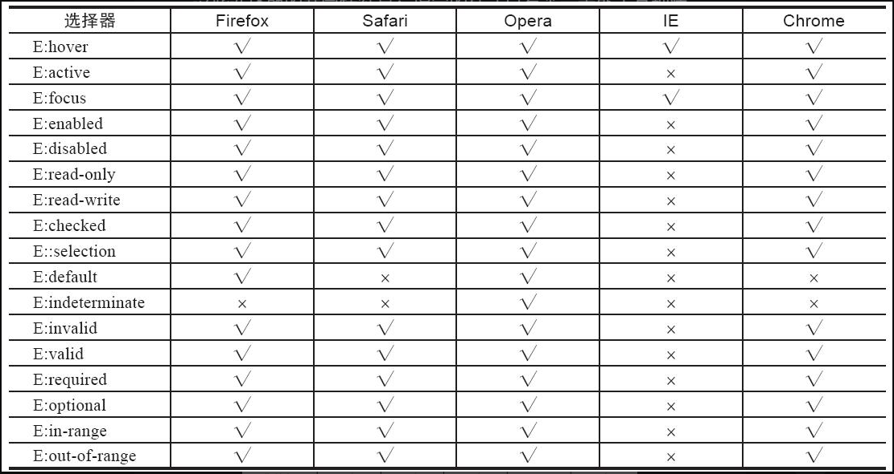

## 属性选择器

* `[attr*=val]`：如果元素用attr表示的属性的属性值中包含用val指定的字符，则该元素使用这个样式
* `[attr^=val]`：如果元素用attr表示的属性的属性值的开头字符为用val指定的字符话，则该元素使用这个样式
* `[attr$=val]`：如果元素用attr表示的属性的属性值的结尾字符为用val指定的字符，则该元素使用这个样式

<span style="color: pink;">tips：有一些属性值包含特殊符号，需要`\`进行转义，例如`[attr$=\-1]`（匹配属性值以 -1 结尾的元素）</span>

## 结构性伪类选择器

::: tip
**理解两个概念**

伪类选择器：预先定义好的一些类的选择器，例如`a:link`

伪元素选择器：预先定义好的元素的选择器，例如`::after`伪元素，他会出现在dom中

* `first-line`：用于向某个元素中的第一行文字使用样式
* `first-letter`：用于向某个元素中的文字的首字母（欧美文字）或第一个字（中文或日文等汉字）使用样式
* `before`
* `after`

其实区别就是查看是否会在页面生成元素！！！生成元素的就是伪元素选择器！！！
:::

* root：html元素的样式
* not：除去某个元素不设置样式
* empty：元素内容为空时的样式
* target：样式在用户点击页面中的超链接，并且跳转到target元素后起作用
* first-child
* last-child
* nth-child
* nth-last-child
* nth-of-type
* nth-last-of-type
* only-child：代替 `子元素:nth-child(1):nth-last-child(1)`选择只有一个子元素
* only-of-type：代替 `子元素:nth-of-type(1):nth-last-of-type(1)`

讲解一下 `nth-child` 以及 `nth-of-type` 的区别

`nth-child`：所有子元素开始算

```html
<!DOCTYPE html PUBLIC "-//W3C//DTD XHTML 1.0 Transitional//EN"
 "http://www.w3.org/TR/xhtml1/DTD/xhtml1-transitional.dtd">
<html xmlns="http://www.w3.org/1999/xhtml">
<head>
<meta http-equiv="Content-Type" content="text/html;charset=gb2312" />
<title>nth-of-type选择器与nth-last-of-type选择器使用示例</title>
<style type="text/css">
/* 奇数 */
h2:nth-child(odd){
    background-color: yellow;
}
/* 偶数 */
h2:nth-child(even){
    background-color: skyblue;
}
</style>
</head>
<body>
<div>
<h2>文章标题A</h2>
<p>文章正文。</p>
<h2>文章标题B</h2>
<p>文章正文。</p>
<h2>文章标题C</h2>
<p>文章正文。</p>
<h2>文章标题D</h2>
<p>文章正文。</p>
</div>
</body>
</html>
```

运行结果：所有的h2元素都是黄色

`nth-of-type`：指定类型的子元素开始算

```html
<!DOCTYPE html PUBLIC "-//W3C//DTD XHTML 1.0 Transitional//EN"
 "http://www.w3.org/TR/xhtml1/DTD/xhtml1-transitional.dtd">
<html xmlns="http://www.w3.org/1999/xhtml">
<head>
<meta http-equiv="Content-Type" content="text/html;charset=gb2312" />
<title>nth-of-type选择器与nth-last-of-type选择器使用示例</title>
<style type="text/css">
<style type="text/css">
h2:nth-of-type(odd){
    background-color: yellow;
}
h2:nth-of-type(even){
    background-color: skyblue;
}
</style>
</style>
</head>
<body>
<div>
<h2>文章标题A</h2>
<p>文章正文。</p>
<h2>文章标题B</h2>
<p>文章正文。</p>
<h2>文章标题C</h2>
<p>文章正文。</p>
<h2>文章标题D</h2>
<p>文章正文。</p>
</div>
</body>
</html>
```

运行结果：奇数黄色，偶数天蓝色

## UI元素状态伪类选择器

指定的样式只有当元素处于某种状态下时才起作用，在默认状态下不起作用



## 通用兄弟元素选择器

用来指定位于同一个父元素之中的某个元素之后的所有其他某个种类的兄弟元素所使用的样式

```html
<!DOCTYPE html PUBLIC "-//W3C//DTD XHTML 1.0 Transitional//EN" 
"http://www.w3.org/TR/xhtml1/DTD/xhtml1-transitional.dtd">
<html xmlns="http://www.w3.org/1999/xhtml">
<head>
<meta http-equiv="Content-Type" content="text/html; charset=gb2312" />
<style type="text/css">
div ~ p {background-color:#00FF00;}
</style>
<title>通用兄弟元素选择器 E ~ F</title>
</head>
<body>
<div style="width:733px; border: 1px solid #666; padding:5px;">
<div>
    <p>p元素为div元素的子元素</p>
    <p>p元素为div元素的子元素</p>
</div>
<hr />
<p>p元素为div元素的兄弟元素</p>
<p>p元素为div元素的兄弟元素</p>
<hr />
<p>p元素为div元素的兄弟元素</p>
<hr />
<div>p元素为div元素的子元素</div>
<hr />
<p>p元素为div元素的兄弟元素</p>
</div>
</body>
</html>
```

与div同级的p元素的颜色为 `#00FF00`
