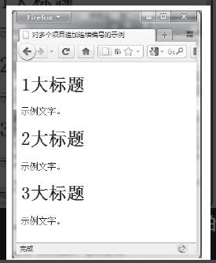
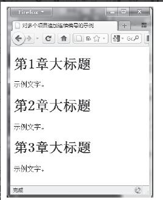
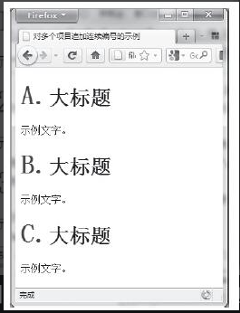
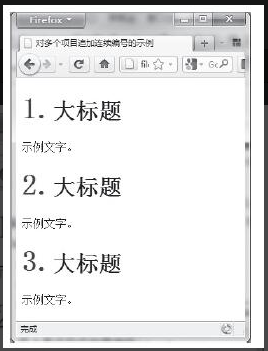
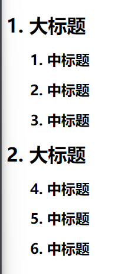
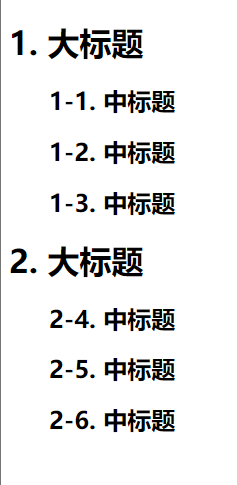
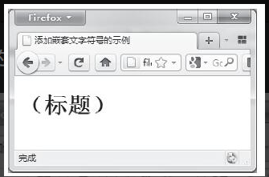

## 使用选择器插入文字

很常用，不赘述

## 插入图像文件

```html
<!DOCTYPE html PUBLIC "-//W3C//DTD XHTML 1.0 Transitional//EN" 
"http://www.w3.org/TR/xhtml1/DTD/xhtml1-transitional.dtd">
<html xmlns="http://www.w3.org/1999/xhtml">
<head>
<meta http-equiv="Content-Type" content="text/html; charset=gb2312" />
<title>使用选择器插入图像文件示例</title>
</head>
<style type="text/css">
h1.new:after{
    content:url(new.gif);
}
</style>
<body>
<h1 class="new">标题A</h1>
<h1 class="new">标题B</h1>
<h1>标题C</h1>
<h1>标题D</h1>
<h1>标题E</h1>
</body>
</html>
```

也可以直接通过background的方式添加图片<span style="color: pink;">（使用浏览器的打印预览时可能图片出不来）</span> 

```css
p::before{
  content: "";
  width: 30px;
  height: 14px;
  display: inline-block;
  background-image: url(../assets/hot@2x.png);
  background-size: cover;
}
```

骚操作（直接将图片的alt属性值作为哦after伪元素的内容显示出来）

```html
<!DOCTYPE html PUBLIC "-//W3C//DTD XHTML 1.0 Transitional//EN" 
"http://www.w3.org/TR/xhtml1/DTD/xhtml1-transitional.dtd">
<html xmlns="http://www.w3.org/1999/xhtml">
<head>
<meta http-equiv="Content-Type" content="text/html; charset=gb2312" />
<title>attr属性值的使用示例</title>
</head>
<style type="text/css">
img:after{
    content:attr(alt);
    display:block;
    text-align:center;
    margin-top:5px;
}
</style>
<body>
<p></p>
</body>
</html>
```

## 使用content属性插入项目编号

知识盲区

### content：counter（计数器名）

```html
<!DOCTYPE html PUBLIC "-//W3C//DTD XHTML 1.0 Transitional//EN" 
"http://www.w3.org/TR/xhtml1/DTD/xhtml1-transitional.dtd">
<html xmlns="http://www.w3.org/1999/xhtml">
<head>
<meta http-equiv="Content-Type" content="text/html; charset=gb2312" />
<title>对多个项目追加连续编号的示例</title>
</head>
<style type="text/css">
h1:before{
    content: counter(mycounter);
}
h1{
    counter-increment: mycounter;
}
</style>
<body>
<h1>大标题</h1>
<p>示例文字。</p>
<h1>大标题</h1>
<p>示例文字。</p>
<h1>大标题</h1>
<p>示例文字。</p>
</body>
</html>
```



```css
h1:before{
  content: '第'counter(mycounter)'章';
}
```



### content：counter（计数器名，编号种类）

```css
h1:before{
  content: counter(mycounter, upper-alpha)'.';
  color:blue;
  font-size:42px;
}
```



```css
h1:before{
  content: counter(mycounter, upper-roman)'.';
  color:blue;
  font-size:42px;
}
```



### 编号嵌套

```html
<!DOCTYPE html PUBLIC "-//W3C//DTD XHTML 1.0 Transitional//EN" 
"http://www.w3.org/TR/xhtml1/DTD/xhtml1-transitional.dtd">
<html xmlns="http://www.w3.org/1999/xhtml">
<head>
<meta http-equiv="Content-Type" content="text/html; charset=gb2312" />
<title>编号嵌套示例</title>
</head>
<style type="text/css">
h1:before{
    content: counter(mycounter) '. ';
}
h1{
    counter-increment: mycounter;
}
h2:before{
    content: counter(subcounter) '. ';
}
h2{
    counter-increment: subcounter;
    margin-left: 40px;
}
</style>
<body>
<h1>大标题</h1>
<h2>中标题</h2>
<h2>中标题</h2>
<h2>中标题</h2>
<h1>大标题</h1>
<h2>中标题</h2>
<h2>中标题</h2>
<h2>中标题</h2>
</body>
</html>
```



可以看到，第二个大标题下面的中标题序号跟之前的连续

可以在h1元素增加 `counter-reset: subcounter` 开启重新编号

<span style="color: pink;">**中编号嵌入大编号**</span>

```css
h2:before{
    content:  counter(mycounter) '-' counter(subcounter) '. ';
}
```



<span style="color: pink;">**字符串两边添加嵌套文字符号**</span>

```html
<!DOCTYPE html PUBLIC "-//W3C//DTD XHTML 1.0 Transitional//EN" 
"http://www.w3.org/TR/xhtml1/DTD/xhtml1-transitional.dtd">
<html xmlns="http://www.w3.org/1999/xhtml">
<head>
<meta http-equiv="Content-Type" content="text/html; charset=gb2312" />
<title>添加嵌套文字符号的示例</title>
</head>
<style type="text/css">
h1:before{
  content: open-quote;
}
h1:after{
  content: close-quote;
}
h1{
  /* "\"" "\"" 引号 */ 
  quotes:"（" "）";
}
</style>
<body>
<h1>标题</h1>
</body>
</html>
```


