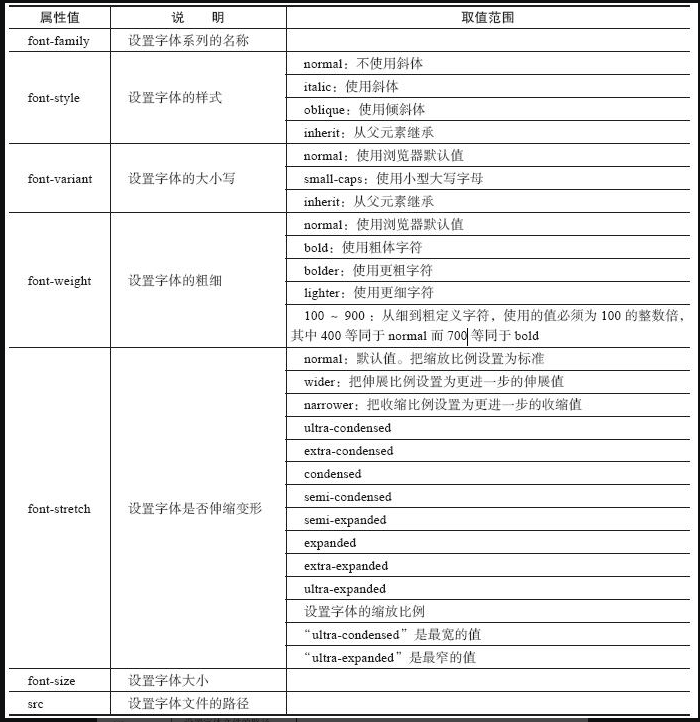
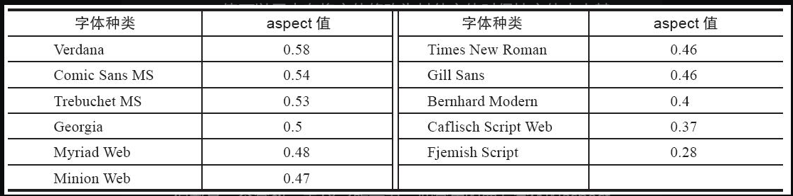

## text-shadow

`text-shadow: x y blur color`

添加多个阴影

```html
<style type="text/css">
div{
        text-shadow: 10px 10px #f39800, 
                  40px 35px #fff100, 
                  70px 60px #c0ff00;
        color: navy;
        font-size: 50px;
        font-weight: bold;
        font-family: 宋体;
}
</style>
```

## word-break

### 浏览器自动换行的规则

* 对于西方文字来说，浏览器会在半角空格或连字符的地方自动换行，而不会在单词的当中突然换行。对于中文来说，可以在任何一个中文字后面进行换行
* 如果中文当中含有西方文字，浏览器也会在半角空格或连字符的地方进行换行，而不会在单词中间强制换行
* 当中文当中含有标点符号的时候，浏览器总是不可能让标点符号位于一行文字的行首，通常将标点符号以及它前面的一个文字作为一个整体来统一换行

### 手动指定

`word-break: normal | keep-all | break-all`

* normal：默认换行规则
* keep-all：只能在半角空格或连字符（` `、`-`）
* break-all：允许单词内换行

当word-break属性使用keep-all参数值时，对于中文来说，只能在半角空格或连字符或任何标点符号的地方换行，中文与中文之间不能换行

当word-break属性使用break-all参数值时，对于西方文字来说，允许在单词内换行

## word-wrap（长单词与URL地址自动换行）

url地址：在URL地址中没有半角空格，所以当URL地址中没有连字符的时候，浏览器在显示时是将其视为一个比较长的单词来进行显示的

`word-wrap: normal | break-word`

使用normal属性值时浏览器保持默认处理，只在半角空格或连字符的地方进行换行（若过长就会横向出现滚动条）。使用break-word时浏览器可在长单词或URL地址内部进行换行。

## 使用webfont

`@font-face` 中可指定的属性



**根据font-style以及font-weight的不同加载不同的服务端字体**

```html
<!DOCTYPE html PUBLIC "-//W3C//DTD XHTML 1.0 Transitional//EN" 
"http://www.w3.org/TR/xhtml1/DTD/xhtml1-transitional.dtd">
<html xmlns="http://www.w3.org/1999/xhtml">
<head>
<meta http-equiv="Content-Type" content="text/html; charset=gb2312"/>
<title>服务器端字体使用粗体与斜体的示例</title>
</head>
<style type="text/css">
@font-face{
    font-family: WebFont;
    src: url('Fontin_Sans_R_45b.otf') format("opentype");
}
@font-face{
    font-family: WebFont;
    font-style: italic;
    src: url('Fontin_Sans_I_45b.otf') format("opentype");
}
@font-face{
    font-family: WebFont;
    font-weight: bold;
    src: url('Fontin_Sans_B_45b.otf') format("opentype");
}
@font-face{
    font-family: WebFont;
    font-style: italic;
    font-weight: bold;
    src: url('Fontin_Sans_BI_45b.otf') format("opentype");
}
div{
    font-family: WebFont;
    font-size: 40px;
}
div#div1
{
    font-style: normal;
    font-weight: normal;
}
div#div2
{
    font-style: italic;
    font-weight: normal;
}
div#div3
{
    font-style: normal;
    font-weight: bold;
}
div#div4
{
    font-weight: bold;
    font-style: italic;
}
</style>
<body>
<div id="div1">Text Sample1</div>
<div id="div2">Text Sample2</div>
<div id="div3">Text Sample3</div>
<div id="div4">Text Sample4</div>
</body>
</html>
```

**加载客户端本地的字体（local）**

```html
<!DOCTYPE html PUBLIC "-//W3C//DTD XHTML 1.0 Transitional//EN"
"http://www.w3.org/TR/xhtml1/DTD/xhtml1-transitional.dtd">
<html xmlns="http://www.w3.org/1999/xhtml">
<head>
<meta http-equiv="Content-Type" content="text/html; charset=gb2312" />
<title>使用@font-face属性显示客户端本地的字体示例</title>
</head>
<style type="text/css">
@font-face{
    font-family: Arial;
    src: local('Arial');
}
@font-face
{
    font-family: Arial;
    font-weight: bold;
    src: local('Arial Black');
}
div{
    font-family: Arial;
    font-size: 40px;
}
div#div1
{
    font-weight: normal;
}
div#div2
{
    font-weight: bold;
}
</style>
<body>
<div id="div1">Text Sample1</div>
<div id="div2">Text Sample2</div>
</body>
</html>
```

**先找本地字体，不存在则加载服务端字体**

```css
@font-face {
    font-family: MyHelvetica;
    src: local("Helvetica Neue"),
    url(MgOpenModernaRegular.ttf);
}
```

## font-size-adjust保持字体种类改变而大小不变



<span style="color: pink;">实际使用过程中，即使不设置 font-size-adjust，只要根据公式能推导出字体大小就好了</span> 

`font-size-adjust：aspect`

计算公式 ：<span style="color: pink;">指定字体大小 = 实际浏览器显示字体大小 / (实际使用字体的aspect / 修改前字体的aspect)</span> 

```html
<!DOCTYPE html PUBLIC "-//W3C//DTD XHTML 1.0 Transitional//EN" 
"http://www.w3.org/TR/xhtml1/DTD/xhtml1-transitional.dtd">
<html xmlns="http://www.w3.org/1999/xhtml">
<head>
<meta http-equiv="Content-Type" content="text/html; charset=gb2312" />
<title>font-size-adjust属性的使用示例</title>
</head>
<style type="text/css">
div#div1{
    font-size: 16px;
    font-family: Comic Sans MS;
    font-size-adjust:0.54;
}
div#div2{
    font-size: 16px;
    font-family: Times New Roman;
    font-size-adjust: 0.46;
}
div#div3{
    font-size: 16px;
    font-family: Times New Roman;
    font-size-adjust: 0.46;
}
</style>
<body>
<div id="div1">
It is fine today. Never change your plans because of the weather.
</div>
<div id="div2">
It is fine today. Never change your plans because of the weather.
</div>
<div id="div3">
It is fine today. Never change your plans because of the weather.
</div>
</body>
</html>
```

将 `div#div2` 更改为字体 `Comic Sans MS`，此时aspect为 `0.54`，所以根据计算公式算出需要设置的字体大小为 `14px`

```css
div#div2{
    font-size: 14px;
    font-family: Comic Sans MS;
    font-size-adjust:0.54;
}
```

## rem单位

主要作用于自适应页面开发（当然也可以选择使用 viewport 单位进行设置）

使用vw自适应h5的项目地址：[`starter-h5`](https://github.com/chinbor/starter-h5)

对了可以参考vant-ui的[`demo`](https://github.com/vant-ui/vant-demo/tree/master/vant)，里面有很多示例工程（rem、vw方案）
