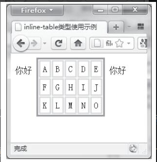
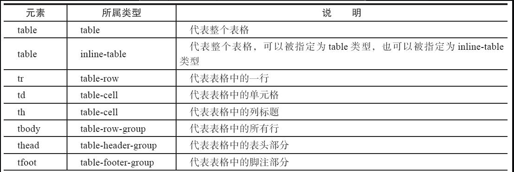
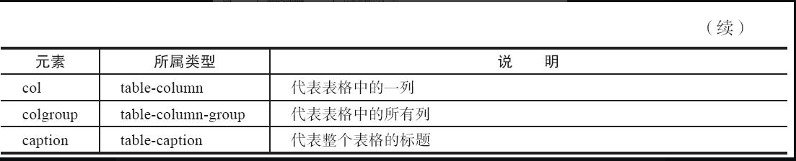
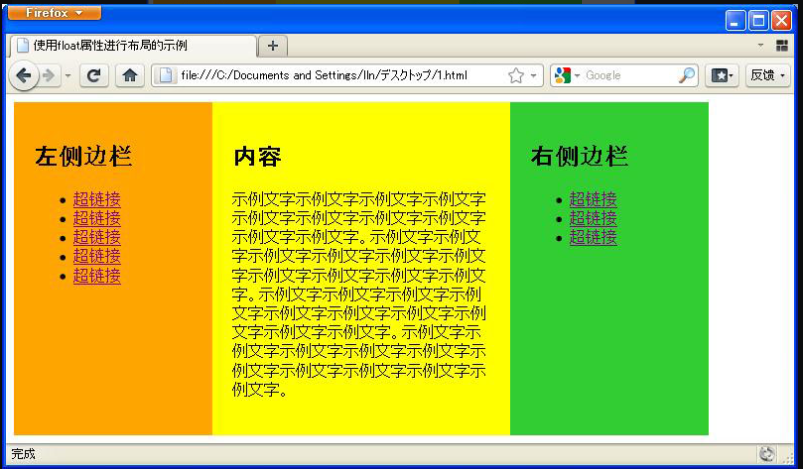

## 盒相关样式

### inline-table

* 表格整体转换为行内块

```html
<!DOCTYPE html PUBLIC "-//W3C//DTD XHTML 1.0 Transitional//EN" 
"http://www.w3.org/TR/xhtml1/DTD/xhtml1-transitional.dtd">
<html xmlns="http://www.w3.org/1999/xhtml">
<head>
<meta http-equiv="Content-Type" content="text/html; charset=gb2312" />
<title>inline-table类型使用示例</title>
<style type="text/css">
table{
        display: inline-table;
        border: solid 3px #00aaff;
}
td{
        border: solid 2px #ccff00;
        padding: 5px;
}
</style>
</head>
<body>
你好
<table>
<tr>
        <td>A</td><td>B</td><td>C</td><td>D</td><td>E</td>
</tr>
<tr>
        <td>F</td><td>G</td><td>H</td><td>I</td><td>J</td>
</tr>
<tr>
        <td>K</td><td>L</td><td>M</td><td>N</td><td>O</td>
</tr>
</table>
你好
</body>
</html>
```



### list-item

* 在display属性中将元素的类型设定为list-item类型，可以将多个元素作为列表来显示，同时在元素的开头加上列表的标记。
* list-style-type可以设置列表的标记为什么形状（circle等）

### run-in类型与compact类型

将元素指定为run-in类型或compact类型时，如果元素后面还有block类型的元素，run-in类型的元素将被包含在后面的block类型的元素内部，而compact类型的元素将被放置在block类型的元素左边。

<span style="color: pink;">但是这个类型存在浏览器兼容性问题。</span>

### 表格相关类型





使用div实现表格

```html
<!DOCTYPE html PUBLIC "-//W3C//DTD XHTML 1.0 Transitional//EN" 
"http://www.w3.org/TR/xhtml1/DTD/xhtml1-transitional.dtd">
<html xmlns="http://www.w3.org/1999/xhtml">
<head>
<meta http-equiv="Content-Type" content="text/html; charset=gb2312" />
<title>CSS3中完整表格的构成示例</title>
<style type="text/css">
.table{
        display: table;
        border: solid 3px #00aaff;
}
.caption{
        display: table-caption;
        text-align: center;
}
.tr{
        display: table-row
}
.td {
        display: table-cell;
        border: solid 2px #aaff00;
        padding: 10px;
}
.thead{
        display: table-header-group;
        background-color: #ffffaa;
}
</style>
</head>
<body>
<div class="table">
    <div class="caption">字母表</div>
    <div class="thead">
        <div class="tr">
            <div class="td">1st</div>
            <div class="td">2nd</div>
            <div class="td">3rd</div>
            <div class="td">4th</div>
            <div class="td">5th</div>
        </div>
    </div>
    <div class="tr">
        <div class="td">A</div>
        <div class="td">B</div>
        <div class="td">C</div>
        <div class="td">D</div>
        <div class="td">E</div>
    </div>
    <div class="tr">
        <div class="td">F</div>
        <div class="td">G</div>
        <div class="td">H</div>
        <div class="td">I</div>
        <div class="td">J</div>
    </div>
</div>
</body>
</html>
```

### 对于盒模型的元素内容溢出省略

单行

```css
<style type="text/css">
div{
  overflow:hidden;
  text-overflow: ellipsis;
  white-space: nowrap; 
  width: 300px;
  border: solid 1px orange;
}
</style>
```

多行

```css
@mixin multi-ellipsis($count: 1) {
  overflow: hidden;
  text-overflow: ellipsis;
  display: -webkit-box;
  -webkit-line-clamp: $count;
  -webkit-box-orient: vertical;
}
```

## 背景与边框相关样式

### background-clip

`默认情况下背景的显示范围是指包括边框在内的范围`，`background-clip`的作用就是修改背景的显示范围

取值：`padding-box`、`border-box`、`content-box`

### background-origin

`默认是从内部补白（padding）区域的左上角开始绘制的，但是可以利用background-origin属性来指定绘制时从边框的左上角开始绘制，或者从内容的左上角开始绘制`

### background-size

* `在使用background-size属性的时候，可以将宽度与高度中的一个参数省略，只指定一个参数。在这种情况下，在浏览器中将该值作为宽度值，auto作为高度值进行处理` 高度auto的意思就是维持图片的宽高比例。
* `也可以将background-size属性值指定为contain关键字，这将把原始图像在维持纵横比的前提下自动放大或缩小，以使原始图像的宽度或高度完全等于元素的宽度或高度`
* `也可以将background-size属性值指定为百分比，在浏览器中将指定的百分比视为图像尺寸除以整个边框区域的尺寸后得出的百分比来处理（就是说背景图的宽度等于边框区域的宽度乘以50%）`
* `将background-size属性值指定为cover关键字，这会使原始图像在维持纵横比的前提下将背景图像自动缩放到填满元素内部，如果元素的长宽比例与原始图像的长宽比例不一致，那么多余部分将被剪去`

### 图像平铺使用的两个属性

`background-repeat`

* space
* round

以上两个属性都不会裁剪掉超过元素尺寸的部分。

### 使用图像边框

关于这里，书里面讲的有点不好。
点击这篇[文章](https://www.zhangxinxu.com/wordpress/2022/02/css-border-image-tap-highlight/)

## 变形处理

transform：`scale` `skew` `rotate` `translate`

`skew`：水平方向跟垂直方向进行倾斜

### 指定变形基准点

`transform-origin`

## css3中的动画

### web animations api

```html
<!DOCTYPE html>
<html>
<head>
<meta http-equiv="Content-Type" content="text/html; charset=gb2312" />
<title>小球在运动过程中不断随机地修改颜色</title>
<style>
#redball {      
    background: red;        
    width: 180px;      
    height: 180px;         
    border-radius: 50%;         
}  
</style>
</head>
<body>
<div id="redball"></div>
<script>
let color1,color2,color3;
function getRandomColor(){ 
    return "#"+("00000"+((Math.random()*16777215+0.5)>>0).toString(16))
    .slice(-6); 
} 
moveBall();
setInterval(function(){
    moveBall();//移动小球
},3000);
function moveBall(){
    let color1=getRandomColor();                //设置颜色变量并赋予随机颜色值
    let color2=getRandomColor();                //设置颜色变量并赋予随机颜色值
    let color3=getRandomColor();                //设置颜色变量并赋予随机颜色值
    document.getElementById('redball').animate([{      
        transform: 'translateX(0px) translateY(0px)',
        background:'red'        
    }, {         
        transform: 'translateX(300px) translateY(0px)',
        background:color1,        
        offset: 0.25      
    }, {         
        transform: 'translateX(300px) translateY(300px)',
        background:color2, 
        offset: 0.5            
    }, {         
        transform: 'translateX(0px) translateY(300px)',
        background:color3, 
        offset: 0.75           
    }, {         
        transform: 'translateX(0px) translateY(0px)',
        background:'red'        
    }], {        
        duration: 3000,             
        easing: 'ease'      
    });
}
</script>
</body>
</html>
```

更多的功能控制

```html
<!DOCTYPE html>
<html>
<head>
<meta http-equiv="Content-Type" content="text/html; charset=gb2312" />
<title>对动画播放进行更多控制</title>
<style>
#redball {      
    background: red;        
    width: 180px;      
    height: 180px;         
    border-radius: 50%;         
}  
</style>
</head>
<body>
<div id="redball"></div><br/>
<input type="button" id="btnCancel" value="放弃播放" />
<input type="button" id="btnReverse" value="回放"/>
<input type="button" id="btnSpeedUp" value="加速播放"/>
<input type="button" id="btnSpeedDown" value="减速播放"/>
<script>
let animate=document.getElementById('redball').animate([{      
    transform: 'translateX(0px) translateY(0px)'      
}, {         
    transform: 'translateX(300px) translateY(0px)',
    offset: 0.2      
}, {         
    transform: 'translateX(300px) translateY(300px)'      
}], {        
    duration: 30000,         
    iterations: Infinity,       
    easing: 'ease'      
});
console.log(animate);
document.getElementById('redball').addEventListener("mouseenter",
function(){
    animate.pause();
},false);
document.getElementById('redball').addEventListener("mouseleave",
function(){
    animate.play();
},false);
document.getElementById('btnCancel').addEventListener("click",
function(){
    animate.cancel();
},false);
function reverse(){
    animate.reverse();
}
function speedUp(){
    animate.playbackRate*=2;
}
function speedDown(){
    animate.playbackRate/=2;
}
</script>
</body>
</html>
```

## 布局相关样式

### 多栏布局

* `column-count`：将元素中的内容分为多栏进行显示
* `column-width`：指定每栏宽度（但是必须元素外面单独设立一个带有指定宽度的容器元素）
* `column-gap`：指定多栏之间的间隔距离
* `column-rule`：栏与栏之间增加间隔线

### 盒布局

```html
<!DOCTYPE html PUBLIC "-//W3C//DTD XHTML 1.0 Transitional//EN" 
"http://www.w3.org/TR/xhtml1/DTD/xhtml1-transitional.dtd">
<html xmlns="http://www.w3.org/1999/xhtml">
<head>
<meta http-equiv="Content-Type" content="text/html;charset=gb2312" />
<title>使用float属性进行布局的示例</title>
<style type="text/css">
#container{
        display: -moz-box;
        display: -webkit-box;
}
#left-sidebar{
        width: 200px;
        padding: 20px;
        background-color: orange;
}
#contents{
        width: 300px;
        padding: 20px;
        background-color: yellow;
}
#right-sidebar{
        width: 200px;
        padding: 20px;
        background-color: limegreen;
}
#left-sidebar, #contents, #right-sidebar{
        box-sizing: border-box;
}
</style>
</head>
<body>
<div id="container">
<div id="left-sidebar">
<h2>左侧边栏</h2>
<ul>
<li><a href="">超链接</a></li>
<li><a href="">超链接</a></li>
<li><a href="">超链接</a></li>
<li><a href="">超链接</a></li>
<li><a href="">超链接</a></li>
</ul>
</div>
<div id="contents">
<h2>内容</h2>
<p>示例文字示例文字示例文字示例文字示例文字示例文字示例文字示例文字示
例文字示例文字。示例文字示例文字示例文字示例文字示例文字示例文字示例文
字示例文字示例文字示例文字。示例文字示例文字示例文字示例文字示例文字示
例文字示例文字示例文字示例文字示例文字。示例文字示例文字示例文字示例文
字示例文字示例文字示例文字示例文字示例文字示例文字。</p>
</div>
<div id="right-sidebar">
<h2>右侧边栏</h2>
<ul>
<li><a href="">超链接</a></li>
<li><a href="">超链接</a></li>
<li><a href="">超链接</a></li>
</ul>
</div>
</div>
</body>
</html>
```

显示效果



可以看到将每一个块的底部都对齐了（且块元素具备了inline的特性）

### <span style="color: pink;">弹性盒布局——flex</span> 

[flex布局](https://www.yuque.com/docs/share/3f65b679-7d0c-4a3e-b73c-8af6f1708071?#)

### <span style="color: pink;">网格布局——grid</span> 

[grid布局](https://www.yuque.com/docs/share/ffe7d512-6d21-45ec-81e2-7c962dab3c36?#)
