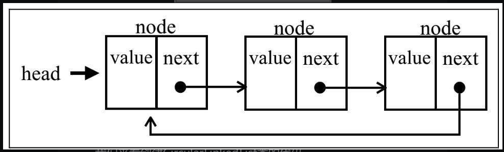
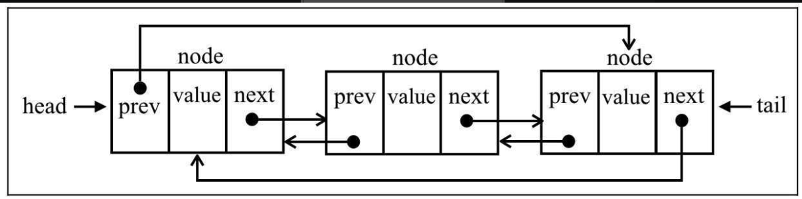

## 链表

> 链表的变种：双向链表、循环链表、有序链表<br />对比于数组来说，好处就是添加或移除元素无需对原有元素进行移动

### 数据结构实现

#### 链表

节点类

```ts
export class Node<T> {
  constructor(public element: T, public next?: Node<T>) {}
}
```

默认的相等判断函数及类型定义

```ts
export type IEqualsFunction<T> = (a: T, b: T) => boolean

export function defaultEquals<T>(a: T, b: T): boolean {
  return a === b
}
```

链表类

```ts
export class LinkdeList<T> {
  // 长度统计
  protected count = 0
  // 头指针
  protected head: Node<T> | undefined

  // equalsFn是自己定义的判断两个元素是否相等的方法（因为元素的类型是变化的，所以判断相等的方法需要自己编写）
  constructor(protected equalsFn: IEqualsFunction<T> = defaultEquals) {}

  // 链表尾部添加元素
  push(ele: T) {
    const node = new Node(ele)

    let current

    // 链表为空的时候
    if (this.head == null) {
      this.head = node
    }
    else {
      current = this.head

      while (current.next)
        current = current.next

      current.next = node
    }

    this.count++
  }

  getElementAt(index: number) {
    if (index >= 0 && index <= this.count) {
      let node = this.head

      for (let i = 0; i < index && node != null; i++)
        node = node.next

      return node
    }

    return undefined
  }

  removeAt(index: number) {
    if (index >= 0 && index < this.count) {
      let current = this.head

      // 移除第一项（注意头指针只会在移除第一项的时候发生变化，指向下一个节点）
      if (index === 0) { this.head = current?.next }
      else {
        // 获取当前索引的前一个索引元素
        const previous = this.getElementAt(index - 1)
        // 当前指向previous的下一个
        current = previous?.next
        // 切除中间的元素
        previous!.next = current?.next
      }

      // 计数减一并返回当前元素
      this.count--
      return current?.element
    }

    // 不合法时返回undefined
    return undefined
  }

  insert(ele: T, index: number) {
    if (index >= 0 && index <= this.count) {
      const node = new Node(ele)

      if (index === 0) {
        const current = this.head
        node.next = current
        this.head = node
      }
      else {
        const previous = this.getElementAt(index - 1)
        const current = previous?.next
        node.next = current
        previous!.next = node
      }

      this.count++
      return true
    }

    return false
  }

  indexOf(ele: T) {
    let current = this.head

    for (let i = 0; i < this.count && current != null; i++) {
      if (this.equalsFn(ele, current.element))
        return i

      current = current.next
    }

    return -1
  }

  remove(ele: T) {
    const index = this.indexOf(ele)
    return this.removeAt(index)
  }

  size() {
    return this.count
  }

  isEmpty() {
    return this.size() === 0
  }

  getHead() {
    return this.head
  }

  clear() {
    this.head = undefined
    this.count = 0
  }

  toString() {
    if (this.head == null)
      return ''

    let objString = `${this.head.element}`
    let current = this.head.next
    for (let i = 1; i < this.size() && current != null; i++) {
      objString = `${objString},${current.element}`
      current = current.next
    }
    return objString
  }
}
```

* 核心方法`push` `getElementAt` `removeAt` `insert`

#### 双向链表

节点类

```ts
export class DoublyNode<T> extends Node<T> {
  constructor(
    public element: T,
    public next?: DoublyNode<T>,
    public prev?: DoublyNode<T>,
  ) {
    super(element, next)
  }
}
```

默认的相等判断函数及类型定义

```ts
export type IEqualsFunction<T> = (a: T, b: T) => boolean

export function defaultEquals<T>(a: T, b: T): boolean {
  return a === b
}
```

双向链表类

```ts
export class DoublyLinkedList<T> extends LinkdeList<T> {
  protected head: DoublyNode<T> | undefined
  protected tail: DoublyNode<T> | undefined

  constructor(protected equalsFn: IEqualsFunction<T> = defaultEquals) {
    super(equalsFn)
  }

  push(ele: T) {
    const node = new DoublyNode(ele)

    // 为空链表
    if (this.head == null) {
      this.head = node
      this.tail = node
    }
    else {
      this.tail!.next = node
      node.prev = this.tail
      this.tail = node
    }

    this.count++
  }

  insert(ele: T, index: number) {
    if (index >= 0 && index <= this.count) {
      const node = new DoublyNode(ele)

      let current = this.head

      // 尾 HEAD <-> B
      if (index === 0) {
        if (this.head == null) {
          this.head = node
          this.tail = node
        }
        else {
          node.next = current
          current!.prev = node
          this.head = node
        }
      }
      // 尾 B <-> TAIL
      else if (index === this.count) {
        current = this.tail
        current!.next = node
        node.prev = current
        this.tail = node
      }
      // 中间 A <-> B <-> C
      else {
        const previous = this.getElementAt(index - 1)
        current = previous?.next
        node.next = current
        previous!.next = node
        current!.prev = node
        node.prev = previous
      }

      this.count++
      return true
    }

    return false
  }

  removeAt(index: number) {
    if (index >= 0 && index < this.count) {
      let current = this.head

      // 头
      if (index === 0) {
        this.head = this.head?.next

        if (this.count === 1)
          this.tail = undefined

        else
          this.head!.prev = undefined
      }
      // 尾
      else if (index === this.count - 1) {
        current = this.tail
        this.tail = current?.prev
        this.tail!.next = undefined
      }
      // 中间
      else {
        current = this.getElementAt(index)
        const previous = current?.prev
        previous!.next = current?.next
        current!.next!.prev = previous
      }

      this.count--
      return current!.element
    }

    return undefined
  }

  indexOf(ele: T) {
    let current = this.head
    let index = 0

    while (current) {
      if (this.equalsFn(ele, current.element))
        return index
      index++
      current = current.next
    }

    return -1
  }

  getHead() {
    return this.head
  }

  getTail() {
    return this.tail
  }

  clear() {
    super.clear()
    this.tail = undefined
  }

  toString() {
    if (this.head == null)
      return ''

    let objString = `${this.head.element}`
    let current = this.head.next
    while (current != null) {
      objString = `${objString},${current.element}`
      current = current.next
    }
    return objString
  }

  inverseToString() {
    if (this.tail == null)
      return ''

    let objString = `${this.tail.element}`
    let previous = this.tail.prev
    while (previous != null) {
      objString = `${objString},${previous.element}`
      previous = previous.prev
    }
    return objString
  }
}
```

#### 循环链表

循环链表存在两种，单向循环链表以及双向循环链表

单向：


```ts
export class CircularLinkedList<T> extends LinkdeList<T> {
  constructor(protected equalsFn: IEqualsFunction<T> = defaultEquals) {
    super(equalsFn)
  }

  push(ele: T) {
    const node = new Node(ele)
    let current

    if (this.head == null) {
      this.head = node
    }
    else {
      current = this.getElementAt(this.size() - 1)
      current!.next = node
    }

    node.next = this.head
    this.count++
  }

  insert(ele: T, index: number): boolean {
    if (index >= 0 && index <= this.count) {
      const node = new Node(ele)
      let current = this.head

      // 头部插入
      if (index === 0) {
        // 空的链表
        if (this.head == null) {
          this.head = node
          node.next = this.head
        }
        // 非空链表
        else {
          node.next = current
          // 最后一个节点
          current = this.getElementAt(this.size() - 1)
          this.head = node
          current!.next = this.head
        }
      }
      // 其余位置插入
      else {
        const previous = this.getElementAt(index - 1)
        node.next = previous?.next
        previous!.next = node
      }

      this.count++
      return true
    }

    return false
  }

  removeAt(index: number): T | undefined {
    if (index >= 0 && index < this.count) {
      let current = this.head

      // 删除第一个元素
      if (index === 0) {
        // 仅仅存在一个元素
        if (this.size() === 1) {
          this.head = undefined
        }
        else {
          const removed = this.head
          current = this.getElementAt(this.size() - 1)
          this.head = this.head?.next
          current!.next = this.head
          current = removed
        }
      }
      // 删除其余位置的元素
      else {
        const previous = this.getElementAt(index - 1)
        current = previous?.next
        previous!.next = current?.next
      }

      this.count--
      return current?.element
    }

    return undefined
  }
}
```

双向：


😂代码实现略过（不是偷懒只是觉得将更多精力投入到后面的学习更重要）

#### 有序链表

默认比较函数以及类型和枚举变量

```ts
export type ICompareFunction<T> = (a: T, b: T) => number

export enum Compare {
  LESS_THAN = -1,
  BIGGER_THAN = 1,
  EQUALS = 0,
}

export function defaultCompare<T>(a: T, b: T): number {
  if (a === b)
    return Compare.EQUALS

  return a < b ? Compare.LESS_THAN : Compare.BIGGER_THAN
}
```

有序链表

```ts
export class SortedLinkedList<T> extends LinkdeList<T> {
  constructor(
    protected equalsFn: IEqualsFunction<T> = defaultEquals,
    protected compareFn: ICompareFunction<T> = defaultCompare,
  ) {
    super(equalsFn)
  }

  private getIndexNextSortedElement(ele: T) {
    let current = this.head
    let i = 0

    for (; i < this.size() && current; i++) {
      const comp = this.compareFn(ele, current.element)
      // NOTE: 这里的顺序是小到大（可以改变这里的枚举值改变排序顺序）
      if (comp === Compare.LESS_THAN)
        return i

      current = current.next
    }

    return i
  }

  push(ele: T): void {
    if (this.isEmpty()) {
      super.push(ele)
    }
    else {
      const index = this.getIndexNextSortedElement(ele)
      super.insert(ele, index)
    }
  }

  insert(ele: T, index: number): boolean {
    if (this.isEmpty())
      return super.insert(ele, index)

    index = this.getIndexNextSortedElement(ele)
    return super.insert(ele, index)
  }
}
```

### 应用示例

#### 使用双向链表实现栈

<span style="color: pink;">为什么使用双向链表而不是普通链表？</span> 尾部的插入以及删除操作不需要循环链表中的元素，因为tail指针记录了对应的位置，只需操作tail指针就好了（时间复杂度 O(1)）

```ts
export class Stack<T> {
  private items: DoublyLinkedList<T>

  constructor() {
    this.items = new DoublyLinkedList<T>()
  }

  push(element: T) {
    this.items.push(element)
  }

  pop() {
    if (this.isEmpty())
      return undefined

    const result = this.items.removeAt(this.size() - 1)
    return result
  }

  peek() {
    if (this.isEmpty())
      return undefined

    return this.items.getTail()?.element
  }

  isEmpty() {
    return this.items.isEmpty()
  }

  size() {
    return this.items.size()
  }

  clear() {
    this.items.clear()
  }

  toString() {
    return this.items.toString()
  }
}
```
