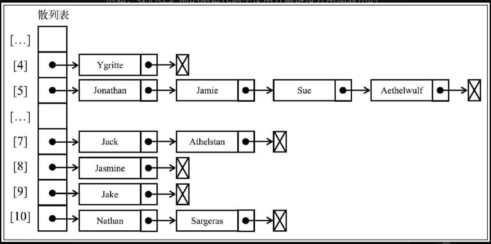
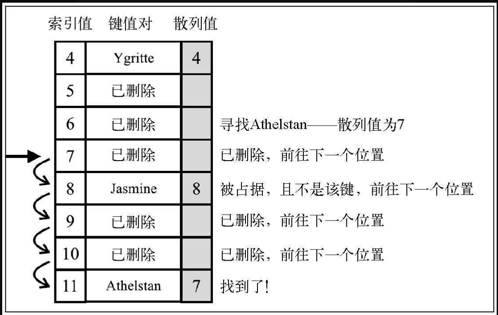
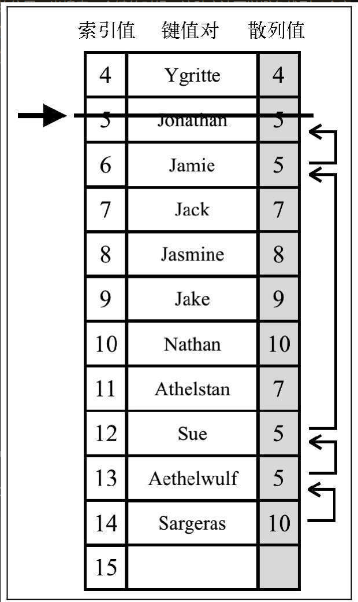

## 字典和散列表

### 字典

* `obj[toStrFn(key)] = value`

```ts
export function defaultToString(item: any): string {
  if (item === null)
    return 'NULL'

  else if (item === undefined)
    return 'UNDEFINED'

  else if (typeof item === 'string' || item instanceof String)
    return `${item}`

  return item.toString()
}

export class ValuePair<K, V> {
  constructor(public key: K, public value: V) {}

  toString() {
    return `[#${this.key}: ${this.value}]`
  }
}

export class Dictionary<K, V> {
  private table: { [key: string]: ValuePair<K, V> }

  constructor(private toStrFn: (key: K) => string = defaultToString) {
    this.table = {}
  }

  hasKey(key: K) {
    return this.table[this.toStrFn(key)] != null
  }

  set(key: K, value: V) {
    if (key != null && value != null) {
      const tableKey = this.toStrFn(key)
      this.table[tableKey] = new ValuePair(key, value)
      return true
    }

    return false
  }

  remove(key: K) {
    if (this.hasKey(key)) {
      delete this.table[this.toStrFn(key)]
      return true
    }

    return false
  }

  get(key: K) {
    const valuePair = this.table[this.toStrFn(key)]
    return valuePair == null ? undefined : valuePair.value
  }

  keyValues() {
    return Object.values(this.table)
  }

  keys() {
    return this.keyValues().map(valuePair => valuePair.key)
  }

  values() {
    return this.keyValues().map(valuePair => valuePair.value)
  }

  forEach(cb: (key: K, value: V) => any) {
    const valuePairs = this.keyValues()

    for (let i = 0; i < valuePairs.length; i++) {
      const result = cb(valuePairs[i].key, valuePairs[i].value)
      if (result === false)
        break
    }
  }

  size() {
    return Object.keys(this.table).length
  }

  isEmpty() {
    return this.size() === 0
  }

  clear() {
    this.table = {}
  }

  toString() {
    if (this.isEmpty())
      return ''

    const valuePairs = this.keyValues()

    let objString = `${valuePairs[0].toString()}`

    for (let i = 0; i < valuePairs.length; i++)
      objString = `${objString}, ${valuePairs[i].toString()}`

    return objString
  }
}

```

### 散列表

#### 数据结构

* 与字典的区别就是 key 通过`散列函数`转换为了 hashCode `obj[hashCode] = value`

```ts
import { ValuePair, defaultToString } from './dictionary'

// NOTE: 会存在hash冲突！！（因为生成hashCode的方法是依据字符ascii编码累加除去37取余数，所以后者会覆盖前者）
export default class HashTable<K, V> {
  protected table: { [key: string]: ValuePair<K, V> }

  constructor(protected toStrFn: (key: K) => string = defaultToString) {
    this.table = {}
  }

  // 散列函数
  private loseloseHashCode(key: K) {
    if (typeof key === 'number')
      return key

    const tableKey = this.toStrFn(key)
    let hash = 0
    for (let i = 0; i < tableKey.length; i++)
      hash += tableKey.charCodeAt(i)

    return hash % 37
  }

  hashCode(key: K) {
    return this.loseloseHashCode(key)
  }

  put(key: K, value: V) {
    if (key != null && value != null) {
      const position = this.hashCode(key)
      this.table[position] = new ValuePair(key, value)
      return true
    }
    return false
  }

  get(key: K) {
    const valuePair = this.table[this.hashCode(key)]
    return valuePair == null ? undefined : valuePair.value
  }

  remove(key: K) {
    const hash = this.hashCode(key)
    const valuePair = this.table[hash]
    if (valuePair != null) {
      delete this.table[hash]
      return true
    }
    return false
  }

  getTable() {
    return this.table
  }

  isEmpty() {
    return this.size() === 0
  }

  size() {
    return Object.keys(this.table).length
  }

  clear() {
    this.table = {}
  }

  toString() {
    if (this.isEmpty())
      return ''

    const keys = Object.keys(this.table)
    let objString = `{${keys[0]} => ${this.table[keys[0]].toString()}}`
    for (let i = 1; i < keys.length; i++)
      objString = `${objString},{${keys[i]} => ${this.table[keys[i]].toString()}}`

    return objString
  }
}

```

* 存在一个问题：hash冲突（因为生成的hashCode是依据字符串的ascii编码累加除去37取余得到的，那么key会被覆盖！！）
* 解决hash冲突办法有 `分离链接` `线性探查` `双散列法`

#### 分离链接



* `value` 使用 链表进行存储
* <span style="color: red;">存在一个问题就是同名的key在添加的过程中hashCode相等。并不是覆盖前者而是链表中往后链接（可以改写链表的equalsFn函数，从而只判断ValuePair.key是否相等，在往hash表put的过程中需要判断是否链表中存在同key的元素，存在则更新value值）</span>

```ts
import { LinkdeList as LinkedList } from './linkedList'
import { ValuePair, defaultToString } from './dictionary'

export default class HashTableSeparateChaining<K, V> {
  protected table: { [key: string]: LinkedList<ValuePair<K, V>> }

  constructor(protected toStrFn: (key: K) => string = defaultToString) {
    this.table = {}
  }

  private loseloseHashCode(key: K) {
    if (typeof key === 'number')
      return key

    const tableKey = this.toStrFn(key)
    let hash = 0
    for (let i = 0; i < tableKey.length; i++)
      hash += tableKey.charCodeAt(i)

    return hash % 37
  }

  hashCode(key: K) {
    return this.loseloseHashCode(key)
  }

  put(key: K, value: V) {
    if (key != null && value != null) {
      const position = this.hashCode(key)

      if (this.table[position] == null)
        this.table[position] = new LinkedList<ValuePair<K, V>>()

      // BUG: 判断链表是否存在同key的节点，存在直接更新value就好了
      this.table[position].push(new ValuePair(key, value))
      return true
    }
    return false
  }

  get(key: K) {
    const position = this.hashCode(key)
    const linkedList = this.table[position]
    if (linkedList != null && !linkedList.isEmpty()) {
      let current = linkedList.getHead()
      while (current != null) {
        if (current.element.key === key)
          return current.element.value

        current = current.next
      }
    }
    return undefined
  }

  remove(key: K) {
    const position = this.hashCode(key)
    const linkedList = this.table[position]
    if (linkedList != null && !linkedList.isEmpty()) {
      let current = linkedList.getHead()
      while (current != null) {
        if (current.element.key === key) {
          linkedList.remove(current.element)
          if (linkedList.isEmpty())
            delete this.table[position]

          return true
        }
        current = current.next
      }
    }
    return false
  }

  isEmpty() {
    return this.size() === 0
  }

  size() {
    let count = 0
    Object.values(this.table).forEach(linkedList => count += linkedList.size())
    return count
  }

  clear() {
    this.table = {}
  }

  getTable() {
    return this.table
  }

  toString() {
    if (this.isEmpty())
      return ''

    const keys = Object.keys(this.table)
    let objString = `{${keys[0]} => ${this.table[keys[0]].toString()}}`
    for (let i = 1; i < keys.length; i++) {
      objString = `${objString},{${keys[i]} => ${this.table[
        keys[i]
      ].toString()}}`
    }
    return objString
  }
}

```

#### <span style="color: pink;">线性探查</span> 

* 处理冲突的方法是将元素直接存储到表中，而不是在单独的数据结构中
* 向表中某个位置（hashCode为索引）添加一个新元素的时候，如果索引为position的位置已经被占据了，就尝试position+1的位置。如果position+1的位置也被占据了，就尝试position+2的位置，以此类推，直到在散列表中找到一个空闲的位置

两种方法：软删除跟空位元素移动的方法<span style="color: red;">软删除在对元素的搜索过程（get）中性能较差，因为空位置存在，只不过使用标识进行假删除，空位元素移动的方法对元素的删除（remove）来说性能较差，因为不仅仅需要找到元素还需要移动元素！！</span> 

**软删除**

```ts
import { ValuePair, defaultToString } from './dictionary'

export class ValuePairLazy<K, V> extends ValuePair<K, V> {
  constructor(public key: K, public value: V, public isDeleted = false) {
    super(key, value)
  }
}

export default class HashTableLinearProbingLazy<K, V> {
  protected table: { [key: string]: ValuePairLazy<K, V> }

  constructor(protected toStrFn: (key: K) => string = defaultToString) {
    this.table = {}
  }

  private loseloseHashCode(key: K) {
    if (typeof key === 'number')
      return key

    const tableKey = this.toStrFn(key)
    let hash = 0
    for (let i = 0; i < tableKey.length; i++)
      hash += tableKey.charCodeAt(i)

    return hash % 37
  }

  hashCode(key: K) {
    return this.loseloseHashCode(key)
  }

  put(key: K, value: V) {
    if (key != null && value != null) {
      const position = this.hashCode(key)

      if (
        this.table[position] == null
        || (this.table[position] != null && this.table[position].isDeleted)
      ) {
        this.table[position] = new ValuePairLazy(key, value)
      }
      else {
        let index = position + 1
        while (this.table[index] != null && !this.table[position].isDeleted)
          index++

        this.table[index] = new ValuePairLazy(key, value)
      }
      return true
    }
    return false
  }

  get(key: K) {
    const position = this.hashCode(key)

    if (this.table[position] != null) {
      if (this.table[position].key === key && !this.table[position].isDeleted)
        return this.table[position].value

      let index = position + 1
      while (
        this.table[index] != null
        && (this.table[index].key !== key || this.table[index].isDeleted)
      ) {
        if (this.table[index].key === key && this.table[index].isDeleted)
          return undefined

        index++
      }
      if (
        this.table[index] != null
        && this.table[index].key === key
        && !this.table[index].isDeleted
      )
        return this.table[position].value
    }
    return undefined
  }

  remove(key: K) {
    const position = this.hashCode(key)

    if (this.table[position] != null) {
      if (this.table[position].key === key && !this.table[position].isDeleted) {
        this.table[position].isDeleted = true
        return true
      }
      let index = position + 1
      while (
        this.table[index] != null
        && (this.table[index].key !== key || this.table[index].isDeleted)
      )
        index++

      if (
        this.table[index] != null
        && this.table[index].key === key
        && !this.table[index].isDeleted
      ) {
        this.table[index].isDeleted = true
        return true
      }
    }
    return false
  }

  isEmpty() {
    return this.size() === 0
  }

  size() {
    let count = 0
    Object.values(this.table).forEach((valuePair) => {
      count += valuePair.isDeleted === true ? 0 : 1
    })
    return count
  }

  clear() {
    this.table = {}
  }

  getTable() {
    return this.table
  }

  toString() {
    if (this.isEmpty())
      return ''

    const keys = Object.keys(this.table)
    let objString = `{${keys[0]} => ${this.table[keys[0]].toString()}}`
    for (let i = 1; i < keys.length; i++) {
      objString = `${objString},{${keys[i]} => ${this.table[
        keys[i]
      ].toString()}}`
    }
    return objString
  }
}
```



**移动后续元素**

```ts
import { ValuePair, defaultToString } from './dictionary'

export default class HashTableLinearProbing<K, V> {
  protected table: { [key: string]: ValuePair<K, V> }

  constructor(protected toStrFn: (key: K) => string = defaultToString) {
    this.table = {}
  }

  private loseloseHashCode(key: K) {
    if (typeof key === 'number')
      return key

    const tableKey = this.toStrFn(key)
    let hash = 0
    for (let i = 0; i < tableKey.length; i++)
      hash += tableKey.charCodeAt(i)

    return hash % 37
  }

  hashCode(key: K) {
    return this.loseloseHashCode(key)
  }

  put(key: K, value: V) {
    if (key != null && value != null) {
      const position = this.hashCode(key)

      if (this.table[position] == null) {
        this.table[position] = new ValuePair(key, value)
      }
      else {
        let index = position + 1
        while (this.table[index] != null)
          index++

        this.table[index] = new ValuePair(key, value)
      }
      return true
    }
    return false
  }

  get(key: K) {
    const position = this.hashCode(key)

    if (this.table[position] != null) {
      if (this.table[position].key === key)
        return this.table[position].value

      let index = position + 1
      while (this.table[index] != null && this.table[index].key !== key)
        index++

      if (this.table[index] != null && this.table[index].key === key)
        return this.table[position].value
    }
    return undefined
  }

  remove(key: K) {
    const position = this.hashCode(key)

    if (this.table[position] != null) {
      if (this.table[position].key === key) {
        delete this.table[position]
        this.verifyRemoveSideEffect(key, position)
        return true
      }
      let index = position + 1
      while (this.table[index] != null && this.table[index].key !== key)
        index++

      if (this.table[index] != null && this.table[index].key === key) {
        delete this.table[index]
        this.verifyRemoveSideEffect(key, index)
        return true
      }
    }
    return false
  }

  private verifyRemoveSideEffect(key: K, removedPosition: number) {
    const hash = this.hashCode(key)
    let index = removedPosition + 1
    while (this.table[index] != null) {
      const posHash = this.hashCode(this.table[index].key)
      if (posHash <= hash || posHash <= removedPosition) {
        this.table[removedPosition] = this.table[index]
        delete this.table[index]
        removedPosition = index
      }
      index++
    }
  }

  isEmpty() {
    return this.size() === 0
  }

  size() {
    return Object.keys(this.table).length
  }

  clear() {
    this.table = {}
  }

  getTable() {
    return this.table
  }

  toString() {
    if (this.isEmpty())
      return ''

    const keys = Object.keys(this.table)
    let objString = `{${keys[0]} => ${this.table[keys[0]].toString()}}`
    for (let i = 1; i < keys.length; i++) {
      objString = `${objString},{${keys[i]} => ${this.table[
        keys[i]
      ].toString()}}`
    }
    return objString
  }
}
```



<span style="color: red;">根据图示理解其中的删除操作</span> 

#### 更好的散列函数

应该具备两点

* 较低的冲突可能性
* 插入和检索元素的时间（散列表操作元素包含删除、插入以及检索，每一个操作都需要通过将`key`转换为`hashCode`）

```ts
private djb2HashCode(key: K) {
  const tableKey = this.toStrFn(key);
  let hash = 5381;
  for (let i = 0; i < tableKey.length; i++) {
    hash = (hash * 33) + tableKey.charCodeAt(i);
  }
  return hash % 1013;
}
```

这个函数对于第二点跟前面的 `loseloseHashCode`函数无区别，但是第一点却是提高了

## weakMap、weakSet

[点我了解](https://zh.javascript.info/weakmap-weakset)

* 键或元素只能是对象（键是对map而言，元素是对set而言）
* 对象被释放（`=null`），那么引用的键值都被释放

```ts
let john = { name: "John" };

let weakMap = new WeakMap();
weakMap.set(john, "...");

john = null; // 覆盖引用

// john 被从内存中删除了！
```
