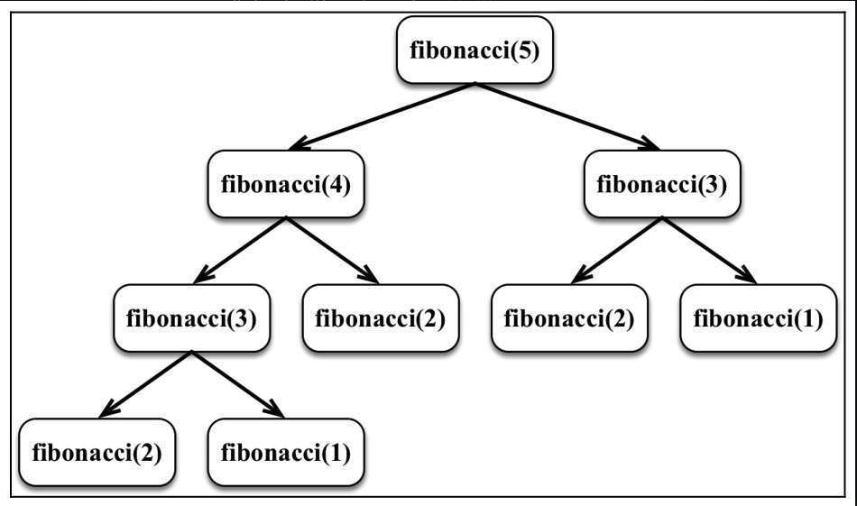

## 递归

> 对于图数据结构以及树数据结构，很依赖于递归函数！！

### 定义

<span style="color: pink;">要理解递归，首先要理解递归。——佚名</span>

* 直接调用自身或间接调用自身。
* 每个递归函数都必须有基线条件，即一个不再递归调用的条件（停止点），以防止无限递归。

那句名言的代码实现

```ts
function understandRecursion(doIunderstandRecursion) {
  const recursionAnswer = confirm('Do you understand recursion? ');
  if (recursionAnswer === true) { // 基线条件或停止点
    return true;
  }
  understandRecursion(recursionAnswer); // 递归调用
}
```

### 经典递归算法

#### 阶乘

f(5) = 5 * f(4)

f(5) = 5 * (4 * f(3))

f(5) = 5 * (4 * (3 * f(2)))

f(5) = 5 * (4 * (3 * (2 * f(1))))

f(5) = 5 * (4 * (3 * (2 * (1))))

1! = 1 * 0!, 0! = 1 推出 1! = 1

```ts
export function factorial(n: number): number | undefined {
  if (n < 0)
    return undefined

  if (n === 1 || n === 0)
    return 1

  return n * factorial(n - 1)!
}
```

#### 斐波拉契数列

0 1 1 2 3 5 8 13 21 34 ....

位置0的斐波那契数是零。

❑ 位置1和2的斐波那契数是1。

❑ 位置n（此处n > 2）的斐波那契数是位置（n -1）的斐波那契数加上位置（n -2）的斐波那契数。

```ts
export function fibonacci(n: number): number {
  if (n < 1)
    return 0 // {1}
  if (n <= 2)
    return 1 // {2}
  return fibonacci(n - 1) + fibonacci(n - 2) // {3}
}
```

分析位置5的斐波拉契数如图



<span style="color: pink;">记忆化斐波拉契数</span>

```ts
export function fibonacciMemoization(n: number) {
  if (n < 1)
    return 0
  const memo = [0, 1]
  const fibonacciMem = (num: number): number => {
    if (memo[num] != null)
      return memo[num]
    return (memo[num] = fibonacciMem(num - 1) + fibonacciMem(num - 2))
  }
  return fibonacciMem(n)
}
```

这段代码好于前者的地方在于之前我们计算位置 5的时候，其实很多的计算结果没有进行缓存，也就是 f(5) = f(4) + f(3)，f(4) = f(3) + f(2)，可以发现f(3)其实是重复执行了的，如果我们能够利用memo数组将第一次执行的结果缓存，后面直接获取缓存好的值那么当我们计算位置很大的斐波拉契数，此时可以节省很多额计算资源！！

对于递归由于会存在很多函数的调用栈极大的浪费内存空间，所以可以采取[尾调用优化](https://www.ruanyifeng.com/blog/2015/04/tail-call.html)的手段进行调用栈的删减

（调用位置以及变量都不再引用到了，外层函数直接return，同时外层函数的变量都传递给了内层函数！！）

#### 汉诺塔

<span style="color: pink;">这个理解起来最复杂！！</span> 

[汉诺塔代码实现](./102001.md)
