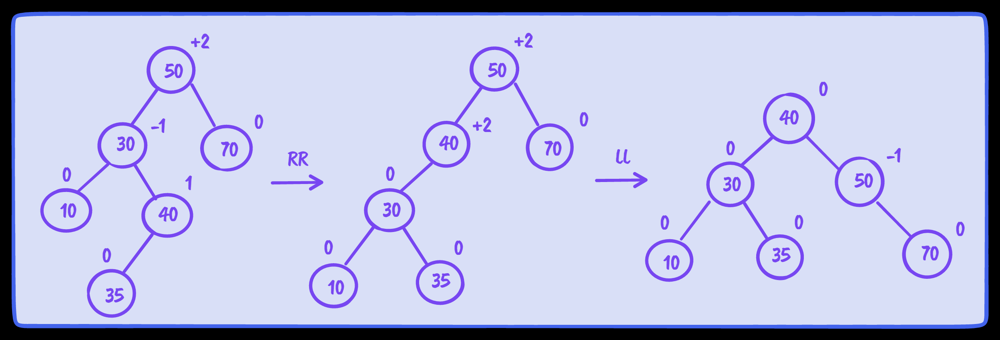

## 树

### 一些专用名词

深度：节点的深度取决于它的祖先节点的数量

树的高度：根节点表示第0层，其子节点为第1层，最高层也就是最底辈的孙子节点所在位置的层数即为树的高度

子树：子树由节点和它的后代构成

内部节点：至少有一个子节点的节点

外部节点：没有子节点的节点（叶子节点）

二叉树：节点最多只能有两个子节点：一个是左侧子节点，另一个是右侧子节点

二叉搜索树（BST）：归属于二叉树分类中，左侧子节点存储比父节点小的值，右侧子节点存储比父节点大的值（<span style="color: pink;">注意，一定是左边的所有节点都小于右侧的节点，所以最小的值就是最左边的节点，最大的值就是最右边的节点</span>），下图就是一颗BST


BST存在一个问题就是树的一条边可能会非常深；也就是说，树的一条分支会有很多层，而其他的分支却只有几层，这个时候在某条边添加、移除、搜索某个节点时会引起一些性能问题，所以引出了自平衡二叉搜索树（AVL）


自平衡二叉搜索树（AVL）：任何一个节点左右两侧子树的高度之差最多为1

### 实现二叉搜索树的一些常用方法

* insert(key)
* search(key)
* inOrderTraverse()：中序遍历
* preOrderTraverse()：先序遍历
* postOrderTraverse()：后序遍历
* min()
* max()
* remove(key)

#### insert方法

* 根节点是否为空
* 根节点非空且插入值小于节点值，那么新增节点插入左侧，否则新增节点插入右侧
* 左右侧节点插入过程中也需要判断是否左右侧节点为空，非空的情况下递归进行循环操作

```ts
insert(key: T) {
  if (this.root == null)
    this.root = new Node(key)
  else
    this.insertNode(this.root, key)
}

protected insertNode(node: Node<T>, key: T) {
  // 小于插入左侧
  if (this.compareFn(key, node.key) === Compare.LESS_THAN) {
    if (node.left == null)
      node.left = new Node(key)

    else
      this.insertNode(node.left, key)
  }
  // 大于或等于插入右侧（但是等于这个情况不合理）
  else {
    if (node.right == null)
      node.right = new Node(key)

    else
      this.insertNode(node.right, key)
  }
}
```

#### 先中后序遍历

* 都是从根节点出发
* 中序：左（子节点）->中（父节点）->右（子节点）

<small style="text-align: center; display: inline-block; width: 100%;">3 5 6 7 8 9 10 11 12 13 14 15 18 20 25</small>
* 先序：中（父节点）->左（子节点）->右（子节点）

<small style="text-align: center; display: inline-block; width: 100%;">11 7 5 3 6 9 8 10 15 13 12 14 20 18 25</small>
* 后序：左（子节点）->右（子节点）->中（父节点）

<small style="text-align: center; display: inline-block; width: 100%;">3 6 5 8 10 9 7 12 14 13 18 25 20 15 11</small>
* 参数cb代表你可以传入一个打印字符串的函数

```ts
inOrderTraverse(cb: Function) {
  this.inOrderTraverseNode(this.root, cb)
}

private inOrderTraverseNode(node: Node<T> | undefined, cb: Function) {
  if (node != null) {
    this.inOrderTraverseNode(node.left, cb)
    cb(node.key)
    this.inOrderTraverseNode(node.right, cb)
  }
}

preOrderTraverse(cb: Function) {
  this.preOrderTraverseNode(this.root, cb)
}

private preOrderTraverseNode(node: Node<T> | undefined, cb: Function) {
  if (node != null) {
    cb(node.key)
    this.inOrderTraverseNode(node.left, cb)
    this.inOrderTraverseNode(node.right, cb)
  }
}

postOrderTraverse(cb: Function) {
  this.postOrderTraverseNode(this.root, cb)
}

private postOrderTraverseNode(node: Node<T> | undefined, cb: Function) {
  if (node != null) {
    this.inOrderTraverseNode(node.left, cb)
    this.inOrderTraverseNode(node.right, cb)
    cb(node.key)
  }
}
```

#### 搜索树中的值

* min（最左边节点）
* max（最右边节点）
* search（小于找左边节点，等于返回true，大于找右边节点，节点为空返回false表示未找到）

```ts
// BST最左侧节点即为最小值
min() {
  return this.minNode(this.root)
}

protected minNode(node: Node<T> | null) {
  let current = node

  while (current != null && current.left != null)
    current = current.left

  return current
}

// BST最右侧节点即为最大值
max() {
  return this.maxNode(this.root)
}

protected maxNode(node: Node<T> | null) {
  let current = node

  while (current != null && current.right != null)
    current = current.right

  return current
}

search(key: T) {
  return this.searchNode(this.root, key)
}

protected searchNode(node: Node<T> | null, key: T): boolean {
  if (node == null)
    return false

  if (this.compareFn(key, node.key) === Compare.LESS_THAN)
    return this.searchNode(node.left, key)

  else if (this.compareFn(key, node.key) === Compare.BIGGER_THAN)
    return this.searchNode(node.right, key)

  else
    return true
}
```

#### 移除一个节点（巨tm一般难）

```ts
remove(key: T) {
  this.root = this.removeNode(this.root, key)
}

protected removeNode(node: Node<T> | null, key: T) {
  if (node == null)
    return null

  if (this.compareFn(key, node.key) === Compare.LESS_THAN) {
    // 寻找的值小于当前节点，那么寻找左侧
    node.left = this.removeNode(node.left, key)
    return node
  }
  else if (this.compareFn(key, node.key) === Compare.BIGGER_THAN) {
    // 寻找的值大于当前节点，那么寻找右侧
    node.right = this.removeNode(node.right, key)
    return node
  }
  else {
    // 找到节点执行删除操作

    // 执行三种特殊情况
    // 1 - 当前节点为叶子节点
    // 2 - 当前节点只有一个子节点
    // 3 - 当前节点存在两个子节点

    if (node.left == null && node.right == null) {
      node = null
      return node
    }

    if (node.left == null) {
      node = node.right
      return node
    }
    else if (node.right == null) {
      node = node.left
      return node
    }

    //                    删除为 17 的节点
    //             12                           12
    //          8      17         =>         8      18
    //        6  9   13  20                6  9   13  20
    //                 18  21                           21

    const aux = this.minNode(node.right)!
    node.key = aux.key
    node.right = this.removeNode(node.right, aux.key)
    return node
  }
}
```

其实这个方法跟search很类似，小于或大于的情况下寻找左边节点或者右边节点，最终的删除操作其实是在等于的时候进行，等于情况下存在三种特别的情况，需要执行不同的操作，尤其注意的是当前节点存在两个子节点的时候！！

### <span style="color: pink;">自平衡二叉搜索树（巨tm非常难）</span>

AVL（自平衡二叉搜索树）：任意一个节点（不论深度）的左子树和右子树高度最多相差1，目的是防止二叉搜索树单边过长从而导致搜索、插入、删除效率下降！！

#### 节点的高度

节点的高度：从节点到其任意子节点的边的最大值


计算方法

```ts
private getNodeHeight(node: Node<T> | null): number {
  if (node == null)
    return -1

  return Math.max(this.getNodeHeight(node.left), this.getNodeHeight(node.right)) + 1
}
```

#### 平衡因子

平衡因子：节点的平衡因子 = 右子树的高度（最长边条数） - 左子树的高度（最长边条数）或者 左子树的高度（最长边条数） - 右子树的高度（最长边条数）


计算方法

```ts
export enum BalanceFactor {
  UNBALANCED_RIGHT = 1,
  SLIGHTLY_UNBALANCED_RIGHT = 2,
  BALANCED = 3,
  SLIGHTLY_UNBALANCED_LEFT = 4,
  UNBALANCED_LEFT = 5,
}

private getBalanceFactor(node: Node<T>) {
  const heightDifference = this.getNodeHeight(node.left) - this.getNodeHeight(node.right)
  switch (heightDifference) {
    case -2:
      return BalanceFactor.UNBALANCED_RIGHT
    case -1:
      return BalanceFactor.SLIGHTLY_UNBALANCED_RIGHT
    case 1:
      return BalanceFactor.SLIGHTLY_UNBALANCED_LEFT
    case 2:
      return BalanceFactor.UNBALANCED_LEFT
    default:
      return BalanceFactor.BALANCED
  }
}
```

#### 平衡操作——AVL旋转

LL（向右的单旋转）：节点的左侧子节点的高度大于右侧子节点的高度时，并且左侧子节点也是平衡或左侧较重的


```ts
private rotationLL(node: Node<T>) {
  const tmp = node.left
  node.left = tmp!.right
  tmp!.right = node
  return tmp
}
```

RR（向左的单旋转）：节点的右侧子节点的高度大于左侧子节点的高度，并且右侧子节点也是平衡或右侧较重的


```ts
private rotationRR(node: Node<T>) {
  const tmp = node.right
  node.right = tmp!.left
  tmp!.left = node
  return tmp
}
```

LR（向右的双旋转）：节点的左侧子节点的高度大于右侧子节点的高度，并且左侧子节点右侧较重


```ts
private rotationLR(node: Node<T>) {
  node.left = this.rotationRR(node.left!)
  return this.rotationLL(node)
}
```

RL（向左的双旋转）：节点的右侧子节点的高度大于左侧子节点的高度，并且右侧子节点左侧较重


```ts
private rotationRL(node: Node<T>) {
  node.right = this.rotationLL(node.right!)
  return this.rotationRR(node)
}
```

#### 插入操作

* 计算平衡因子
* =UNBALANCED_RIGHT（右边失去平衡） 走 RR（右侧节点值小于插入值） 或 RL（右侧节点值大于插入值）
* =UNBALANCED_LEFT（左边失去平衡） 走 LL（左侧节点值大于插入值） 或 LR（左侧节点值小于插入值）

```ts
protected insertNode(node: Node<T> | null, key: T) {
  if (node == null)
    return new Node(key)

  else if (this.compareFn(key, node.key) === Compare.LESS_THAN)
    node.left = this.insertNode(node.left, key)

  else if (this.compareFn(key, node.key) === Compare.BIGGER_THAN)
    node.right = this.insertNode(node.right, key)

  else
    return node

  const balanceState = this.getBalanceFactor(node)

  if (balanceState === BalanceFactor.UNBALANCED_RIGHT) {
    if (this.compareFn(key, node.right!.key) === Compare.BIGGER_THAN) {
      // Right right case
      node = this.rotationRR(node)
    }
    else {
      // Right left case
      return this.rotationRL(node)
    }
  }

  if (balanceState === BalanceFactor.UNBALANCED_LEFT) {
    if (this.compareFn(key, node!.left!.key) === Compare.LESS_THAN) {
      // Left left case
      node = this.rotationLL(node!)
    }
    else {
      // Left right case
      return this.rotationLR(node!)
    }
  }

  return node
}
```

#### 移除操作

* 代码跟BST的一样，不过多了移除节点操作外，还需要验证是否失去平衡，若失去平衡那么需要进行旋转操作！！
* 可以假设删除树节点后变成前面的平衡操作的图示来辅助代码阅读

```ts
protected removeNode(node: Node<T> | null, key: T) {
  node = super.removeNode(node, key)

  if (node == null)
    return node

  const balanceState = this.getBalanceFactor(node)

  if (balanceState === BalanceFactor.UNBALANCED_LEFT) {
    // node.left必然不可能为null！！因为 getBalanceFactor内部返回平衡因子为 UNBALANCED_LEFT 说明左侧长度减去右侧长度为2
    if (this.getBalanceFactor(node.left!) === BalanceFactor.BALANCED || this.getBalanceFactor(node.left!) === BalanceFactor.SLIGHTLY_UNBALANCED_LEFT)
      return this.rotationLL(node)

    if (this.getBalanceFactor(node.left!) === BalanceFactor.SLIGHTLY_UNBALANCED_RIGHT)
      return this.rotationLR(node)
  }

  if (balanceState === BalanceFactor.UNBALANCED_RIGHT) {
    // node.right必然不可能为null！！因为 getBalanceFactor内部返回平衡因子为 UNBALANCED_RIGHT 说明右侧长度减去左侧长度为2
    if (this.getBalanceFactor(node.right!) === BalanceFactor.BALANCED || this.getBalanceFactor(node.right!) === BalanceFactor.SLIGHTLY_UNBALANCED_RIGHT)
      return this.rotationRR(node)

    if (this.getBalanceFactor(node.right!) === BalanceFactor.SLIGHTLY_UNBALANCED_LEFT)
      return this.rotationRL(node)
  }

  return node
}
```

### <span style="color: red;">红黑树（巨tm超级难）</span>

> 我决定放弃，真的太tm的难了<br /> [红黑树理论1](https://www.jianshu.com/p/e136ec79235c)<br />[一些特别树的介绍](https://www.cnblogs.com/sxkgeek/p/9349931.html#_label3)（注意里面的一些描述有误，记得甄别）

二叉搜索树进行插入或者删除节点操作都进行平衡因子的判断，进而进行不同的旋转方式从而将二叉搜索树转换为自平衡二叉搜索树。

自平衡二叉搜索树需要旋转操作，对于频繁的插入或者删除操作性能会很差，这个时候可以考虑使用红黑树。

红黑树是用非严格的平衡来换取增删节点时候旋转次数的降低，任何不平衡都会在三次旋转之内解决，而AVL是严格平衡树，因此在增加或者删除节点的时候，根据不同情况，旋转的次数比红黑树要多。所以红黑树的插入效率更高！！！

特性

* 节点不是红的就是黑的
* 树的根节点是黑的
* 所有叶节点都是黑的
* 如果一个节点是红的，那么它的两个子节点都是黑的
* 不能有两个相邻的红节点，一个红节点不能有红的父节点或子节点
* 从给定的节点到它的后代节点（NULL叶节点）的所有路径包含相同数量的黑色节点

#### 插入方法

```ts
insert(key: T) {
  if (this.root == null) {
    this.root = new RedBlackNode(key)
    this.root.color = Colors.BLACK
  }
  else {
    const newNode = this.insertNode(this.root, key)
    // 这里！！！需要对插入的节点的属性进行修正！！！
    this.fixTreeProperties(newNode)
  }
}

// 返回插入的节点
protected insertNode(node: RedBlackNode<T>, key: T): RedBlackNode<T> {
  if (this.compareFn(key, node.key) === Compare.LESS_THAN) {
    if (node.left == null) {
      node.left = new RedBlackNode(key)
      node.left.parent = node
      return node.left
    }
    else {
      return this.insertNode(node.left, key)
    }
  }
  else if (node.right == null) {
    node.right = new RedBlackNode(key)
    node.right.parent = node
    return node.right
  }
  else {
    return this.insertNode(node.right, key)
  }
}
```

插入操作与BST相似，只不过多添加了父节点的引用，同时insertNode返回插入后的节点，需要对这个节点进行修正（重新填色以及旋转），修正方法如下

```ts
private fixTreeProperties(node: RedBlackNode<T>) {
  while (node && node.parent && node.parent.color === Colors.RED && node.color !== Colors.BLACK) {
    let parent = node.parent
    const grandParent = parent.parent

    // A：父节点是爷爷节点的左侧节点
    if (grandParent && grandParent.left === parent) {
      const uncle = grandParent.right

      // 1: uncle of node is also red - only recoloring
      if (uncle && uncle.color === Colors.RED) {
        grandParent.color = Colors.RED
        parent.color = Colors.BLACK
        uncle.color = Colors.BLACK
        node = grandParent
      }
      else {
        // case 2: node is right child - left rotate
        if (node === parent.right) {
          this.rotationRR(parent)
          node = parent
          parent = node.parent!
        }

        // case 3: node is left child - right rotate
        this.rotationLL(grandParent)
        // swap color
        parent.color = Colors.BLACK
        grandParent.color = Colors.RED
        node = parent
      }
    }
    // B：父节点是爷爷节点的右侧节点
    else {
      const uncle = grandParent!.left

      // case 1: uncle is read - only recoloring
      if (uncle && uncle.color === Colors.RED) {
        grandParent!.color = Colors.RED
        parent.color = Colors.BLACK
        uncle.color = Colors.BLACK
        node = grandParent!
      }
      else {
        // case 2: node is left child - left rotate
        if (node === parent.left) {
          this.rotationLL(parent)
          node = parent
          parent = node.parent!
        }

        // case 3: node is right child - left rotate
        this.rotationRR(grandParent!)
        // swap color
        parent.color = Colors.BLACK
        grandParent!.color = Colors.RED
        node = parent
      }
    }
  }

  this.root!.color = Colors.BLACK
}
```

LL旋转

```ts
private rotationLL(node: RedBlackNode<T>) {
  const tmp = node.left
  node.left = tmp!.right
  if (tmp!.right && tmp!.right.key)
    tmp!.right.parent = node

  tmp!.parent = node.parent
  if (!node.parent) {
    this.root = tmp!
  }
  else {
    if (node === node.parent.left)
      node.parent.left = tmp!

    else
      node.parent.right = tmp!
  }
  tmp!.right = node
  node.parent = tmp!
}
```

RR旋转

```ts
private rotationRR(node: RedBlackNode<T>) {
  const tmp = node.right
  node.right = tmp!.left
  if (tmp!.left && tmp!.left.key)
    tmp!.left.parent = node

  tmp!.parent = node.parent
  if (!node.parent) {
    this.root = tmp!
  }
  else {
    if (node === node.parent.left)
      node.parent.left = tmp!

    else
      node.parent.right = tmp!
  }
  tmp!.left = node
  node.parent = tmp!
}
```

#### 删除方法

书中未实现，据说很复杂，比插入操作还复杂
