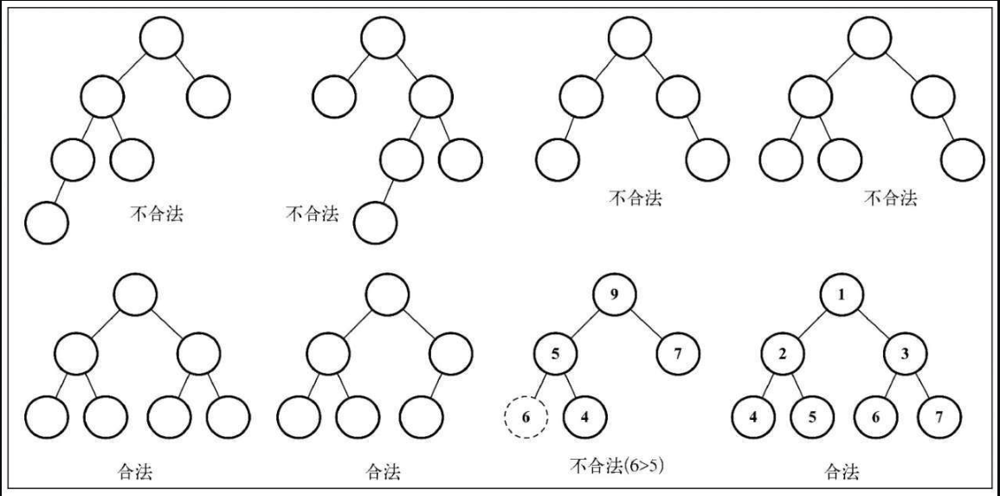
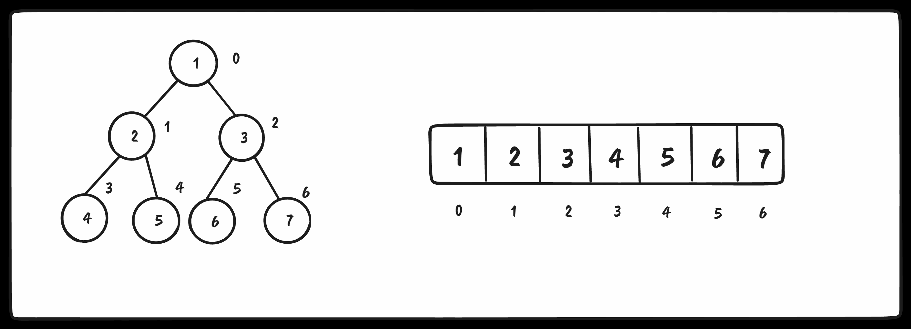
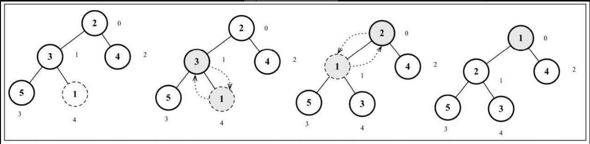
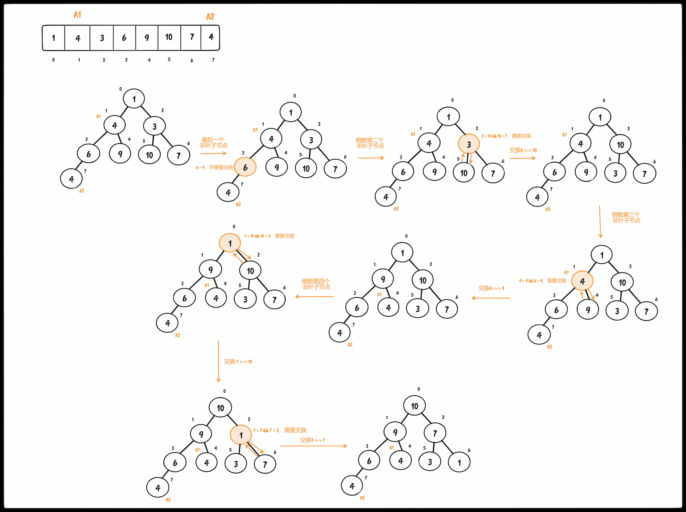
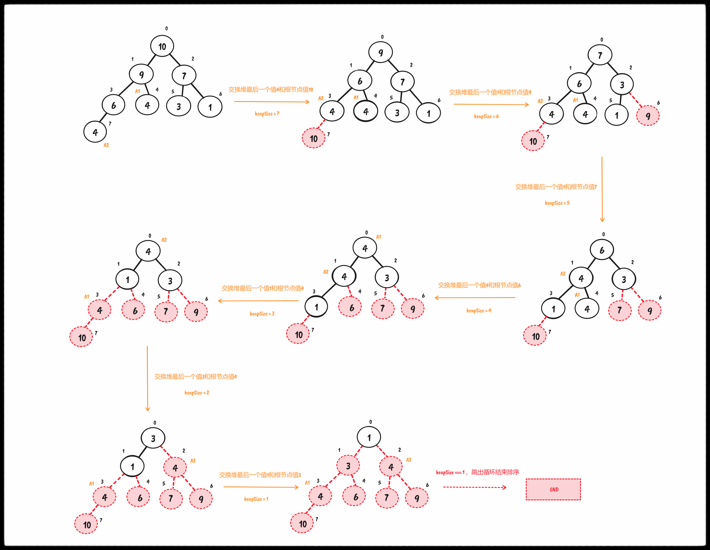

## 二叉堆和堆排序

### 名词解释

> [了解一些基础知识](https://www.cnblogs.com/idorax/p/6441043.html)

二叉树（Binary Tree）：树中节点的度（子树个数）不大于2的有序树

完美二叉树（Perfect Binary Tree）：Every node except the leaf nodes have two children and every level (last level too) is completely filled. （除了叶子结点之外的每一个结点都有两个孩子，每一层(当然包含最后一层)都被完全填充。）

完全二叉树（Complete Binary Tree）：Every level except the last level is completely filled and all the nodes are left justified. （除了最后一层之外的其他每一层都被完全填充，并且所有结点都保持向左对齐。）

完满二叉树（Full Binary Tree）：Every node except the leaf nodes have two children. （除了叶子结点之外的每一个结点都有两个孩子结点。）

### 特性

一种 <span style="color: pink;">特殊的二叉树</span> ，也就是堆数据结构，也叫作二叉堆。二叉堆是计算机科学中一种非常著名的数据结构，由于它能 <span style="color: pink;">高效、快速地找出最大值和最小值，常被应用于优先队列</span> 。它也被用于著名的 <span style="color: pink;">堆排序算法中</span>。 

* 它是一棵完全二叉树，表示树的每一层都有左侧和右侧子节点（除了最后一层的叶节点），并且最后一层的叶节点尽可能都是左侧子节点，这叫作结构特性
* 二叉堆不是最小堆就是最大堆。最小堆允许你快速导出树的最小值，最大堆允许你快速导出树的最大值。所有的节点都大于等于（最大堆）或小于等于（最小堆）每个它的子节点。这叫作堆特性。



二叉堆（节点大于等于或者小于等于每个子节点）一定不是二叉搜索树（左边子节点小，右边子节点大）

### 代码实现

上一章节我们使用的Node类模拟二叉树的节点，这一章节使用数组进行模拟



#### 寻找节点

对于给定位置 index 的节点：

* 左侧子节点的位置是 2 * index + 1
* 右侧子节点的位置是 2 * index + 2
* 父节点的位置是 Math.floor((index - 1) / 2)

```ts
private getLeftIndex(index: number) {
  return 2 * index + 1
}

private getRightIndex(index: number) {
  return 2 * index + 2
}

private getParentIndex(index: number) {
  if (index === 0)
    return undefined

  return Math.floor((index - 1) / 2)
}
```

#### 堆中插入值

其实就是往数组的最后一个位置 push 元素，这个最后位置一定是一个叶子节点。之后需要将这个值同父节点、祖先节点直到根节点进行比较（祖先节点一定是值最小的，最小堆）

核心就是上移操作 `siftUp`

```ts
insert(value: T) {
  if (value != null) {
    const index = this.heap.length
    this.heap.push(value)
    this.siftUp(index)
    return true
  }

  return false
}

private siftUp(index: number): void {
  let parent = this.getParentIndex(index)

  while (index > 0 && this.compareFn(this.heap[Number(parent)], this.heap[index]) === Compare.BIGGER_THAN) {
    swap(this.heap, Number(parent), index)
    index = Number(parent)
    parent = this.getParentIndex(index)
  }
}
```



#### 找最大值或最小值

* 根节点要么最大（最大堆）要么最小（最小堆）！！

```ts
size() {
  return this.heap.length
}

isEmpty() {
  return this.size() <= 0
}

// 最大 or 最小值
findMinimum() {
  return this.isEmpty() ? undefined : this.heap[0]
}
```

#### 导出堆中最小值或最大值

导出最小值或最大值就是移除根节点！！
需要将最后一个push的元素提取到根节点的位置，然后就是递归执行下移函数 `siftDown`

```ts
private siftDown(index: number) {
  let element = index
  const left = this.getLeftIndex(index)
  const right = this.getRightIndex(index)
  const size = this.size()

  // 左节点对比满足条件则更新element为左节点索引
  if (left < size && this.compareFn(this.heap[element], this.heap[left]) === Compare.BIGGER_THAN)
    element = left

  // 右节点对比满足条件则更新element为右节点索引
  if (right < size && this.compareFn(this.heap[element], this.heap[right]) === Compare.BIGGER_THAN)
    element = right

  // 找到最低层次节点 left right都超越节点数组的边界，于是此时 index === element
  if (index !== element) {
    swap(this.heap, index, element)
    this.siftDown(element)
  }
}

extract() {
  if (this.isEmpty())
    return undefined

  if (this.size() === 1)
    return this.heap.shift()

  const removedValue = this.heap[0]
  this.heap[0] = this.heap.pop()!
  this.siftDown(0)
  return removedValue
}
```

需要说的一句就是咱们是对比了 父节点、左子节点以及右子节点三者值的大小！！更新element为最小值的索引，代表咱们需要交换这个element索引的元素与父元素索引位置的元素！！

由于咱们是将数组最后一个元素（也就是完全二叉树最底层最右边的叶子节点）移动到的根节点，那么对于移动后的根节点，在最小堆中，必然是小于左子节点或者右子节点至少其中之一，所以第一次判断过程中一定会更新 element 要么为 left 要么为 right，所以不用担心出现 index === element 的情况！！！

#### 创建最大堆类

很简单！！！我们只需要将比较函数改变为小于

```ts
export class MaxHeap<T> extends MinHeap<T> {
  constructor(protected compareFn: ICompareFunction<T> = defaultCompare) {
    super(compareFn)
    this.compareFn = reverseCompare(compareFn)
  }
}
```

#### 堆排序算法

<span style="color: red;">堆排序是一种不稳定的排序算法（假定在待排序的记录序列中，存在多个具有相同的关键字的记录，若经过排序，这些记录的相对次序保持不变，即在原序列中，A1=A2，且A1在A2之前，而在排序后的序列中，A1仍在A2之前，则称这种排序算法是稳定的；否则称为不稳定的）</span>

1. 将无序列表构建为最大堆
2. 在创建最大堆后，最大的值会被存储在堆的第一个位置。我们要将它替换为堆的最后一个值，将堆的大小减1
3. 最后，我们将堆的根节点下移并重复步骤2直到堆的大小为1

```ts
function heapify(array: any[], index: number, heapSize: number, compareFn: ICompareFunction<any>) {
  let largest = index
  // 当前索引的左子节点索引
  const left = (2 * index) + 1

  // 当前索引的右子节点索引
  const right = (2 * index) + 2

  if (left < heapSize && compareFn(array[left], array[index]) > 0)
    largest = left

  if (right < heapSize && compareFn(array[right], array[largest]) > 0)
    largest = right

  if (largest !== index) {
    swap(array, index, largest)
    heapify(array, largest, heapSize, compareFn)
  }
}

function buildMaxHeap(array: any[], compareFn: ICompareFunction<any>) {
  // 最后一个非叶子节点 = Math.floor(array.length / 2) - 1，然后开始堆化
  for (let i = Math.floor(array.length / 2) - 1; i >= 0; i--)
    heapify(array, i, array.length, compareFn)

  return array
}

export function heapSort(array: any[], compareFn = defaultCompare) {
  let heapSize = array.length

  // 构建最大堆
  buildMaxHeap(array, compareFn)

  // 交换根节点与最后节点的位置，然后再下移
  while (heapSize > 1) {
    swap(array, 0, --heapSize)
    heapify(array, 0, heapSize, compareFn)
  }

  return array
}
```


<small style="display: inline-block; width: 100%; text-align: center;">构建最大堆示意图</small>

<small style="display: inline-block; width: 100%; text-align: center;">排序示意图</small>

<span style="color: pink;">
需要注意：
<br />
1. 构建最大堆时是从最后一个非叶子节点开始依次到根节点，因为选择非叶子节点是它能够在<code>heapify</code>的时候与左子节点和右子节点进行比较！！！
<br />
2. 交换首尾位置的时候进行了 <code>--heapSize</code>，于是乎咱们的<code>heapify</code>执行时left与right边界的判定是缩小了的！！！做到了假的堆节点删除操作
<br />
3. 排序后结果可以看到 A1（4）出现在了A2（4）后面与之前的 A1在A2前面相反，说明这是一个不稳定的排序算法
</span>
