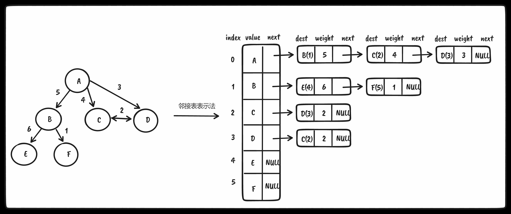
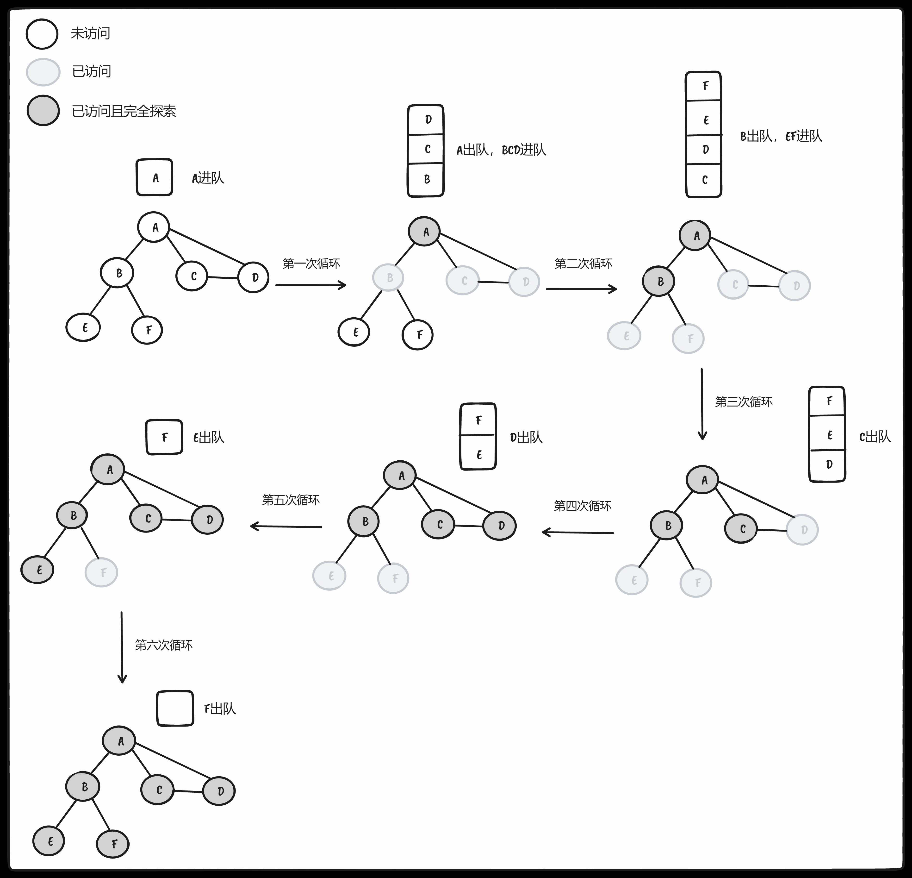
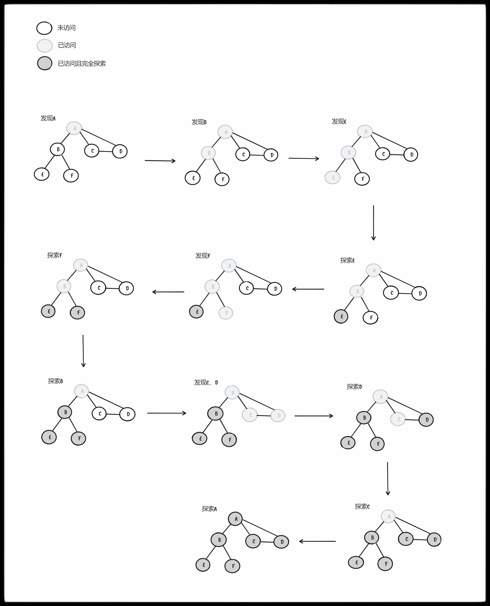
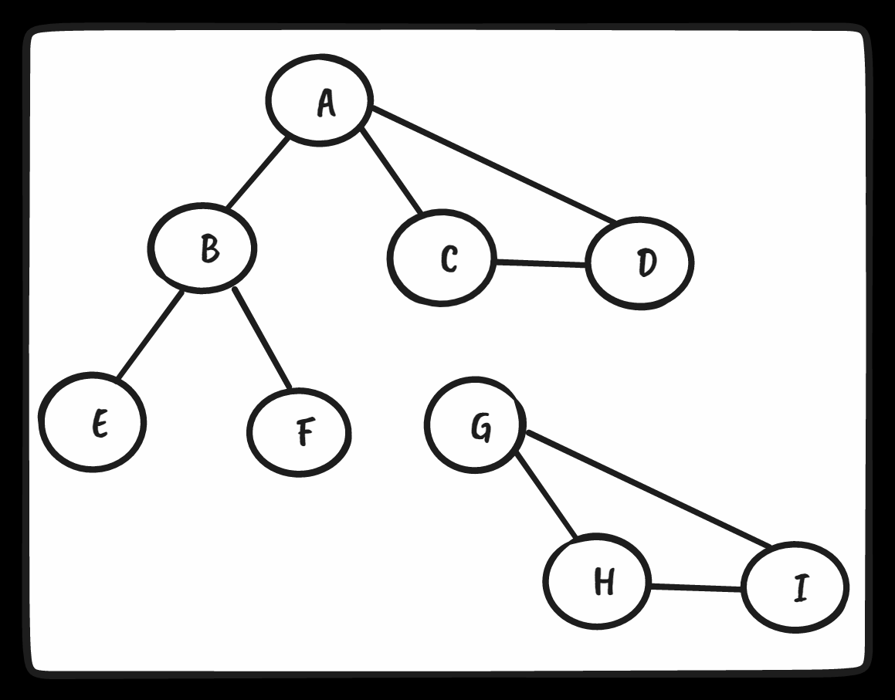
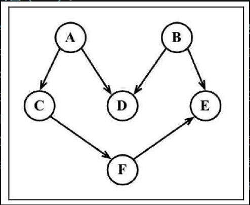
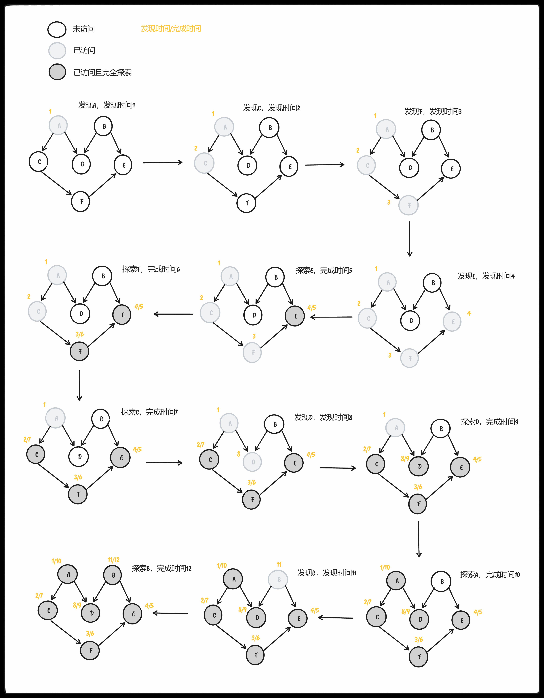

## 图

* 相邻顶点：由 <span style="color: pink;">一条边</span> 连接在一起的顶点
* 顶点的度：
  * 无向图：一个顶点的度是其相邻顶点的数量
  * 有向图：分为入度（其他相邻顶点指向当前顶点）跟出度（当前顶点指出去到其他相邻顶点）
* 路径：路径是顶点v1, v2,…, vk的一个连续序列，其中vi和vi+1是相邻的
* 简单路径：简单路径要求 <span style="color: pink;">不包含重复</span> 的顶点，
* 环：除去最后一个顶点（因为它和第一个顶点是同一个顶点），环也是一个简单路径
* 无环：如果图中不存在环，则称该图是无环的
* 连通：如果图中 <span style="color: pink;">每两个顶点间都存在路径</span> ，则该图是连通的，如下图

* 强连通：每两个顶点间 <span style="color: pink;">在双向上都存在路径</span> ，如下图


### 有向图、无向图和加权图

* 有向图：边有一个方向，A可到B，B不一定可到A
* 加权图：边存在权重
* 无向图：连接而无方向，A可到B，B可到A


如果图中每两个顶点间在双向上都存在路径，则该图是强连通的。CD双向都存在路径是强连通的，AB不是强连通的所以图示的图不是 <span style="color: pink;">强连通的</span> 

图还可以是 <span style="color: pink;">未加权的或是加权的</span> 。加权的意思就是边具有权值，如下图所示


### 图的邻接矩阵表示法

我们用一个二维数组来表示顶点之间的连接。如果索引为i的节点和索引为j的节点相邻，则array[i][j] === 1，否则array[i][j] === 0

使用二维数组进行表示，会浪费很多空间，因为我们对于图的一系列操作（查找，遍历等）无非是基于边的关系进行的（存储1），顶点与顶点之间若无边此时存储0，这其实是浪费了空间的，因为我们本不需要0这个关系！！尤其是出现稀疏图（不是强连通的图，如下图），此时会出现很多0！！！强连通图只会是左上到右下斜线全为0，其余全为1


#### 未加权邻接矩阵

对于未加权图而言，若顶点Vi 和 Vj 之间有边相连，则邻接矩阵中对应项存放着1，若顶点Vi 和 Vj 不相连，则用0代表这两个顶点之间不存在边。

**未加权有向图**


**未加权无向图**


* 可以看到对于无向图基于对角线划分为上下两半，他们是对称的，所以存储一半就好了！！

#### 加权邻接矩阵

对于带权图而言，若顶点Vi 和 Vj 之间有边相连，则邻接矩阵中对应项存放着该边对应的权值，若顶点Vi 和 Vj 不相连，则用0或∞来代表这两个顶点之间不存在边。

**加权有向图**


**加权无向图**


### 图的邻接表表示法

每一个顶点都是一个链表数据结构，数组存放每一个顶点

#### 未加权邻接表

**未加权有向图**


**未加权无向图**


#### 加权邻接表

**加权有向图**


**加权无向图**


### 图的关联矩阵表示法

在关联矩阵中，矩阵的行表示顶点，列表示边。如下图所示，使用二维数组来表示两者之间的连通性，如果顶点v是边e的入射点，则array[v][e] === 1；否则，array[v][e] === 0。


## 代码实现

### 创建Graph类

```ts
import { Dictionary } from './dictionary'

export class Graph {
  private vertices: (string | number)[] = []
  private adjList: Dictionary<string | number, (string | number)[]> = new Dictionary()

  constructor(private isDirected = false) {}

  addVertex(v: string | number) {
    if (!this.vertices.includes(v)) {
      this.vertices.push(v)
      this.adjList.set(v, [])
    }
  }

  addEdge(a: string | number, b: string | number) {
    // 验证添加的两个顶点是否在 adjList 列表中，不存在则都添加进去！！
    if (!this.adjList.get(a))
      this.addVertex(a)

    if (!this.adjList.get(b))
      this.addVertex(b)

    // a -> b
    this.adjList.get(a)?.push(b)

    // 若为无向图 b -> a，否则只是单向 a -> b
    if (!this.isDirected)
      this.adjList.get(b)?.push(a)
  }

  getVertices() {
    return this.vertices
  }

  getAdjList() {
    return this.adjList
  }

  toString() {
    let s = ''

    for (let i = 0; i < this.vertices.length; i++) {
      s += `${this.vertices[i]} -> `
      const neighbors = this.adjList.get(this.vertices[i])!

      for (let j = 0; j < neighbors.length; j++)
        s += `${neighbors[j]} `

      s += '\n'
    }

    return s
  }
}
```

vitest测试如下

```ts
import { describe, expect, test } from 'vitest'
import { Graph } from '../examples/graph'

describe('graph.ts', () => {
  test('Graph', () => {
    const graph = new Graph()
    const vertices = ['A', 'B', 'C', 'D', 'E', 'F']

    for (const v of vertices)
      graph.addVertex(v)

    graph.addEdge('A', 'B')
    graph.addEdge('A', 'C')
    graph.addEdge('A', 'D')
    graph.addEdge('B', 'E')
    graph.addEdge('B', 'F')
    graph.addEdge('C', 'D')

    expect(graph.toString()).toMatchInlineSnapshot(`
      "A -> B C D 
      B -> A E F 
      C -> A D 
      D -> A C 
      E -> B 
      F -> B 
      "
    `)
  })
})

```

### 图的遍历

* 必须追踪每个第一次访问的节点，并且追踪有哪些节点还没有被完全探索
* 完全探索一个顶点要求我们查看该顶点的每一条边。对于每一条边所连接的没有被访问过的顶点，将其标注为被发现的，并将其加进待访问顶点列表中
* 为了保证算法的效率，务必访问每个顶点至多两次

三种颜色表示顶点的状态

* 白色：未被访问过的顶点
* 灰色：发现顶点，被访问过
* 黑色：被访问过且被完全探索过

颜色枚举代码如下

```ts
enum Colors {
  WHITE = 0,
  GREY = 1,
  BLACK = 2
}
```

初始情况所有顶点都是白色，初始化颜色代码如下

```ts
export const initializeColor = (vertices: (string | number)[]) => {
  const color: any = {}
  for (let i = 0; i < vertices.length; i++)
    color[vertices[i]] = Colors.WHITE

  return color
}
```

#### 广度优先搜索（BFS）

<span style="color: pink;">需要一个源顶点startVertex</span>

* 创建一个队列Q。
* 标注v为被发现的（灰色），并将v入队列Q。
* 如果Q非空，则运行以下步骤：
  * 将u从Q中出队列；
  * 标注u为被发现的（灰色）；
  * 将u所有未被访问过的邻点（白色）入队列；
  * 标注u为已被探索的（黑色）。

```ts
export const breadthFirstSearch = (graph: Graph, startVertex: number | string, callback: (v: number | string) => void) => {
  // 获取图中所有顶点
  const vertices = graph.getVertices()
  // 获取所有的顶点的关系
  const adjList = graph.getAdjList()
  // 初始化顶点颜色为全白（表示未访问）
  const color = initializeColor(vertices)
  // 创建队列用于存储顶点！
  const queue = new Queue()

  // 开始搜索的顶点
  queue.enqueue(startVertex)

  while (!queue.isEmpty()) {
    // 从队列中去取顶点
    const u = queue.dequeue()
    // 获取顶点的相邻顶点
    const neighbors = adjList.get(u)!
    // 顶点颜色设置为灰色（表示已访问）
    color[u] = Colors.GREY

    for (const v of neighbors) {
      if (color[v] === Colors.WHITE) {
        color[v] = Colors.GREY
        queue.enqueue(v)
      }
    }

    color[u] = Colors.BLACK

    callback && callback(u)
  }
}
```



<span style="color: pink;">tips：上面罗列的是未加权无向图，关于未加权有向图可以依葫芦画瓢</span> 

**解决最短路径问题（给定一个图G和源顶点v，找出每个顶点u和v之间最短路径的距离（以边的数量计））**

* 对于给定顶点v，广度优先算法会访问所有与其距离为1的顶点，接着是距离为2的顶点，以此类推

```ts
export const shortestPathByBFS = (graph: Graph, startVertex: number | string) => {
  const vertices = graph.getVertices()
  const adjList = graph.getAdjList()
  const color = initializeColor(vertices)
  const queue = new Queue()
  const distances: any = {}
  const predecessors: any = {}

  queue.enqueue(startVertex)

  for (const v of vertices) {
    distances[v] = 0
    predecessors[v] = null
  }

  while (!queue.isEmpty()) {
    const u = queue.dequeue()
    const neighbors = adjList.get(u)!
    color[u] = Colors.GREY

    for (const v of neighbors) {
      if (color[v] === Colors.WHITE) {
        color[v] = Colors.GREY
        distances[v] = distances[u] + 1
        predecessors[v] = u
        queue.enqueue(v)
      }
    }

    color[u] = Colors.BLACK
  }

  return {
    distances,
    predecessors,
  }
}
```

上述代码在之前搜索算法的基础上增加了对象 `distances`、`predecessors`，一个是按边统计距离源点距离，一个是记录顶点的前溯点

得到了`predecessors`对象，我们需要处理这个对象进而构建源点到其余各点的最短路径线路，方法如下

```ts
export const buildPaths = (startVertex: number | string, vertices: (string | number)[], predecessors: any = {}) => {
  const fromVertex = startVertex
  const paths = []

  for (let i = 1; i < vertices.length; i++) {
    const toVertex = vertices[i]
    const path = new Stack()

    for (let v = toVertex; v !== fromVertex; v = predecessors[v])
      path.push(v)

    path.push(fromVertex)

    let s = path.pop()

    while (!path.isEmpty())
      s += ` - ${path.pop()}`

    paths.push(s)
  }

  return paths
}
```

使用vitest测试代码如下

```ts
import { describe, expect, test } from 'vitest'
import { Graph } from '../examples/graph'
import { breadthFirstSearch, buildPaths, shortestPathByBFS } from '../examples/breadth-first-search'

describe('graph.ts', () => {
  const graph = new Graph()
  const vertices = ['A', 'B', 'C', 'D', 'E', 'F']

  for (const v of vertices)
    graph.addVertex(v)

  graph.addEdge('A', 'B')
  graph.addEdge('A', 'C')
  graph.addEdge('A', 'D')
  graph.addEdge('B', 'E')
  graph.addEdge('B', 'F')
  graph.addEdge('C', 'D')

  test('Graph', () => {
    expect(graph.toString()).toMatchInlineSnapshot(`
      "A -> B C D 
      B -> A E F 
      C -> A D 
      D -> A C 
      E -> B 
      F -> B 
      "
    `)
  })

  test('BFS', () => {
    let s = ''

    breadthFirstSearch(graph, vertices[0], (v) => {
      s = `${s + v} `
    })

    s = s.trim()

    expect(s).toMatchInlineSnapshot('"A B C D E F"')
  })

  test('shortestPath', () => {
    // NOTE: 注意咱们的 vertices第一个元素一定是作为最短路径shortestPathByBFS的 startVertex 以及 buildPaths中的 startVertex
    // buildPaths 不是一个通用的方法
    const graph = new Graph()
    const vertices = ['B', 'A', 'C', 'D', 'E', 'F']

    for (const v of vertices)
      graph.addVertex(v)

    graph.addEdge('A', 'B')
    graph.addEdge('A', 'C')
    graph.addEdge('A', 'D')
    graph.addEdge('B', 'E')
    graph.addEdge('B', 'F')
    graph.addEdge('C', 'D')

    const shortestPath = shortestPathByBFS(graph, vertices[0])

    expect(buildPaths(vertices[0], vertices, shortestPath.predecessors)).toMatchInlineSnapshot(`
      [
        "B - A",
        "B - A - C",
        "B - A - D",
        "B - E",
        "B - F",
      ]
    `)
  })
})
```

#### 深度优先搜索（DFS）

<span style="color: pink;">不需要源顶点</span> 

要访问顶点v，照如下步骤做：
* 标注v为被发现的（灰色）；
* 对于v的所有未访问（白色）的邻点w，访问顶点w；
* 标注v为已被探索的（黑色）。

```ts
const depthFirstSearchVisit = (
  v: string | number,
  color: any,
  adjList: Dictionary<string | number, (string | number)[]>,
  callback: (v: string | number) => void,
) => {
  // 顶点置为灰色，表示访问过
  color[v] = Colors.GREY
  callback && callback(v)

  // 获取顶点的所有邻接点
  const neighbors = adjList.get(v)!

  // 所有邻接点若为白色那么递归继续访问
  for (const w of neighbors) {
    if (color[w] === Colors.WHITE)
      depthFirstSearchVisit(w, color, adjList, callback)
  }

  // 顶点设置为完全探索
  color[v] = Colors.BLACK
}

export const depthFirstSearch = (graph: Graph, callback: (v: string | number) => void) => {
  // 获取所有顶点
  const vertices = graph.getVertices()
  // 获取所有邻接点
  const adjList = graph.getAdjList()
  // 获取所有顶点的顶点颜色
  const color = initializeColor(vertices)

  for (const v of vertices) {
    if (color[v] === Colors.WHITE)
      depthFirstSearchVisit(v, color, adjList, callback)
  }
}
```



<span style="color: pink;">注意：<br />1. 访问的顺序跟邻接点的顺序是有关系的（代码 `depthFirstSearchVisit -> for (const w of neighbors)`）<br />2. `depthFirstSearch` 函数内部有一个遍历所有顶点数组的循环，会判定顶点是否是白色，进而执行`depthFirstSearchVisit`，但是在我们给出的如图示例中的图执行的时候仅仅只会执行`depthFirstSearchVisit`方法一次，因为咱们访问的A顶点与其他任何一个顶点之间都是存在路径的！！，倘若使用如下的无向图那么函数 `depthFirstSearchVisit` 会执行两次！！`GHI`构成的图与`ABCDEF`构成的图没有关联关系！！</span>



<span style="color: pink;">深度优先算法背后的思想是什么？边是从最近发现的顶点u处被向外探索的。只有连接到未发现的顶点的边被探索了。当u所有的边都被探索了，该算法回退到u被发现的地方去探索其他的边`depthFirstSearchVisit -> for (const w of neighbors)`。这个过程持续到我们发现了所有从原始顶点能够触及的顶点。如果还留有任何其他未被发现的顶点，我们对新源顶点重复这个过程`depthFirstSearch -> for (const v of vertices)`。重复该算法，直到图中所有的顶点都被探索了</span> 

**拓扑排序**：编排一些任务或步骤的执行顺序（只能是有向无环图 DAG）



首先第一步就是咱们需要一个函数可以帮助咱们记录访问顶点的发现时间以及顶点访问完成的探索时间，当然还有前溯点（有了前溯点那么咱们可以写方法构建顶点间的路径数组，就像前面BFS中的`buildPaths`一样）

```ts
const DFSVisit = (
  v: string | number,
  color: any,
  d: any,
  f: any,
  p: any,
  time: number,
  adjList: Dictionary<string | number, (string | number)[]>,
) => {
  color[v] = Colors.GREY
  // 发现时间
  d[v] = ++time

  // 获取顶点的所有邻接点
  const neighbors = adjList.get(v)!

  // 所有邻接点若为白色那么递归继续访问
  for (const w of neighbors) {
    if (color[w] === Colors.WHITE) {
      p[w] = v
      DFSVisit(w, color, d, f, p, time, adjList)
    }
  }

  // 顶点设置为完全探索
  color[v] = Colors.BLACK

  // 完成时间
  f[v] = ++time
}

export const DFS = (graph: Graph) => {
  const vertices = graph.getVertices()
  const adjList = graph.getAdjList()
  const color = initializeColor(vertices)

  const discovery: any = {}
  const finished: any = {}
  const predecessors: any = {}
  const time = 0

  for (const v of vertices) {
    finished[v] = 0
    discovery[v] = 0
    predecessors[v] = null
  }

  for (const w of vertices) {
    if (color[w] === Colors.WHITE)
      DFSVisit(w, color, discovery, finished, predecessors, time, adjList)
  }

  return {
    discovery,
    finished,
    predecessors,
  }
}
```



有了访问完成时间，接下来将所有顶点的访问时间按从大到小的顺序输出即为拓扑排序（相当于任务的执行顺序，执行A任务后才能执行B任务，每个任务的执行都有先决条件），代码如下

```ts
export const topSort = (vertices: (string | number)[], fTimes: any = {}) => {
  let path = ''

  for (let count = 0; count < vertices.length; count++) {
    let max = 0
    let maxName = null

    for (const v of vertices) {
      if (fTimes[v] > max) {
        max = fTimes[v]
        maxName = v
      }
    }

    path += ` - ${maxName}`
    delete fTimes[maxName!]
  }

  return path
}
```

<span style="color: pink;">对了：不同的顶点顺序，拓扑排序的结果不同</span> 

vitest测试用例如下

```ts
test('depthFirstSearch', () => {
  let s = ''

  depthFirstSearch(graph, (v) => {
    s = `${s + v} `
  })

  s = s.trim()

  expect(s).toMatchInlineSnapshot('"A B E F C D"')
})

test('DFS-topSort', () => {
  const graph = new Graph(true)
  const vertices = ['A', 'B', 'C', 'D', 'E', 'F']

  for (const v of vertices)
    graph.addVertex(v)

  graph.addEdge('A', 'C')
  graph.addEdge('A', 'D')
  graph.addEdge('B', 'D')
  graph.addEdge('B', 'E')
  graph.addEdge('C', 'F')
  graph.addEdge('F', 'E')

  const result = DFS(graph)

  const path = topSort(vertices, result.finished)

  expect(path).toMatchInlineSnapshot('" - E - F - C - D - A - B"')
})

// 在 DFS 测试用例中改变顶点顺序
test('DFS-order-topSort', () => {
  const graph = new Graph(true)
  const vertices = ['B', 'A', 'C', 'E', 'D', 'F']

  for (const v of vertices)
    graph.addVertex(v)

  graph.addEdge('A', 'C')
  graph.addEdge('A', 'D')
  graph.addEdge('B', 'D')
  graph.addEdge('B', 'E')
  graph.addEdge('C', 'F')
  graph.addEdge('F', 'E')

  const result = DFS(graph)

  const path = topSort(vertices, result.finished)

  expect(path).toMatchInlineSnapshot('" - A - C - F - B - E - D"')
})
```
