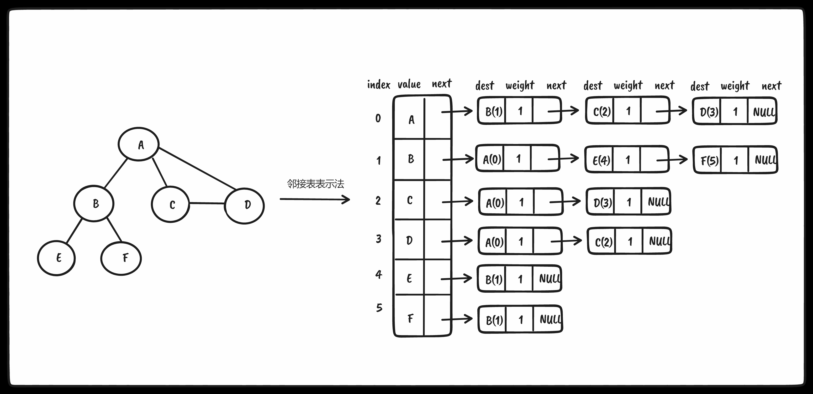

## 图

* 相邻顶点：由 <span style="color: pink;">一条边</span> 连接在一起的顶点
* 顶点的度：
  * 无向图：一个顶点的度是其相邻顶点的数量
  * 有向图：分为入度（其他相邻顶点指向当前顶点）跟出度（当前顶点指出去到其他相邻顶点）
* 路径：路径是顶点v1, v2,…, vk的一个连续序列，其中vi和vi+1是相邻的
* 简单路径：简单路径要求 <span style="color: pink;">不包含重复</span> 的顶点，
* 环：除去最后一个顶点（因为它和第一个顶点是同一个顶点），环也是一个简单路径
* 无环：如果图中不存在环，则称该图是无环的
* 连通：如果图中 <span style="color: pink;">每两个顶点间都存在路径</span> ，则该图是连通的，如下图

* 强连通：每两个顶点间 <span style="color: pink;">在双向上都存在路径</span> ，如下图


### 有向图、无向图和加权图

* 有向图：边有一个方向，A可到B，B不一定可到A
* 加权图：边存在权重
* 无向图：连接而无方向，A可到B，B可到A


如果图中每两个顶点间在双向上都存在路径，则该图是强连通的。CD双向都存在路径是强连通的，AB不是强连通的所以图示的图不是 <span style="color: pink;">强连通的</span> 

图还可以是 <span style="color: pink;">未加权的或是加权的</span> 。加权的意思就是边具有权值，如下图所示


### 图的邻接矩阵表示法

我们用一个二维数组来表示顶点之间的连接。如果索引为i的节点和索引为j的节点相邻，则array[i][j] === 1，否则array[i][j] === 0

使用二维数组进行表示，会浪费很多空间，因为我们对于图的一系列操作（查找，遍历等）无非是基于边的关系进行的（存储1），顶点与顶点之间若无边此时存储0，这其实是浪费了空间的，因为我们本不需要0这个关系！！尤其是出现稀疏图（不是强连通的图，如下图），此时会出现很多0！！！强连通图只会是左上到右下斜线全为0，其余全为1


#### 未加权邻接矩阵

对于未加权图而言，若顶点Vi 和 Vj 之间有边相连，则邻接矩阵中对应项存放着1，若顶点Vi 和 Vj 不相连，则用0代表这两个顶点之间不存在边。

**未加权有向图**


**未加权无向图**


* 可以看到对于无向图基于对角线划分为上下两半，他们是对称的，所以存储一半就好了！！

#### 加权邻接矩阵

对于带权图而言，若顶点Vi 和 Vj 之间有边相连，则邻接矩阵中对应项存放着该边对应的权值，若顶点Vi 和 Vj 不相连，则用0或∞来代表这两个顶点之间不存在边。

**加权有向图**


**加权无向图**


### 图的邻接表表示法

每一个顶点都是一个链表数据结构，数组存放每一个顶点

#### 未加权邻接表

**未加权有向图**


**未加权无向图**


#### 加权邻接表

**加权有向图**


**加权无向图**


### 图的关联矩阵表示法

在关联矩阵中，矩阵的行表示顶点，列表示边。如下图所示，使用二维数组来表示两者之间的连通性，如果顶点v是边e的入射点，则array[v][e] === 1；否则，array[v][e] === 0。


## 代码实现

### 创建Graph类

```ts
import { Dictionary } from './dictionary'

export class Graph {
  private vertices: (string | number)[] = []
  private adjList: Dictionary<string | number, (string | number)[]> = new Dictionary()

  constructor(private isDirected = false) {}

  addVertex(v: string | number) {
    if (!this.vertices.includes(v)) {
      this.vertices.push(v)
      this.adjList.set(v, [])
    }
  }

  addEdge(a: string | number, b: string | number) {
    // 验证添加的两个顶点是否在 adjList 列表中，不存在则都添加进去！！
    if (!this.adjList.get(a))
      this.addVertex(a)

    if (!this.adjList.get(b))
      this.addVertex(b)

    // a -> b
    this.adjList.get(a)?.push(b)

    // 若为无向图 b -> a，否则只是单向 a -> b
    if (!this.isDirected)
      this.adjList.get(b)?.push(a)
  }

  getVertices() {
    return this.vertices
  }

  getAdjList() {
    return this.adjList
  }

  toString() {
    let s = ''

    for (let i = 0; i < this.vertices.length; i++) {
      s += `${this.vertices[i]} -> `
      const neighbors = this.adjList.get(this.vertices[i])!

      for (let j = 0; j < neighbors.length; j++)
        s += `${neighbors[j]} `

      s += '\n'
    }

    return s
  }
}
```

vitest测试如下

```ts
import { describe, expect, test } from 'vitest'
import { Graph } from '../examples/graph'

describe('graph.ts', () => {
  test('Graph', () => {
    const graph = new Graph()
    const vertices = ['A', 'B', 'C', 'D', 'E', 'F']

    for (const v of vertices)
      graph.addVertex(v)

    graph.addEdge('A', 'B')
    graph.addEdge('A', 'C')
    graph.addEdge('A', 'D')
    graph.addEdge('B', 'E')
    graph.addEdge('B', 'F')
    graph.addEdge('C', 'D')

    expect(graph.toString()).toMatchInlineSnapshot(`
      "A -> B C D 
      B -> A E F 
      C -> A D 
      D -> A C 
      E -> B 
      F -> B 
      "
    `)
  })
})

```

### 图的遍历

#### 广度优先搜索（BFS）

#### 深度优先搜索（DFS）
