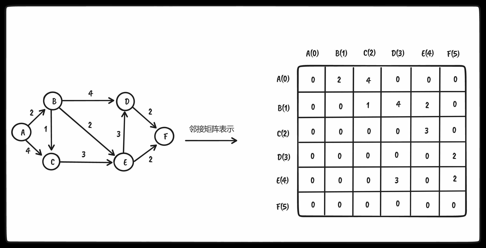
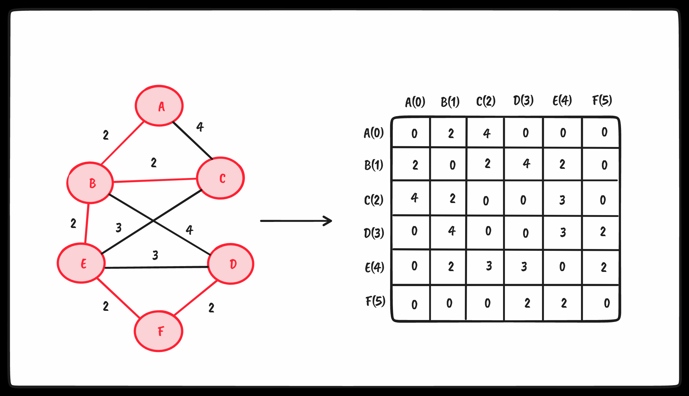

## 基于图的算法

### 最短路径算法

#### Dijkstra算法

> Dijkstra算法是一种计算从单个源到所有其他源的最短路径的贪心算法



图示的图对应的邻接矩阵代码如下

```ts
const graph = [
  [0, 2, 4, 0, 0, 0],
  [0, 0, 1, 4, 2, 0],
  [0, 0, 0, 0, 3, 0],
  [0, 0, 0, 0, 0, 2],
  [0, 0, 0, 3, 0, 2],
  [0, 0, 0, 0, 0, 0],
]
```

dijkstra算法实现如下

```ts
const INF = Number.MAX_SAFE_INTEGER

const minDistance = (dist: number[], visited: boolean[]) => {
  let min = INF
  let minIndex = -1

  for (let v = 0; v < dist.length; v++) {
    if (visited[v] === false && dist[v] <= min) {
      min = dist[v]
      minIndex = v
    }
  }

  return minIndex
}

const tmp: Record<string, any> = {}

export const dijkstra = (vertices: string[], graph: number[][], src: number) => {
  const dist: number[] = []
  const visited: boolean[] = []
  const length = graph.length

  // 初始化所有顶点距离源点距离都是无穷大，同时所有顶点都未访问
  for (let i = 0; i < length; i++) {
    dist[i] = INF
    visited[i] = false
  }

  // 源点到自己的路径置为0
  dist[src] = 0

  for (let i = 0; i < length - 1; i++) {
    // 找出距离源点最小距离的顶点u
    const u = minDistance(dist, visited)

    // 将该顶点置为已经访问（后续由于已经访问过该顶点，所以minDistance不会再次返回该顶点索引）
    visited[u] = true

    // 遍历顶点u的所有邻接点v
    for (let v = 0; v < length; v++) {
      // 1. !visited[v]表示顶点未被访问
      // 2. graph[u][v] !== 0 && dist[u] !== INF表示存在邻接点路径
      // 3. dist[u] + graph[u][v] < dist[v] 已访问顶点u到源点src的距离dist[u]加上已访问顶点u到邻接点v的距离是否小于 v到源点src的距离
      if (!visited[v] && graph[u][v] !== 0 && dist[u] !== INF && dist[u] + graph[u][v] < dist[v]) {
        dist[v] = dist[u] + graph[u][v]

        const key = `${vertices[src]} -> ${vertices[v]}`
        tmp[key] = `${vertices[src]} -> ${vertices[u]} -> ${vertices[v]}, ${dist[v]}`
      }
    }
  }

  return { tmp, dist }
}

```

自己增加了额外的打印路径代码，使用vitest测试代码如下

```ts
test('Dijkstra', () => {
  const vertices = ['A', 'B', 'C', 'D', 'E', 'F']

  const graph = [
    [0, 2, 4, 0, 0, 0],
    [0, 0, 1, 4, 2, 0],
    [0, 0, 0, 0, 3, 0],
    [0, 0, 0, 0, 0, 2],
    [0, 0, 0, 3, 0, 2],
    [0, 0, 0, 0, 0, 0],
  ]

  expect(dijkstra(vertices, graph, 1).tmp).toMatchInlineSnapshot(`
    {
      "B -> C": "B -> B -> C, 1",
      "B -> D": "B -> B -> D, 4",
      "B -> E": "B -> B -> E, 2",
      "B -> F": "B -> E -> F, 4",
    }
  `)

  expect(dijkstra(vertices, graph, 1).dist).toMatchInlineSnapshot(`
    [
      9007199254740991,
      0,
      1,
      4,
      2,
      4,
    ]
  `)
})
```

分析过程如下

* dist数组存放顶点距离源点最短距离的数值
* visited数组存放顶点是否访问过（避免重复访问）
* 内部循环控制二维数组的横向遍历邻接点并比较其与源点距离并更新
* 外部循环控制二维数组的纵向（注意`length-1`， 我也不是很懂为啥，但是下图的分析就是能证明无需外部多一次循环😂）


#### Floyd-Warshall算法

> Floyd-Warshall算法是一种计算图中所有最短路径的动态规划算法

1. 根据graph生成dist数组并初始化
2. 引入中间点k，寻找i -> j =  (i -> k) + (k -> j)

代码如下

```ts
export const floydWarshall = (graph: number[][]) => {
  const dist: number[][] = []
  const length = graph.length

  // 初始化dist数组（对角线都是0，其余位置保持原来graph的数值）
  for (let i = 0; i < length; i++) {
    dist[i] = []
    for (let j = 0; j < length; j++) {
      // 对角线都是0，自己到自己！
      if (i === j)
        dist[i][j] = 0

      // 如果 graph[i][j] 为INF表示 i -> j不存在距离！！
      else if (!isFinite(graph[i][j]))
        dist[i][j] = Infinity

      // i -> j存在距离那么就等于图中的权值
      else
        dist[i][j] = graph[i][j]
    }
  }

  // 引入中间点k，所以 i -> j = (i -> k) + (k -> j)距离之和，
  // 核心就是 dist[i][k] + dist[k][j] < dist[i][j] 进而更新
  for (let k = 0; k < length; k++) {
    for (let i = 0; i < length; i++) {
      for (let j = 0; j < length; j++) {
        if (dist[i][k] + dist[k][j] < dist[i][j])
          dist[i][j] = dist[i][k] + dist[k][j]
      }
    }
  }

  return dist
}
```

使用 vitest测试代码如下

```ts
test('FloydWarshall', () => {
  const INF = Infinity
  const graph = [
    [INF, 2, 4, INF, INF, INF],
    [INF, INF, 1, 4, 2, INF],
    [INF, INF, INF, INF, 3, INF],
    [INF, INF, INF, INF, INF, 2],
    [INF, INF, INF, 3, INF, 2],
    [INF, INF, INF, INF, INF, INF],
  ]

  expect(floydWarshall(graph)).toMatchInlineSnapshot(`
    [
      [
        0,
        2,
        3,
        6,
        4,
        6,
      ],
      [
        Infinity,
        0,
        1,
        4,
        2,
        4,
      ],
      [
        Infinity,
        Infinity,
        0,
        6,
        3,
        5,
      ],
      [
        Infinity,
        Infinity,
        Infinity,
        0,
        Infinity,
        2,
      ],
      [
        Infinity,
        Infinity,
        Infinity,
        3,
        0,
        2,
      ],
      [
        Infinity,
        Infinity,
        Infinity,
        Infinity,
        Infinity,
        0,
      ],
    ]
  `)
})
```

### 最小生成树（MST）

<span style="color: pink;">解决什么问题？</span> 

* <span style="color: pink;">你的公司有几间办公室，要以最低的成本实现办公室电话线路相互连通，以节省资金，最好的办法是什么</span>
* <span style="color: pink;">设想你要在n个岛屿之间建造桥梁，想用最低的成本实现所有岛屿相互连通</span>

#### Prim算法

Prim算法是一种求解 <span style="color: pink;">加权无向连通图</span> 的MST问题的贪心算法。它能找出一个边的子集，<span style="color: pink;">使得其构成的树包含图中所有顶点，且边的权值之和最小。</span> 他的具体实现跟`dijkstra`类似，所以我未提供流程图进行分析😂

代码如下：

```ts
const INF = Number.MAX_SAFE_INTEGER

const minKey = (graph: number[][], key: number[], visited: boolean[]) => {
  let min = INF
  let minIndex = 0

  for (let v = 0; v < graph.length; v++) {
    if (visited[v] === false && key[v] < min) {
      min = key[v]
      minIndex = v
    }
  }

  return minIndex
}

export const prim = (graph: number[][]) => {
  const parent: number[] = []
  const key: number[] = []
  const visited: boolean[] = []
  const length = graph.length

  for (let i = 0; i < length; i++) {
    key[i] = INF
    visited[i] = false
  }

  key[0] = 0
  parent[0] = -1

  for (let i = 0; i < length - 1; i++) {
    const u = minKey(graph, key, visited)
    visited[u] = true

    for (let v = 0; v < length; v++) {
      if (graph[u][v] && visited[v] === false && graph[u][v] < key[v]) {
        parent[v] = u
        key[v] = graph[u][v]
      }
    }
  }

  return parent
}
```

vitest测试如下：

```ts
test('Prim', () => {
  const graph = [[0, 2, 4, 0, 0, 0],
    [2, 0, 2, 4, 2, 0],
    [4, 2, 0, 0, 3, 0],
    [0, 4, 0, 0, 3, 2],
    [0, 2, 3, 3, 0, 2],
    [0, 0, 0, 2, 2, 0],
  ]
  const parent = prim(graph)

  let str = ''

  for (let i = 1; i < graph.length; i++)
    str += `${parent[i]} - ${i}   ${graph[i][parent[i]]}\n`

  expect(str).toMatchInlineSnapshot(`
    "0 - 1   2
    1 - 2   2
    5 - 3   2
    1 - 4   2
    4 - 5   2
    "
  `)
})
```

辅助图如下：



#### Kruskal算法

Kruskal算法也是一种 <span style="color: pink;">求加权无向连通图的MST的贪心算法</span> 

由于书中代码存在问题，所以请访问如下链接

> 给一个链接：[Kruskal算法js实现](https://segmentfault.com/a/1190000012649227)
