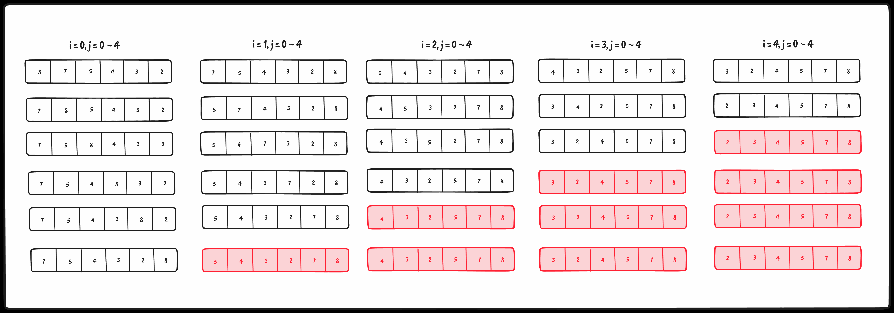
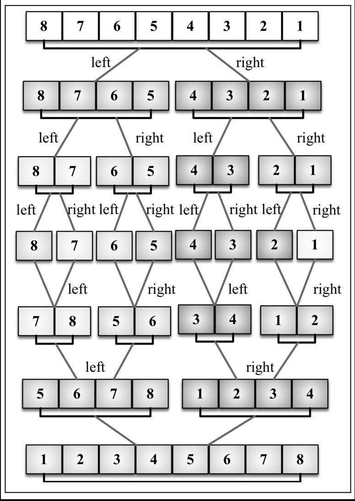

## 排序和搜索算法

### 冒泡排序

> 时间复杂度 O(n^2)

辅助函数 `swap` 交换数组中的元素位置：

```ts
export function swap(array: any[], a: number, b: number) {
  [array[a], array[b]] = [array[b], array[a]]
}
```

辅助函数 `defaultCompare` 比较 a 与 b 的大小：

```ts
export enum Compare {
  LESS_THAN = -1,
  BIGGER_THAN = 1,
  EQUALS = 0,
}

export function defaultCompare<T>(a: T, b: T): number {
  if (a === b)
    return Compare.EQUALS

  return a < b ? Compare.LESS_THAN : Compare.BIGGER_THAN
}
```

排序算法实现：

```ts
export function bubbleSort<T>(array: T[], compareFn = defaultCompare) {
  const { length } = array

  for (let i = 0; i < length; i++) {
    for (let j = 0; j < length - 1; j++) {
      if (compareFn(array[j], array[j + 1]) === Compare.BIGGER_THAN)
        swap(array, j, j + 1)
    }
  }

  return array
}
```

图示分析如下：



可以发现红色部分其实是未必要的比较，于是乎对代码进行优化如下

```ts
export function modifiedBubbleSort<T>(array: T[], compareFn = defaultCompare) {
  const { length } = array

  for (let i = 0; i < length; i++) {
    for (let j = 0; j < length - 1 - i; j++) {
      if (compareFn(array[j], array[j + 1]) === Compare.BIGGER_THAN)
        swap(array, j, j + 1)
    }
  }

  return array
}
```

接着上 `vitest` 测试结果如下：

```ts
const arr = [8, 7, 5, 4, 3, 2]

test('bubbleSort', () => {
  expect(modifiedBubbleSort(arr)).toMatchInlineSnapshot(`
    [
      2,
      3,
      4,
      5,
      7,
      8,
    ]
  `)
})
```

### 选择排序

原理：选择排序大致的思路是找到数据结构中的最小值并将其放置在第一位，接着找到第二小的值并将其放在第二位

代码实现如下：

```ts
import { swap } from './heap'
import { Compare, defaultCompare } from './sortedLinkedList'

export const selectionSort = (array: any[], compareFn = defaultCompare) => {
  const { length } = array
  let indexMin

  for (let i = 0; i < length - 1; i++) {
    indexMin = i

    for (let j = i; j < length; j++) {
      if (compareFn(array[indexMin], array[j]) === Compare.BIGGER_THAN)
        indexMin = j
    }
    if (i !== indexMin)
      swap(array, i, indexMin)
  }

  return array
}

```

vitest测试如下：

```ts
test('selectionSort', () => {
  const arr = [8, 7, 5, 4, 3, 2]

  expect(selectionSort(arr)).toMatchInlineSnapshot(`
    [
      2,
      3,
      4,
      5,
      7,
      8,
    ]
  `)
})
```


### 插入排序

原理：从第二位开始提取为temp并循环比较与前者的大小，若小于前者，那么将前者赋予当前位置，结束后得到temp应该被插入的位置

代码实现如下：

```ts
import { Compare, defaultCompare } from './sortedLinkedList'

export const insertionSort = (array: any[], compareFn = defaultCompare) => {
  const { length } = array
  let temp

  for (let i = 0; i < length; i++) {
    let j = i
    temp = array[i]

    while (j > 0 && compareFn(array[j - 1], temp) === Compare.BIGGER_THAN) {
      array[j] = array[j - 1]
      j--
    }

    array[j] = temp
  }

  return array
}

```

vitest测试如下：

```ts
test('insertionSort', () => {
  const arr = [8, 7, 5, 4, 3, 2]

  expect(insertionSort(arr)).toMatchInlineSnapshot(`
    [
      2,
      3,
      4,
      5,
      7,
      8,
    ]
  `)
})
```


### 归并排序

原理：原始数组切分成较小的数组，直到每个小数组只有一个位置，接着将小数组归并成较大的数组，直到最后只有一个排序完毕的大数组

归并排序的实现大致两个过程（一个函数用来进行拆分，另一个函数用来合并）

`merge`: 合并函数

```ts
function merge<T>(left: T[], right: T[], compareFn: ICompareFunction<T>) {
  let i = 0
  let j = 0
  const result = []

  while (i < left.length && j < right.length)
    result.push(compareFn(left[i], right[j]) === Compare.LESS_THAN ? left[i++] : right[j++])

  return result.concat(i < left.length ? left.slice(i) : right.slice(j))
}
```

`mergeSort`: 拆分函数

```ts
export function mergeSort<T>(array: T[], compareFn = defaultCompare): T[] {
  // 结束条件就是array.length === 1
  if (array.length > 1) {
    const { length } = array

    // 数组中间部分
    const middle = Math.floor(length / 2)

    // 0 ~ middle
    const left = mergeSort(array.slice(0, middle), compareFn)

    // middle ~ array.length
    const right = mergeSort(array.slice(middle, length), compareFn)

    // 左右进行合并
    array = merge(left, right, compareFn)
  }

  return array
}
```

vitest测试如下

```ts
test('mergeSort', () => {
  const arr = [8, 7, 6, 5, 4, 3, 2, 1]

  expect(mergeSort(arr)).toMatchInlineSnapshot(`
    [
      1,
      2,
      3,
      4,
      5,
      6,
      7,
      8,
    ]
  `)
})
```


