## 排序算法

### 冒泡排序

> 时间复杂度 O(n^2)

辅助函数 `swap` 交换数组中的元素位置：

```ts
export function swap(array: any[], a: number, b: number) {
  [array[a], array[b]] = [array[b], array[a]]
}
```

辅助函数 `defaultCompare` 比较 a 与 b 的大小：

```ts
export enum Compare {
  LESS_THAN = -1,
  BIGGER_THAN = 1,
  EQUALS = 0,
}

export function defaultCompare<T>(a: T, b: T): number {
  if (a === b)
    return Compare.EQUALS

  return a < b ? Compare.LESS_THAN : Compare.BIGGER_THAN
}
```

排序算法实现：

```ts
export function bubbleSort<T>(array: T[], compareFn = defaultCompare) {
  const { length } = array

  for (let i = 0; i < length; i++) {
    for (let j = 0; j < length - 1; j++) {
      if (compareFn(array[j], array[j + 1]) === Compare.BIGGER_THAN)
        swap(array, j, j + 1)
    }
  }

  return array
}
```

图示分析如下：


可以发现红色部分其实是未必要的比较，于是乎对代码进行优化如下

```ts
export function modifiedBubbleSort<T>(array: T[], compareFn = defaultCompare) {
  const { length } = array

  for (let i = 0; i < length; i++) {
    for (let j = 0; j < length - 1 - i; j++) {
      if (compareFn(array[j], array[j + 1]) === Compare.BIGGER_THAN)
        swap(array, j, j + 1)
    }
  }

  return array
}
```

接着上 `vitest` 测试结果如下：

```ts
const arr = [8, 7, 5, 4, 3, 2]

test('bubbleSort', () => {
  expect(modifiedBubbleSort(arr)).toMatchInlineSnapshot(`
    [
      2,
      3,
      4,
      5,
      7,
      8,
    ]
  `)
})
```

### 选择排序

原理：选择排序大致的思路是找到数据结构中的最小值并将其放置在第一位，接着找到第二小的值并将其放在第二位

代码实现如下：

```ts
import { swap } from './heap'
import { Compare, defaultCompare } from './sortedLinkedList'

export const selectionSort = (array: any[], compareFn = defaultCompare) => {
  const { length } = array
  let indexMin

  for (let i = 0; i < length - 1; i++) {
    indexMin = i

    for (let j = i; j < length; j++) {
      if (compareFn(array[indexMin], array[j]) === Compare.BIGGER_THAN)
        indexMin = j
    }
    if (i !== indexMin)
      swap(array, i, indexMin)
  }

  return array
}

```

vitest测试如下：

```ts
test('selectionSort', () => {
  const arr = [8, 7, 5, 4, 3, 2]

  expect(selectionSort(arr)).toMatchInlineSnapshot(`
    [
      2,
      3,
      4,
      5,
      7,
      8,
    ]
  `)
})
```

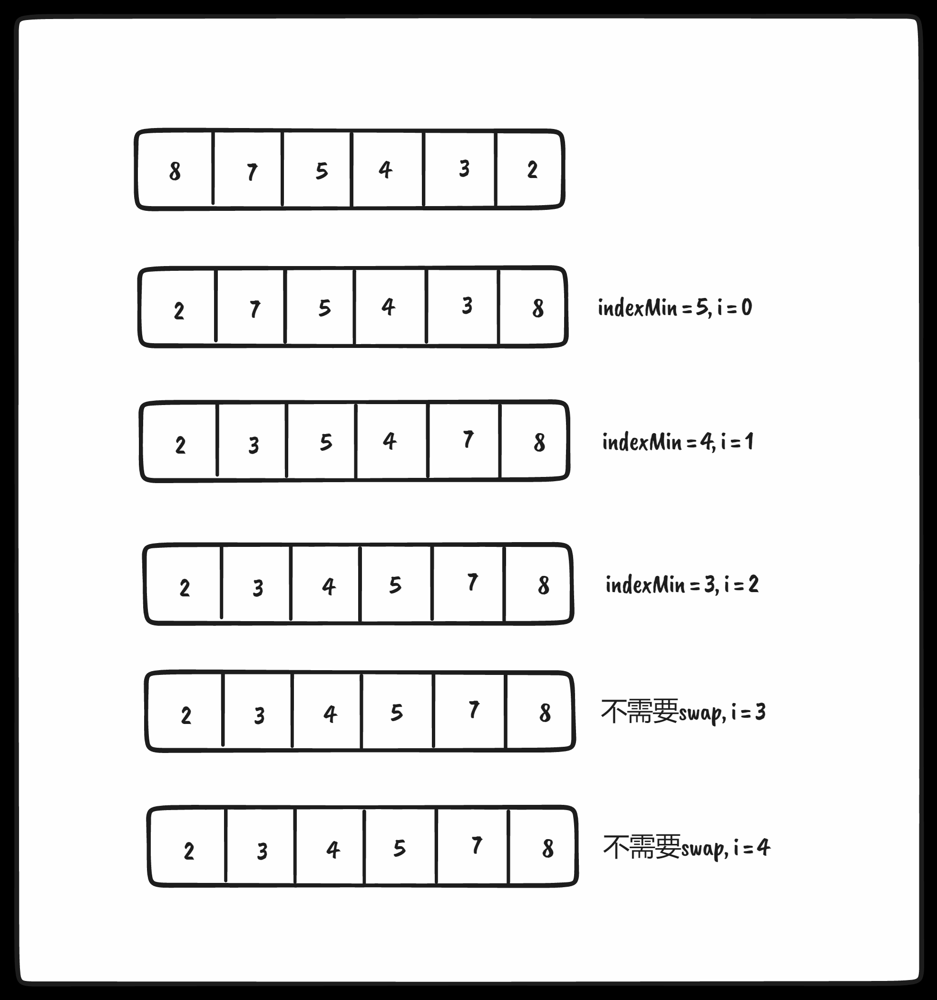

### 插入排序

原理：从第二位开始提取为temp并循环比较与前者的大小，若小于前者，那么将前者赋予当前位置，结束后得到temp应该被插入的位置

代码实现如下：

```ts
import { Compare, defaultCompare } from './sortedLinkedList'

export const insertionSort = (array: any[], compareFn = defaultCompare) => {
  const { length } = array
  let temp

  for (let i = 0; i < length; i++) {
    let j = i
    temp = array[i]

    while (j > 0 && compareFn(array[j - 1], temp) === Compare.BIGGER_THAN) {
      array[j] = array[j - 1]
      j--
    }

    array[j] = temp
  }

  return array
}

```

vitest测试如下：

```ts
test('insertionSort', () => {
  const arr = [8, 7, 5, 4, 3, 2]

  expect(insertionSort(arr)).toMatchInlineSnapshot(`
    [
      2,
      3,
      4,
      5,
      7,
      8,
    ]
  `)
})
```

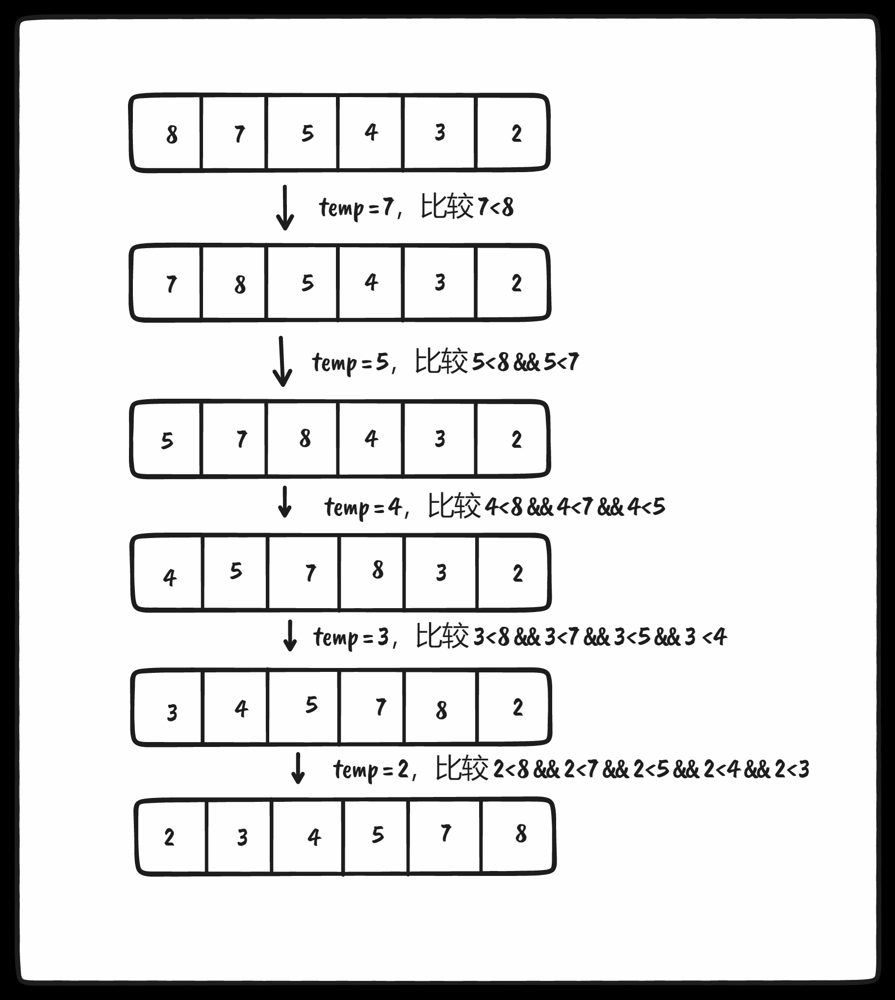

### 归并排序

原理：原始数组切分成较小的数组，直到每个小数组只有一个位置，接着将小数组归并成较大的数组，直到最后只有一个排序完毕的大数组

归并排序的实现大致两个过程（一个函数用来进行拆分，另一个函数用来合并）

`merge`: 合并函数

```ts
function merge<T>(left: T[], right: T[], compareFn: ICompareFunction<T>) {
  let i = 0
  let j = 0
  const result = []

  // 注意这里使用 i j 进行比较 left数组与right数组 中的元素
  while (i < left.length && j < right.length)
    result.push(compareFn(left[i], right[j]) === Compare.LESS_THAN ? left[i++] : right[j++])

  // 判断是left先遍历完毕还是right，
  // 1. 若为right先遍历完毕也就是此时 i < left.length 那么说明left余下部分都是大于right中元素
  // 2. 若为left先遍历完毕也就是此时 i >= left.length 那么说明right余下部分都是大于left中元素
  return result.concat(i < left.length ? left.slice(i) : right.slice(j))
}
```

`mergeSort`: 拆分函数

```ts
export function mergeSort<T>(array: T[], compareFn = defaultCompare): T[] {
  // 结束条件就是array.length === 1
  if (array.length > 1) {
    const { length } = array

    // 数组中间部分
    const middle = Math.floor(length / 2)

    // 0 ~ middle
    const left = mergeSort(array.slice(0, middle), compareFn)

    // middle ~ array.length
    const right = mergeSort(array.slice(middle, length), compareFn)

    // 左右进行合并
    array = merge(left, right, compareFn)
  }

  return array
}
```

vitest测试如下

```ts
test('mergeSort', () => {
  const arr = [8, 7, 6, 5, 4, 3, 2, 1]

  expect(mergeSort(arr)).toMatchInlineSnapshot(`
    [
      1,
      2,
      3,
      4,
      5,
      6,
      7,
      8,
    ]
  `)
})
```


### 快速排序

原理：

* 首先，从数组中选择一个值作为主元（pivot），也就是数组中间的那个值
* 创建两个指针（引用），左边一个指向数组第一个值，右边一个指向数组最后一个值。移动左指针直到我们找到一个比主元大的值，接着，移动右指针直到找到一个比主元小的值，然后交换它们，重复这个过程，直到左指针超过了右指针。这个过程将使得比主元小的值都排在主元之前，而比主元大的值都排在主元之后。这一步叫作划分（partition）操作
* 接着，算法对划分后的小数组（较主元小的值组成的子数组，以及较主元大的值组成的子数组）重复之前的两个步骤，直至数组已完全排序

<span style="color: pink;">你只要知道快速排序通常比所有的 O(nlog(n)) 时间复杂度排序算法中性能更好！</span>

`partition`: 划分函数

```ts
function partition(array: any[], left: number, right: number, compareFn: ICompareFunction<any>) {
  const pivot = array[Math.floor((right + left) / 2)]
  let i = left
  let j = right

  // 当左指针指向的元素比主元大且右指针指向的元素比主元小，并且此时左指针索引没有右指针索引大时，交换它们，并且此时左指针索引没有右指针索引大
  while (i <= j) {
    while (compareFn(array[i], pivot) === Compare.LESS_THAN)
      i++

    while (compareFn(array[j], pivot) === Compare.BIGGER_THAN)
      j--

    if (i <= j) {
      swap(array, i, j)
      i++
      j--
    }
  }

  return i
}
```

`quickSort`: 排序函数

```ts
function quick(array: any[], left: number, right: number, compareFn: ICompareFunction<any>) {
  let index

  // 中止条件 <= 1
  if (array.length > 1) {
    // partition返回 左指针的索引
    index = partition(array, left, right, compareFn)

    if (left < index - 1)
      // 左侧再进行划分
      quick(array, left, index - 1, compareFn)

    if (index < right)
      // 右侧再进行划分
      quick(array, index, right, compareFn)
  }

  return array
}

export const quickSort = (array: any[], compareFn = defaultCompare) => {
  return quick(array, 0, array.length - 1, compareFn)
}

```

使用vitest测试如下

```ts
test('quickSort', () => {
  const arr = [3, 5, 1, 6, 4, 7, 2]

  expect(quickSort(arr)).toMatchInlineSnapshot(`
    [
      1,
      2,
      3,
      4,
      5,
      6,
      7,
    ]
  `)
})
```

分析图如下

* 第一次划分得到`index=5`，下次就是 0到4开始划分

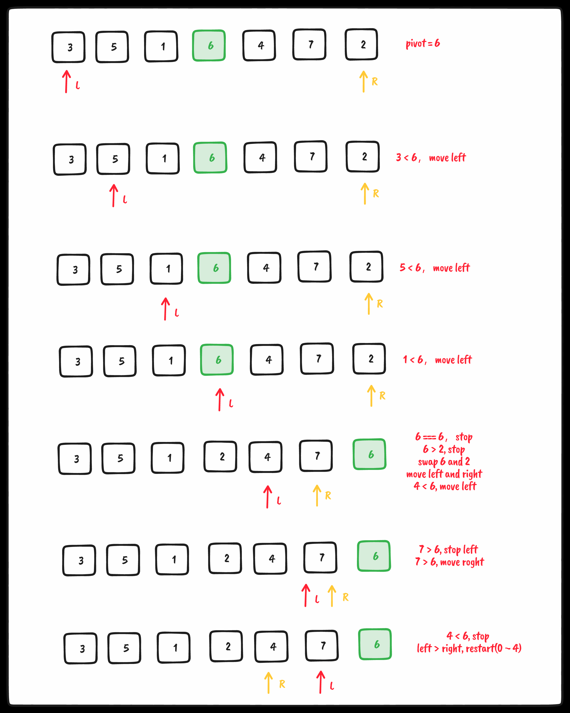

* 第二次划分得到`index=1`，下次就是 1到4开始划分

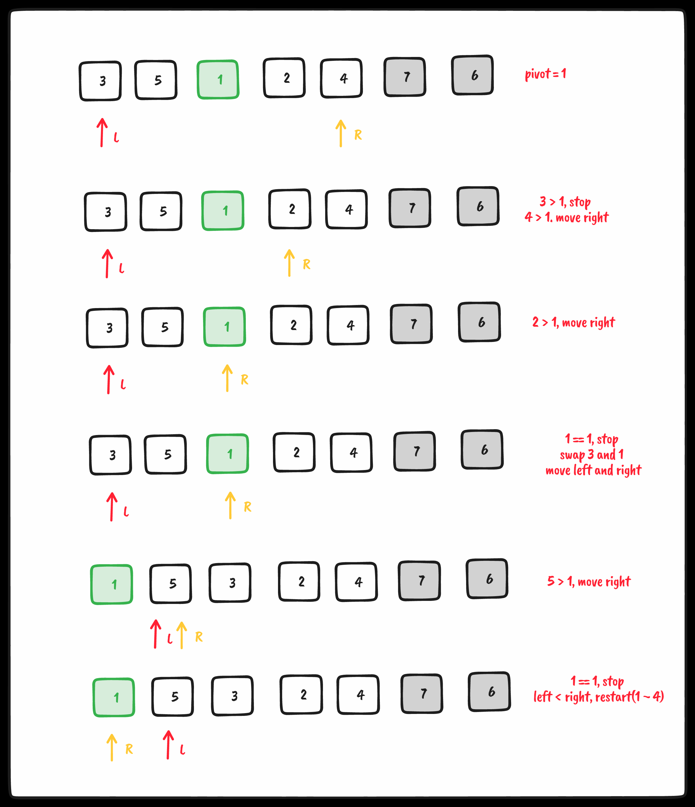

* 第三次划分得到`index=3`，下次就是 1到2开始划分

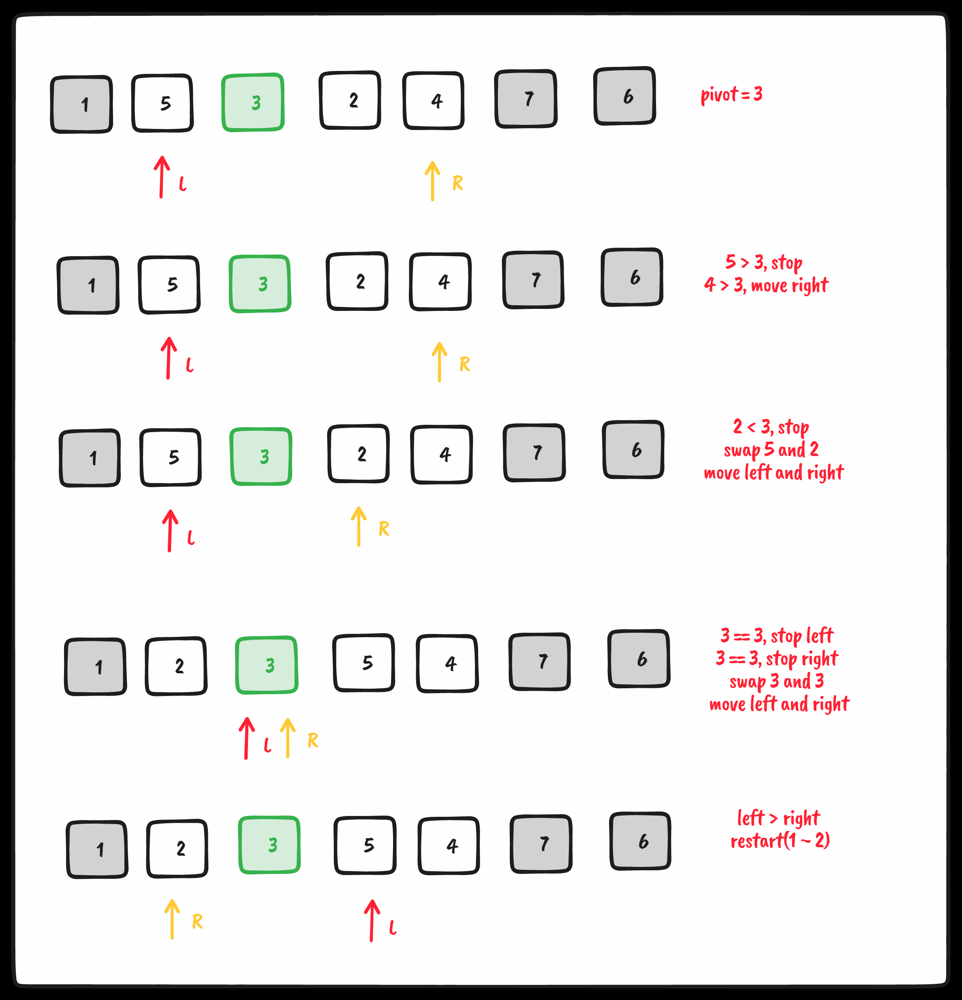

* 第四次划分得到`index=2`，此时左侧quick完毕了，该右侧quick了，下次从 3到4开始

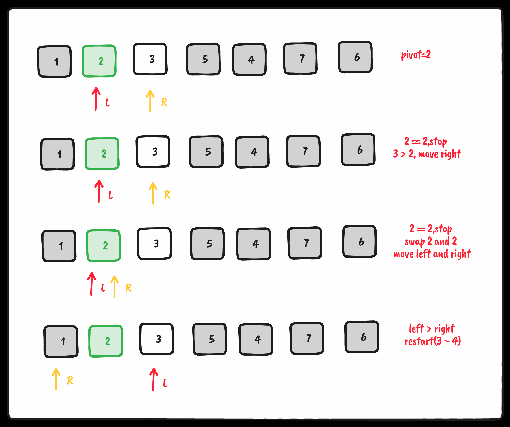

* 第五次划分得到`index=4`， 依然是右侧的quick，下次从 5到6开始

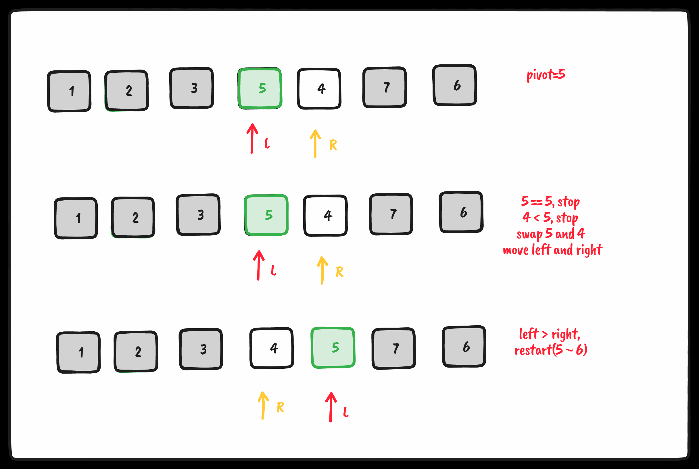

* 第六次划分得到`index=6`，此时由于left=5且right=6，不满足条件于是直接return

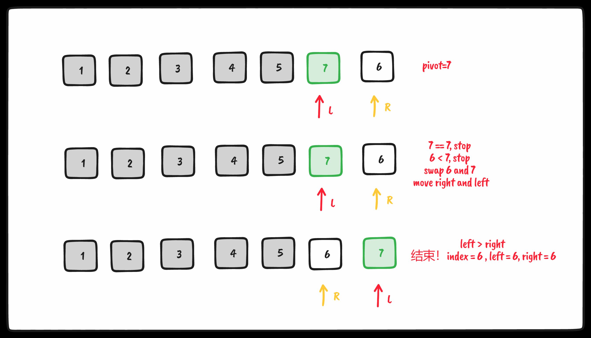

<span style="color: pink;">这里给一个 `chatGpt` 实现的版本，确实比前一个的实现要好太多了！！！</span>

```ts
export function quickSortByChatGpt(arr: number[]): number[] {
  if (arr.length <= 1)
    return arr

  const pivotIndex = Math.floor(arr.length / 2)
  const pivot = arr.splice(pivotIndex, 1)[0]

  const left = []
  const right = []

  for (let i = 0; i < arr.length; i++) {
    if (arr[i] < pivot)
      left.push(arr[i])

    else
      right.push(arr[i])
  }

  return quickSort(left).concat([pivot], quickSort(right))
}
```

### 计数排序

是一个分布式排序，分布式排序使用已组织好的辅助数据结构（称为桶），然后进行合并，得到排好序的数组。计数排序使用一个用来存储每个元素在原始数组中出现次数的临时数组。在所有元素都计数完成后，临时数组已排好序并可迭代以构建排序后的结果数组，<span style="color: pink;">它是用来排序整数的优秀算法</span> 时间复杂度为O(n+k)，k是临时计数数组的大小，需要更多的内存存放临时数组（空间换时间）

代码实现如下：

```ts
import { Compare, defaultCompare } from './sortedLinkedList'

export function findMaxValue<T>(array: T[], compareFn = defaultCompare) {
  if (array && array.length > 0) {
    let max = array[0]

    for (let i = 1; i < array.length; i++) {
      if (compareFn(max, array[i]) === Compare.LESS_THAN)
        max = array[i]
    }

    return max
  }

  return undefined
}

export function countingSort(array: number[]) {
  if (array.length < 2)
    return array

  const maxValue = findMaxValue(array)
  let sortedIndex = 0
  // WHY: 我们将array数组元素值（整数）作为新数组的索引，
  // 初始化长度：最大值 + 1，是因为数组是从0开始索引的
  const counts = new Array(maxValue! + 1).fill(0)

  array.forEach((ele) => {
    counts[ele]++
  })

  counts.forEach((ele, i) => {
    while (ele > 0) {
      array[sortedIndex++] = i
      ele--
    }
  })

  return array
}
```

vitest测试如下：

```ts
test('countingSort', () => {
  const arr = [3, 5, 1, 6, 4, 7, 2, 1, 2]
  expect(countingSort(arr)).toMatchInlineSnapshot(`
    [
      1,
      1,
      2,
      2,
      3,
      4,
      5,
      6,
      7,
    ]
  `)
})
```

分析图如下：

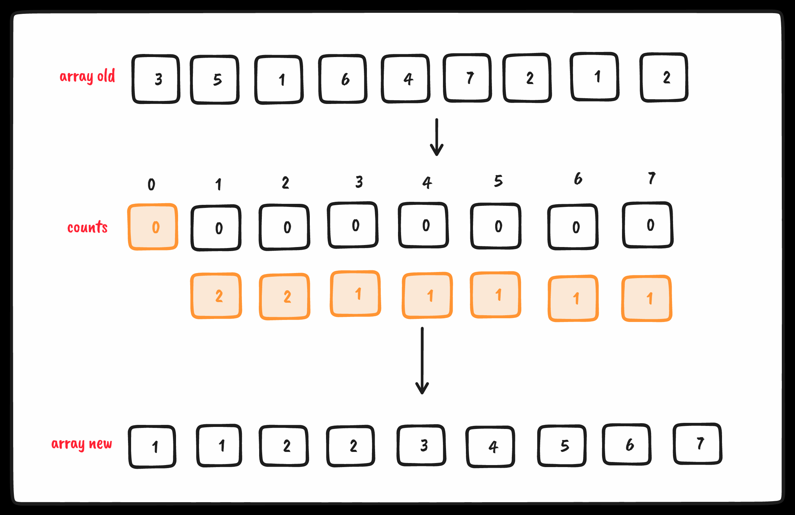

### 桶排序（箱排序）

也是一个 <span style="color: pink;">分布式排序算法</span>，它将元素 <span style="color: pink;">分为不同的桶（较小的数组）</span> ，再使用一个简单的排序算法，例如 <span style="color: pink;">插入排序（用来排序小数组的不错的算法），来对每个桶进行排序</span> 。然后，它将所有的桶合并为结果数组

* 整个数组元素分为多个较小的数组（桶）
* 使用插入排序对每个小数组（桶）进行排序
* 所有桶合并为最终排序后的结果数组

代码实现:

```ts
import { insertionSort } from './insertion-sort'

function createBuckets(array: number[], bucketSize: number): number[][] {
  let minValue = array[0]
  let maxValue = array[0]

  // 找出数组中的最大最小值
  for (let i = 1; i < array.length; i++) {
    if (array[i] < minValue)
      minValue = array[i]

    else if (array[i] > maxValue)
      maxValue = array[i]
  }

  // 一个bucket的大小为5，计算需要几个bucket存放所有元素
  const bucketCount = Math.floor((maxValue - minValue) / bucketSize) + 1
  const buckets: number[][] = []

  // 根据bucket的数量初始化buckets二维数组
  for (let i = 0; i < bucketCount; i++)
    buckets[i] = []

  // 计算当前元素 array[i]应该放在buckets的哪个索引数组中
  // 很简单，(最大值 - 最小值) / bucketSize 则为最大的索引，其余值都是小于最大值，所以索引只会是 `小于等于`
  for (let i = 0; i < array.length; i++)
    buckets[Math.floor((array[i] - minValue) / bucketSize)].push(array[i])

  return buckets
}

function sortBuckets(buckets: number[][]) {
  const sortedArray = []

  for (let i = 0; i < buckets.length; i++) {
    // 跟奇怪，不应该存在 null || undefined 的情况
    if (buckets[i] != null) {
      insertionSort(buckets[i])

      sortedArray.push(...buckets[i])
    }
  }

  return sortedArray
}

export function bucketSort(array: number[], bucketSize = 5) {
  if (array.length < 2)
    return array

  const buckets = createBuckets(array, bucketSize)

  return sortBuckets(buckets)
}
```

使用vitest测试如下:

```ts
test('bucketCount', () => {
  const arr = [3, 5, 1, 6, 4, 7, 2, 1, 2]

  expect(bucketSort(arr)).toMatchInlineSnapshot(`
    [
      1,
      1,
      2,
      2,
      3,
      4,
      5,
      6,
      7,
    ]
  `)
})
```

代码其实相对较为容易看明白（我就不做图例了），将大数组分为很多个桶（小数组）`0号桶中元素 < 1号桶中元素 < ... < n号桶中元素`，将每个桶使用插入排序的方式排序，之后再将其解构到sortedArray中，返回即可，典型的空间换时间排序算法

### 基数排序

基数排序也是一个分布式排序算法，根据数字的有效位或基数将整数分布到桶中，基数是基于数组中值的记数制的。这句话说的迷迷糊糊的，其实就是根据待排序数组中所有元素的个位、十位、百位...进行排序，个位排序后再十位排序再百位排序....

代码如下：

```ts
import { findMaxValue } from './counting-sort'
import { Compare, defaultCompare } from './sortedLinkedList'

export function findMinValue<T>(array: T[], compareFn = defaultCompare) {
  if (array && array.length > 0) {
    let min = array[0]

    for (let i = 1; i < array.length; i++) {
      if (compareFn(min, array[i]) === Compare.BIGGER_THAN)
        min = array[i]
    }

    return min
  }

  return undefined
}

function countingSortForRadix(array: number[], radixBase: number, significantDigit: number, minValue: number) {
  let bucketsIndex
  const buckets: number[] = []
  const aux: number[] = []

  for (let i = 0; i < radixBase; i++)
    buckets[i] = 0

  // 数组正序
  for (let i = 0; i < array.length; i++) {
    bucketsIndex = Math.floor(((array[i] - minValue) / significantDigit) % radixBase)
    buckets[bucketsIndex]++
  }

  // 对 buckets 中的元素除第一个外都累加前者
  for (let i = 1; i < radixBase; i++)
    buckets[i] += buckets[i - 1]

  // 数组倒序
  for (let i = array.length - 1; i >= 0; i--) {
    bucketsIndex = Math.floor(((array[i] - minValue) / significantDigit) % radixBase)
    aux[--buckets[bucketsIndex]] = array[i]
  }

  // array = []
  // array.push(...aux)
  for (let i = 0; i < array.length; i++)
    array[i] = aux[i]

  return array
}

export function radixSort(array: number[], radixBase = 10) {
  if (array.length < 2)
    return array

  const minValue = findMinValue(array)!
  const maxValue = findMaxValue(array)!

  let significantDigit = 1

  while ((maxValue - minValue) / significantDigit >= 1) {
    array = countingSortForRadix(array, radixBase, significantDigit, minValue)

    significantDigit *= radixBase
  }

  return array
}

```

vitest测试如下：

```ts
test('radixSort', () => {
  const arr = [322, 512, 13423, 6123, 421, 223, 734, 21, 12, 2]

  expect(radixSort(arr)).toMatchInlineSnapshot(`
    [
      2,
      12,
      21,
      223,
      322,
      421,
      512,
      734,
      6123,
      13423,
    ]
  `)
})
```

分析图如下（仅仅分析个位的排序，后续十分位、百分位...类推）

* 循环体执行次数

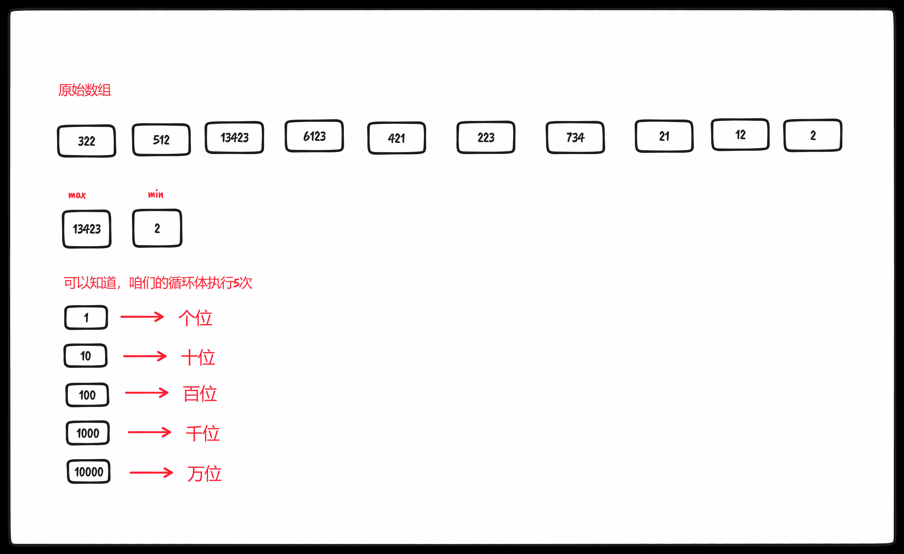

* 利用buckets统计对应分位值出现个数（咱们这里统计的是个位值）

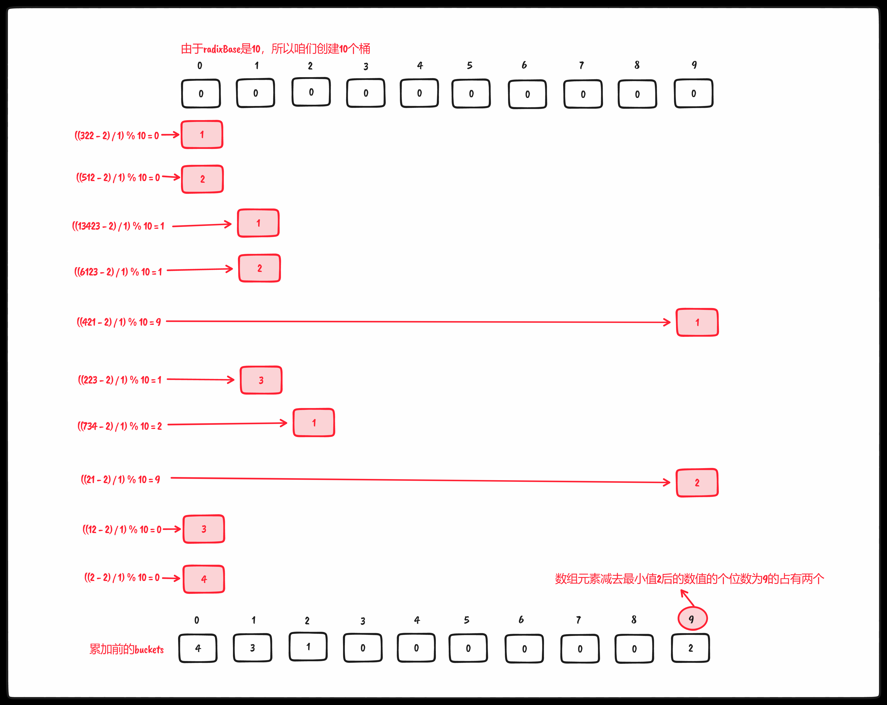

* buckets数组元素除去第一个，后续元素都累加前者


* 使用 aux 数组依据buckets数组对应分位值的统计次数存放对应原array数组中的数据

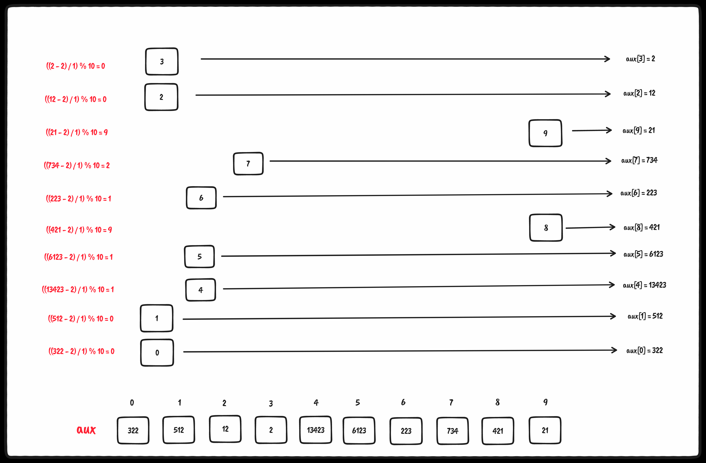

<span style="color: pink;">纵观整个算法，其中最不好理解的就是 为什么 `buckets[i] += buckets[i - 1]`，也就是当前值需要累加前者值？在咱们的buckets中，其索引即为排序元素值减去最小值除以有效位并对10取模得到的对应位的值！！（个位值、百分位值、千分位值...）之后累加前者是因为咱们需要组装 aux数组，可以看到 buckets数组中所有元素值之和为array数组的长度，由于aux数组其实就是排序后的array数组，所以咱们需要在buckets数组中累加前者元素值进而得到正确的aux索引！！！</span>
