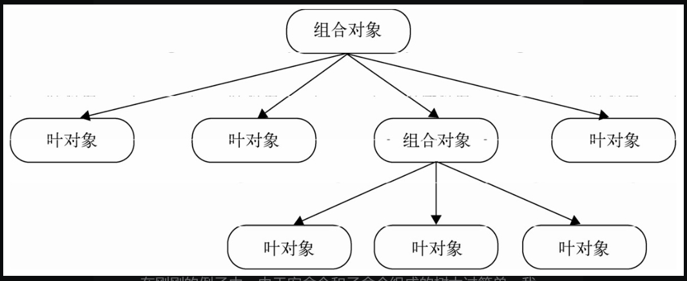

## 定义



以前面命令模式的宏命令举例，开门，登录qq等称为子对象，万能遥控器为组合对象，他们都共同暴露`execute`方法，用户只需通过组合对象的`execute`调用执行即可，内部的调用子对象`execute`等操作是透明不可见的

## 更强大的宏命令

```html
<html>
    <body>
      <button id="button">按我</button>
</body>

<script>

var MacroCommand = function(){
    return {
      commandsList: [],
      add: function( command ){
          this.commandsList.push( command );
      },
      execute: function(){
          for ( var i = 0, command; command = this.commandsList[ i++ ]; ){
              command.execute();
          }
      }
    }
};

var openAcCommand = {
    execute: function(){
      console.log( ’打开空调’ );
    }
};
/**********家里的电视和音响是连接在一起的，所以可以用一个宏命令来组合打开电视和打开音响的命令
*********/

var openTvCommand = {
    execute: function(){
      console.log( ’打开电视’ );
    }
};

var openSoundCommand = {
    execute: function(){
      console.log( ’打开音响’ );
    }
};

var macroCommand1 = MacroCommand();
macroCommand1.add( openTvCommand );
macroCommand1.add( openSoundCommand );

/*********关门、打开电脑和打登录QQ的命令****************/

var closeDoorCommand = {
    execute: function(){
        console.log( ’关门’ );
    }
};

var openPcCommand = {
    execute: function(){
      console.log( ’开电脑’ );
      }
  };

  var openQQCommand = {
      execute: function(){
          console.log( '登录QQ' );
      }
  };

  var macroCommand2 = MacroCommand();
  macroCommand2.add( closeDoorCommand );
  macroCommand2.add( openPcCommand );
  macroCommand2.add( openQQCommand );

/*********现在把所有的命令组合成一个“超级命令”**********/

  var macroCommand = MacroCommand();
  macroCommand.add( openAcCommand );
  macroCommand.add( macroCommand1 );
  macroCommand.add( macroCommand2 );

/*********最后给遥控器绑定“超级命令”**********/

  var setCommand = (function( command ){
      document.getElementById( 'button' ).onclick = function(){
          command.execute();
      }
  })( macroCommand );

  </script>
</html>
```

上面代码进行的树的深度优先遍历，同时调用方只需要知道顶层根节点（组合对象），然后调用暴露的api就好，新增命令的开发人员只需要编写存在 `execute`的对象就好。

## 实际应用——扫描文件夹

定义文件夹类和文件类

```javascript
/******************************* Folder ******************************/
var Folder = function( name ){
    this.name = name;
    this.files = [];
};

Folder.prototype.add = function( file ){
    this.files.push( file );
};

Folder.prototype.scan = function(){
    console.log( ’开始扫描文件夹： ' + this.name );
    for ( var i = 0, file, files = this.files; file = files[ i++ ]; ){
      file.scan();
    }
};

/******************************* File ******************************/
var File = function( name ){
    this.name = name;
};

File.prototype.add = function(){
    throw new Error( ’文件下面不能再添加文件’ );
};
File.prototype.scan = function(){
    console.log( ’开始扫描文件： ' + this.name );
};
```

文件以及文件夹建立树形关系

```javascript
var folder = new Folder( ’学习资料’ );
var folder1 = new Folder( 'JavaScript' );
var folder2 = new Folder ( 'jQuery' );

var file1 = new File( 'JavaScript设计模式与开发实践’ );
var file2 = new File( ’精通jQuery' );
var file3 = new File( ’重构与模式’ )

folder1.add( file1 );
folder2.add( file2 );

folder.add( folder1 );
folder.add( folder2 );
folder.add( file3 );
```

## 关于组合模式的一些注意点

* 组合模式不是父子关系
* 只有用一致的方式对待列表中的每个叶对象的时候，才适合使用组合模式（例如前面的 文件 都是scan操作）
* 对于叶节点同时属于两个组合对象的情形，会出现问题（架构师属于开发组跟架构组），这个时候可以引入中介者模式对对象进行管理
* 树节点过多那么遍历过程会出现性能问题，此时可以使用职责链模式进行优化

好了，这里得到两个重要概念（中介者模式、职责链模式）

## 引用父对象

神乎其神，其实就类似于树了，子节点需要保存父节点的引关系，父节点保持子节点的关系。文件夹的删除就是一个很好的例子，书中还说了职责链（后续了解职责链后再返回来看）。

**文件夹删除代码示例**

文件夹类

```javascript
var Folder = function( name ){
    this.name = name;
    this.parent = null;    //增加this.parent属性
    this.files = [];
};

Folder.prototype.add = function( file ){
    file.parent = this;    //设置父对象
    this.files.push( file );
};

Folder.prototype.scan = function(){
    console.log( ’开始扫描文件夹： ' + this.name );
    for ( var i = 0, file, files = this.files; file = files[ i++ ]; ){
      file.scan();
    }
};

Folder.prototype.remove = function(){
    if ( ! this.parent ){    //根节点或者树外的游离节点
      return;
    }
    for ( var files = this.parent.files, l = files.length -1; l >=0; l-- ){
      var file = files[ l ];
      if ( file === this ){
          files.splice( l, 1 );
      }
    }
};
```

文件类

```javascript
var File = function( name ){
    this.name = name;
    this.parent = null;
};

File.prototype.add = function(){
    throw new Error( ’不能添加在文件下面’ );
};

File.prototype.scan = function(){
    console.log( ’开始扫描文件： ' + this.name );
};

File.prototype.remove = function(){
    if ( ! this.parent ){    //根节点或者树外的游离节点
      return;
    }
    for ( var files = this.parent.files, l = files.length -1; l >=0; l-- ){
      var file = files[ l ];
      if ( file === this ){
          files.splice( l, 1 );
      }
    }
};
```
