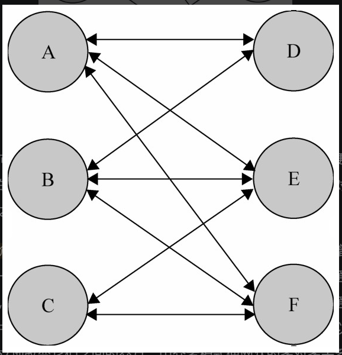
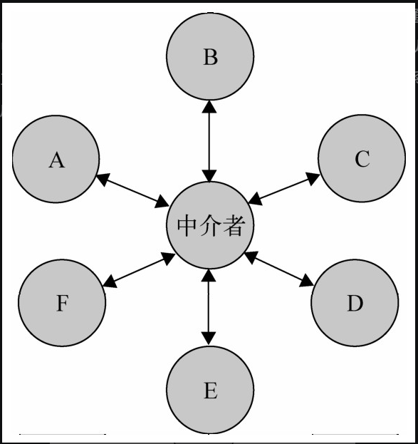

## 定义

<span style="color: pink;">面向对象的设计鼓励将对象拆分的更加细粒，但是这些细粒度之间联系激增的话，他们反而会降低他们的可复用性</span>

<span style="color: pink;">解决对象与对象之间的紧耦合，增加一个中介者对象后，所有的相关对象都通过中介者对象来通信，而不是互相引用，所以当一个对象发生改变时，只需要通知中介者对象即可。中介者使各对象之间耦合松散，而且可以独立地改变它们之间的交互</span>

无图言diao，见下图





## 例子

### 泡泡堂

**首先先看未引入中介者时代码**

```javascript
// 增量式循环初始化队友以及敌人
var players = [];

// ==========================================================
// Player 类
function Player( name, teamColor ){
  this.partners = []; // 队友列表
  this.enemies = [];   // 敌人列表
  this.state = 'live';  // 玩家状态
  this.name = name; // 角色名字
  this.teamColor = teamColor; // 队伍颜色
};

Player.prototype.win = function(){   // 玩家团队胜利
    console.log( 'winner: ' + this.name );
};

Player.prototype.lose = function(){   // 玩家团队失败
    console.log( 'loser: ' + this.name );
};

Player.prototype.die = function(){   // 玩家死亡

    var all_dead = true;
    this.state = 'dead'; // 设置玩家状态为死亡

    for ( var i = 0, partner; partner = this.partners[ i++ ]; ){ // 遍历队友列表
        if ( partner.state !== 'dead' ){   // 如果还有一个队友没有死亡，则游戏还未失败
          all_dead = false;
          break;
        }
    }

    if ( all_dead === true ){   // 如果队友全部死亡
        this.lose();   // 通知自己游戏失败
        for ( var i = 0, partner; partner = this.partners[ i++ ]; ){   // 通知所有队友玩家游戏失败
          partner.lose();
        }
        for ( var i = 0, enemy; enemy = this.enemies[ i++ ]; ){   // 通知所有敌人游戏胜利
          enemy.win();
        }
    }
};

// ==========================================================
// 创建玩家的工厂函数
var playerFactory = function( name, teamColor ){
    var newPlayer = new Player( name, teamColor );   // 创建新玩家

    for ( var i = 0, player; player = players[ i++ ]; ){    // 通知所有的玩家，有新角色加入
      if ( player.teamColor === newPlayer.teamColor ){   // 如果是同一队的玩家
            player.partners.push( newPlayer );     // 相互添加到队友列表
            newPlayer.partners.push( player );
      }else{
            player.enemies.push( newPlayer );  // 相互添加到敌人列表
            newPlayer.enemies.push( player );
      }
    }
    players.push( newPlayer );

    return newPlayer;
};

// ==========================================================
// 创建玩家
//红队：
var player1 = playerFactory( ’皮蛋’, 'red' ),
    player2 = playerFactory( ’小乖’, 'red' ),
    player3 = playerFactory( ’宝宝’, 'red' ),
    player4 = playerFactory( ’小强’, 'red' );

//蓝队：
var player5 = playerFactory( ’黑妞’, 'blue' ),
    player6 = playerFactory( ’葱头’, 'blue' ),
    player7 = playerFactory( ’胖墩’, 'blue' ),
    player8 = playerFactory( ’海盗’, 'blue' );

```

有什么问题？

* 任意一个玩家执行任何操作都需要显示的通知给队友以及敌人

**引入中介者**

Player类

```javascript
function Player( name, teamColor ){
    this.name = name; // 角色名字
    this.teamColor = teamColor; // 队伍颜色
    this.state = 'alive';   // 玩家生存状态
};

Player.prototype.win = function(){
    console.log( this.name + ' won ' );
};

Player.prototype.lose = function(){
    console.log( this.name +' lost' );
};

/*******************玩家死亡*****************/

Player.prototype.die = function(){
    this.state = 'dead';
    playerDirector.reciveMessage( 'playerDead', this );   // 给中介者发送消息，玩家死亡
};

/*******************移除玩家*****************/

Player.prototype.remove = function(){
    playerDirector.reciveMessage( 'removePlayer', this );    // 给中介者发送消息，移除一个玩家
};
/*******************玩家换队*****************/

Player.prototype.changeTeam = function( color ){
    playerDirector.reciveMessage( 'changeTeam', this, color );   // 给中介者发送消息，玩家换队
};
```

工厂函数

```javascript
var playerFactory = function( name, teamColor ){
    var newPlayer = new Player( name, teamColor );    // 创造一个新的玩家对象
    playerDirector.reciveMessage( 'addPlayer', newPlayer );   // 给中介者发送消息，新增玩家

    return newPlayer;
};
```

<span style="color: pink;">playerDirector</span>

```javascript
var playerDirector= ( function(){
  var players = {},   // 保存所有玩家
      operations = {};   // 中介者可以执行的操作

  /****************新增一个玩家***************************/
  operations.addPlayer = function( player ){
    var teamColor = player.teamColor;   // 玩家的队伍颜色
    players[ teamColor ] = players[ teamColor ] || [];   // 如果该颜色的玩家还没有成立队伍，则新成立一个队伍
    players[ teamColor ].push( player );   // 添加玩家进队伍
  };

  /****************移除一个玩家***************************/
  operations.removePlayer = function( player ){
    var teamColor = player.teamColor,   // 玩家的队伍颜色
        teamPlayers = players[ teamColor ] || [];   // 该队伍所有成员
    for ( var i = teamPlayers.length -1; i >= 0; i-- ){   // 遍历删除
      if ( teamPlayers[ i ] === player ){
          teamPlayers.splice( i, 1 );
      }
    }
  };

  /****************玩家换队***************************/
  operations.changeTeam = function( player, newTeamColor ){
    operations.removePlayer( player );   // 从原队伍中删除
    player.teamColor = newTeamColor;   // 改变队伍颜色
    operations.addPlayer( player );       // 增加到新队伍中
  };

  /****************玩家死亡***************************/
  operations.playerDead = function( player ){
    var teamColor = player.teamColor,
        teamPlayers = players[ teamColor ];   // 玩家所在队伍

    var all_dead = true;

    for ( var i = 0, player; player = teamPlayers[ i++ ]; ){
        if ( player.state ! == 'dead' ){
            all_dead = false;
            break;
        }
    }

    if ( all_dead === true ){   // 全部死亡

        for ( var i = 0, player; player = teamPlayers[ i++ ]; ){
            player.lose();   // 本队所有玩家lose
        }

        for ( var color in players ){
            if ( color ! == teamColor ){
              var teamPlayers = players[ color ];   // 其他队伍的玩家
              for ( var i = 0, player; player = teamPlayers[ i++ ]; ){
                  player.win();   // 其他队伍所有玩家win
              }
            }
        }
    }
  };

  var reciveMessage = function(){
    var message = Array.prototype.shift.call( arguments );   // arguments的第一个参数为消息名称
    operations[ message ].apply( this, arguments );
  };

  return {
    reciveMessage: reciveMessage
  }
})();
```

创建玩家以及一些操作

```javascript
// 红队：
var player1 = playerFactory( ’皮蛋’, 'red' ),
    player2 = playerFactory( ’小乖’, 'red' ),
    player3 = playerFactory( ’宝宝’, 'red' ),
    player4 = playerFactory( ’小强’, 'red' );

// 蓝队：
var player5 = playerFactory( ’黑妞’, 'blue' ),
    player6 = playerFactory( ’葱头’, 'blue' ),
    player7 = playerFactory( ’胖墩’, 'blue' ),
    player8 = playerFactory( ’海盗’, 'blue' );

player1.remove();
player2.remove();
player3.die();
player4.die();
```

上面代码很好明白，读不懂就不要学前端了...

* 我真没看出来与前面代码有啥差别，仅仅将原本Player中的方法抽离到了一个playerDirector对象中？只是在代码流程上看起来更清晰，不混乱。
* 玩家只需要告知管理者，管理者实现对所有玩家的管理，有一个好处当两个开发人员，一个只需要实现玩家的功能，另一个只需要实现管理者的功能即可，开发玩家功能的人只需要调用开发管理者功能的人提供的api即可。

### 购买商品

这个例子很棒，使用中介者解决了多个对象之间的紧耦合。

**未优化前的代码**

```html
<body>
      选择颜色：  <select id="colorSelect">
                    <option value="">请选择</option>
                    <option value="red">红色</option>
                    <option value="blue">蓝色</option>
                </select>

      输入购买数量：  <input type="text" id="numberInput"/>

      您选择了颜色：  <div id="colorInfo"></div><br/>
      您输入了数量：  <div id="numberInfo"></div><br/>

      <button id="nextBtn" disabled="true">请选择手机颜色和购买数量</button>
</body>

<script>
  var colorSelect = document.getElementById( 'colorSelect' ),
  numberInput = document.getElementById( 'numberInput' ),
  colorInfo = document.getElementById( 'colorInfo' ),
  numberInfo = document.getElementById( 'numberInfo' ),
  nextBtn = document.getElementById( 'nextBtn' );

  var goods = {   // 手机库存
    "red": 3,
    "blue": 6
  };

  colorSelect.onchange = function(){
    var color = this.value,   // 颜色
        number = numberInput.value,   // 数量
        stock = goods[ color ];   // 该颜色手机对应的当前库存

    colorInfo.innerHTML = color;
    if ( !color ){
        nextBtn.disabled = true;
        nextBtn.innerHTML = '请选择手机颜色';
        return;
    }

    if ( Number.isInteger ( number -0 ) && number > 0 ){   // 用户输入的购买数量是否为正整数
        nextBtn.disabled = true;
        nextBtn.innerHTML = '请输入正确的购买数量';
        return;
    }

    if ( number > stock  ){   // 当前选择数量超过库存量
        nextBtn.disabled = true;
        nextBtn.innerHTML = '库存不足';
        return ;
    }

    nextBtn.disabled = false;
    nextBtn.innerHTML = '放入购物车';

  };

  numberInput.oninput = function(){
    var color = colorSelect.value,   // 颜色
      number = this.value,   // 数量
      stock = goods[ color ];   // 该颜色手机对应的当前库存

    numberInfo.innerHTML = number;

    if ( ! color ){
      nextBtn.disabled = true;
      nextBtn.innerHTML = ’请选择手机颜色’;
      return;
    }

    if ( ( ( number -0 ) | 0 ) ! == number -0 ){   // 输入购买数量是否为正整数
      nextBtn.disabled = true;
      nextBtn.innerHTML = ’请输入正确的购买数量’;
      return;
    }
    if ( number > stock  ){   // 当前选择数量没有超过库存量
        nextBtn.disabled = true;
        nextBtn.innerHTML = ’库存不足’;
        return ;
    }

    nextBtn.disabled = false;
    nextBtn.innerHTML = ’放入购物车’;
};
</script>
```

若增加一个内存的选择框，那么需要做如下更改

* 增加memorySelect选择框
* 改写colorSelect的onchange函数逻辑（增加内存的选择判定逻辑）
* numberInput也需要更改
* 增加memorySelect.onchange函数的逻辑

**中介者优化**

```javascript
var goods = {   // 手机库存
    "red|32G": 3,
    "red|16G": 0,
    "blue|32G": 1,
    "blue|16G": 6
};

var mediator = (function(){

    var colorSelect = document.getElementById( 'colorSelect' ),
      memorySelect = document.getElementById( 'memorySelect' ),
      numberInput = document.getElementById( 'numberInput' ),
      colorInfo = document.getElementById( 'colorInfo' ),
      memoryInfo = document.getElementById( 'memoryInfo' ),
      numberInfo = document.getElementById( 'numberInfo' ),
      nextBtn = document.getElementById( 'nextBtn' );

    return {
      changed: function( obj ){
          var color = colorSelect.value,   // 颜色
              memory = memorySelect.value, // 内存
              number = numberInput.value,   // 数量
              stock = goods[ color + '|' + memory ];   // 颜色和内存对应的手机库存数量

          if ( obj === colorSelect ){     // 如果改变的是选择颜色下拉框
              colorInfo.innerHTML = color;
          }else if ( obj === memorySelect ){
              memoryInfo.innerHTML = memory;
          }else if ( obj === numberInput ){
              numberInfo.innerHTML = number;
          }

          if ( ! color ){
              nextBtn.disabled = true;
              nextBtn.innerHTML = ’请选择手机颜色’;
              return;
          }

          if ( ! memory ){
              nextBtn.disabled = true;
              nextBtn.innerHTML = ’请选择内存大小’;
              return;
          }

          if ( Number.isInteger ( number -0 ) && number > 0 ){   // 输入购买数量是否为正整数
              nextBtn.disabled = true;
              nextBtn.innerHTML = ’请输入正确的购买数量’;
              return;
          }

          nextBtn.disabled = false;
          nextBtn.innerHTML = ’放入购物车’;
      }
    }

})();

// 事件函数：
colorSelect.onchange = function(){
    mediator.changed( this );
};
memorySelect.onchange = function(){
    mediator.changed( this );
};
numberInput.oninput = function(){
    mediator.changed( this );
};
```

后续增加cpu等多个其他select，只需要对中介者中的逻辑修改就好。

```javascript
var goods = {    // 手机库存
    "red|32G|800": 3,    // 颜色red，内存32G, cpu800，对应库存数量为3
    "red|16G|801": 0,
    "blue|32G|800": 1,
    "blue|16G|801": 6
};

var mediator = (function(){
              // 略
    var cpuSelect = document.getElementById( 'cpuSelect' );
    return {
      change: function(obj){
                // 略
          var cpu = cpuSelect.value,
          stock = goods[ color + '|' + memory + '|' + cpu ];
          if ( obj === cpuSelect ){
              cpuInfo.innerHTML = cpu;
          }
                // 略
      }
    }
})();
```
