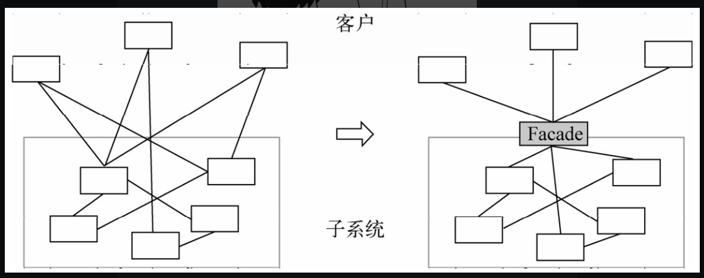

## 定义

最少知识原则要求我们在设计程序时，应当尽量减少对象之间的交互。如果两个对象之间不必彼此直接通信，那么这两个对象就不要发生直接的相互联系。常见的做法是引入一个第三者对象，来承担这些对象之间的通信作用。如果一些对象需要向另一些对象发起请求，可以通过第三者对象来转发这些请求

## 符合这个原则的设计模式

* [中介者模式](./100801.md)

* 外观模式（为子系统中的一组接口提供一个一致的界面，外观模式定义了一个高层接口）

