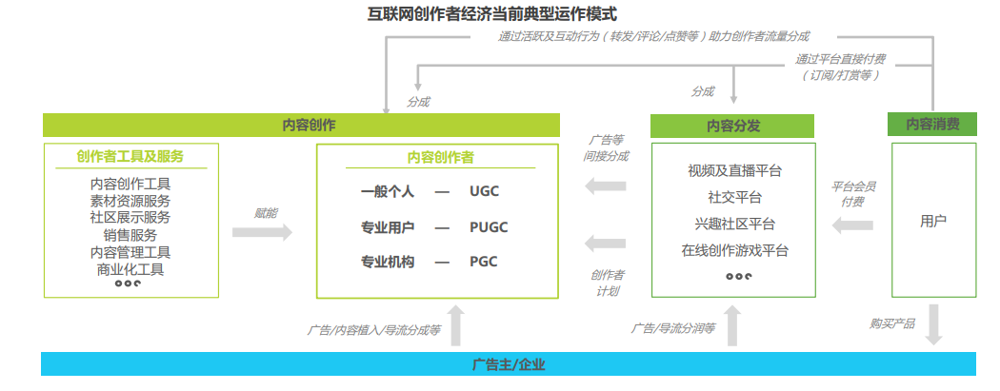
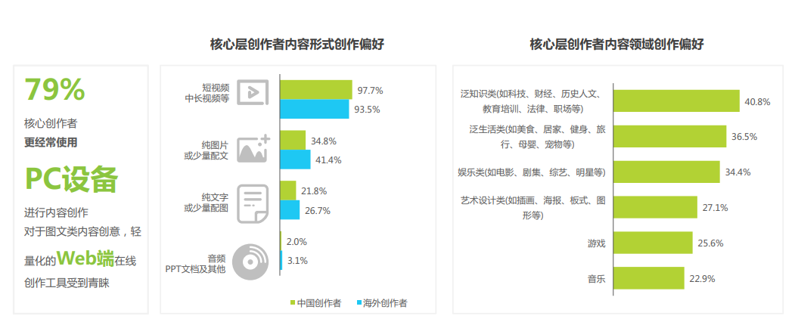
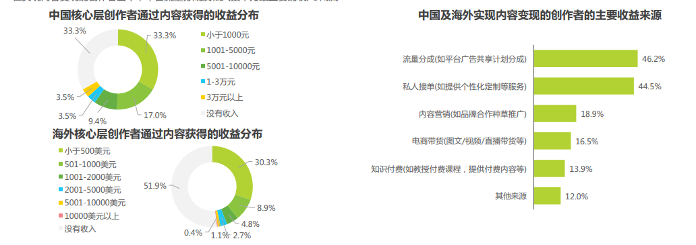
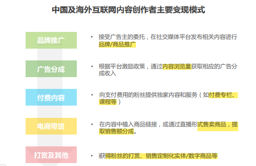
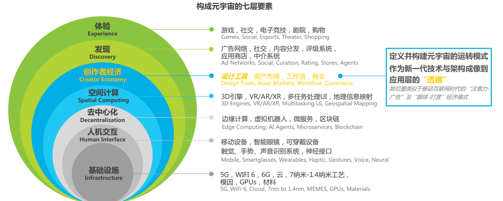

:::info
web1.0：内容传播具有单向性，以平台创造、平台所有为主要特征

web2.0：移动互联网崛起，拥有全民生产信息的权力

web3.0：去中心化，用户创造、用户所有、用户控制
:::

## [web1.0](https://zh.wikipedia.org/wiki/Web_1.0)

### 发展历程

最初的万维网为信息共享和交换而设计，这一时期，大多数网站为静
态HTML页面形态，由Web管理员托管和维护，数据则统一托管在集中式服务器上。

### 创作群体

专业工作者：通过专业训练的人群，例如视频剪辑，动画制作

个体兴趣用户：类似于一些 geeker

### 工具

pc

## [web2.0](https://zh.wikipedia.org/wiki/Web_2.0)

### 发展历程

Web 2.0这一概念由O’Reilly媒体的创始人Tom O’Reilly于2004年在第一届Web 2.0大会上带向大众视野，其定义并没有公认明确的边界，它阐释了新一
代互联网以用户为中心、允许用户创建内容并通过社交媒体交互和协作的发展特征。

### 创作群体

兴趣用户：爱好者、[k12](https://zh.wikipedia.org/wiki/K%E2%80%9312)、...

传播者（核心创作者）：学生、营销人员、知识工作者、商户、...

数字创意专家（核心创作者）

### 工具

pc：软件及网页工具

mobile：App、小程序、网页

### 一图胜千言

## [web3.0](https://zh.wikipedia.org/wiki/Web3)

> `区块链`、`NFT`、`元宇宙`、`web3d`

### 发展历程

Web3是关于万维网发展的一个概念，主要与基于区块链的`去中心化`、`加密货币`以及`非同质化代币`有关。与区块链有关的web3概念是由以太坊联合创始人Gavin Wood于2014年提出，并于2021年受到加密货币爱好者、大型科技公司和创业投资公司的关注。

### 痛点

探索契合创作者经济的[商业模式](https://blog.csdn.net/qq_32193015/article/details/126956577)与技术路径

寻求更为平等开放的合作模式（具体来说，Web3的支持者设想了一个互联网，在这个互联网中，用户可以从少数榨取用户性的中心化机构手中夺回权力，并且每个有互联网连接的人都可以在一个公平的竞争环境中参与。）

丰富面向一般个人创作者的内容生产工具，提升创作者经济的流动性与活跃度

### 创作群体

all in one：一个开放的虚拟宇宙，所有人都可以进行创作、确权以及传播。

### 一图胜千言

