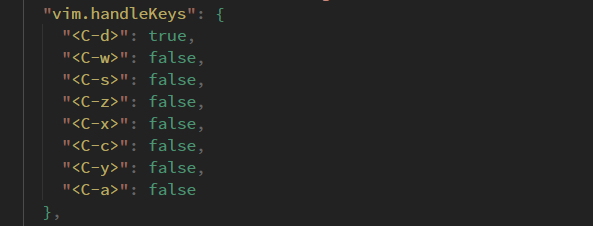
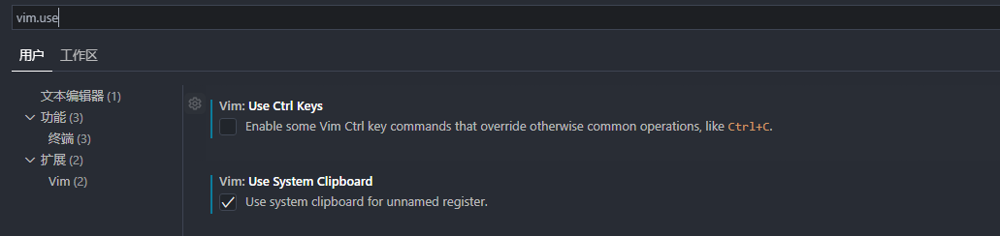
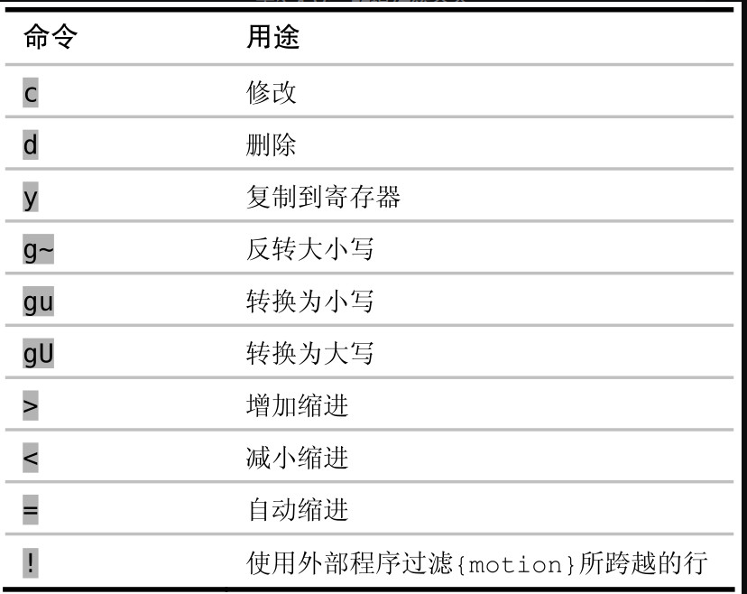

## vim开启前咱们先配置vscode

* 在vscode中集成[zsh](https://juejin.cn/post/7114672924245622821)
* 安装字体 [`Hasklug Nerd Font Mono`](https://juejin.cn/post/7119141141152268301) 并设置为vscode的editor默认字体（这一步其实是非必须的，取决于你是否想要自定义字体）
* 安装vscode插件：`vitesse theme、Carbon Product Icons、Fluent Icons、vim`
* 配置vim的normal模式与insert模式中英文切换 [im-select](https://www.zhihu.com/question/303850876)

## 入门操作

> 一篇不错的[知乎文章](https://zhuanlan.zhihu.com/p/430310347)

## 如何与vscode共存

1. 首先你需要关闭一些 vim 中的 `ctrl+key` 的快捷键映射关系，当然你不嫌麻烦可以将其所有的 `ctrl+key` 修改为自定义快捷键

2. 由于vim走的粘贴复制并不是系统的剪贴板，所以你还需要允许其共享系统剪贴板，`CTRL + ,` 然后输入 `vim.use` 再允许使用系统 `clipboard`

## 初识`.`操作

表示的含义就是 从进入插入模式的那一刻起（例如，输入 i），直到返回普通模式时为止（输入`<Esc>`），Vim会记录每一个按键操作。做出这样一个修改后再用 . 命令的话，它将会重新执行所有这些按键操作

`.范式`: 一键移动，另外一键执行，例如*查找当前单词，`n`则代表移动到下一个单词处，cw代表删除当前单词并进入插入模式，这次的所有操作直到按`esc`退出都会被记录，之后直接 敲击 `.`就可以进行上次插入模式的所有修改操作

## 模式

### 普通模式

什么叫做一次修改：普通模式、插入模式、可视模式以及命令行模式对文本内容进行的修改都叫做一次修改

控制撤销的粒度：一般的编辑器会将撤销控制在最后输入的一个字符或者是将字符控制为块，每次撤销删除一个单词（vscode就是这种）

`i {some text} Esc` 为一次修改，咱们如何控制粒度？当你觉得有必要退出插入模式时，那么这就是一次撤销的最小粒度（vscode中我觉得真没大的必要自己控制撤销以及redo，因为咱们自己通过 `C+z | C+y`就行了）

`daw`：delete a word，不管光标在单词的哪个字符下，然后可以按 `.` 重复删除一个单词

`cw`： 删除一个单词（光标在单词的开头），并进入插入模式

`c3w`：删除三个单词（光标在单词的开头），并进入插入模式（利用次数！！）

get 到一个点：`执行命令产生修改、.重复命令做出修改、u回退进行撤销`

使用次数风格`d5w`还是重复`dw.`风格？`d5w`撤销的颗粒度为5个单词，dw.撤销的颗粒度为一个单词！

`操作符 + 动作命令 = 操作`

常用的操作符命令

`guaw`：单词转换为小写
`guap`：段落的所有单词转换为小写
`gugu`： 当前行的单词转换为小写，等价于 `guu`

Vim的语法只有一条额外规则，即当一个操作符命令被连续调用两次时，它会作用于当前行

`dd`：删除当前行
`>>`：当前行缩进
`gugu = guu`：当前行的单词转换为小写
`yy`：复制当前行

### 插入模式

### 可视模式
