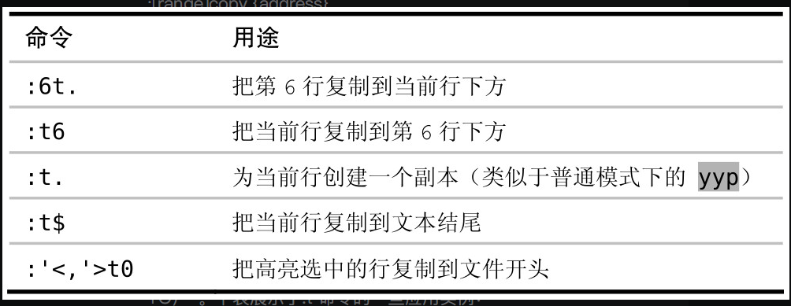

## vim开启前咱们先配置vscode

* 在vscode中集成[zsh](https://juejin.cn/post/7114672924245622821)
* 安装字体 [`Hasklug Nerd Font Mono`](https://juejin.cn/post/7119141141152268301) 并设置为vscode的editor默认字体（这一步其实是非必须的，取决于你是否想要自定义字体）
* 安装vscode插件：`vitesse theme、Carbon Product Icons、Fluent Icons、vim`
* 配置vim的normal模式与insert模式中英文切换 [im-select](https://www.zhihu.com/question/303850876)

## 入门操作

> 一篇不错的[知乎文章](https://zhuanlan.zhihu.com/p/430310347)

## 如何与vscode共存

1. 首先你需要关闭一些 vim 中的 `ctrl+key` 的快捷键映射关系，当然你不嫌麻烦可以将其所有的 `ctrl+key` 修改为自定义快捷键


2. 由于vim走的粘贴复制并不是系统的剪贴板，所以你还需要允许其共享系统剪贴板，`CTRL + ,` 然后输入 `vim.use` 再允许使用系统 `clipboard`


## 初识`.`操作

表示的含义就是 从进入插入模式的那一刻起（例如，输入 i），直到返回普通模式时为止（输入`<Esc>`），Vim会记录每一个按键操作。做出这样一个修改后再用 . 命令的话，它将会重新执行所有这些按键操作

`.范式`: 一键移动，另外一键执行，例如*查找当前单词，`n`则代表移动到下一个单词处，cw代表删除当前单词并进入插入模式，这次的所有操作直到按`esc`退出都会被记录，之后直接 敲击 `.`就可以进行上次插入模式的所有修改操作

## 模式

### 普通模式

什么叫做一次修改：普通模式、插入模式、可视模式以及命令行模式对文本内容进行的修改都叫做一次修改

控制撤销的粒度：一般的编辑器会将撤销控制在最后输入的一个字符或者是将字符控制为块，每次撤销删除一个单词（vscode就是这种）

`i {some text} Esc` 为一次修改，咱们如何控制粒度？当你觉得有必要退出插入模式时，那么这就是一次撤销的最小粒度（vscode中我觉得真没大的必要自己控制撤销以及redo，因为咱们自己通过 `C+z | C+y`就行了）

`daw`：delete a word，不管光标在单词的哪个字符下，然后可以按 `.` 重复删除一个单词

`cw`： 删除一个单词（光标在单词的开头），并进入插入模式

`c3w`：删除三个单词（光标在单词的开头），并进入插入模式（利用次数！！）

get 到一个点：`执行命令产生修改、.重复命令做出修改、u回退进行撤销`

使用次数风格`d5w`还是重复`dw.`风格？`d5w`撤销的颗粒度为5个单词，dw.撤销的颗粒度为一个单词！

`操作符 + 动作命令 = 操作`

常用的操作符命令


`guaw`：单词转换为小写
`guap`：段落的所有单词转换为小写
`gugu`： 当前行的单词转换为小写，等价于 `guu`

<span style="color: pink;">Vim的语法只有一条额外规则，即当一个操作符命令被连续调用两次时，它会作用于当前行</span>

`dd`：删除当前行

`>>`：当前行缩进

`gugu = guu`：当前行的单词转换为小写

`yy`：复制当前行

### 插入模式

在插入模式可以执行如下命令

`<C-h>`：删除前一个字符（同退格符）

`<C-w>`：删除前一个单词（<span style="color: pink;">咱们在vscode中设置为了删除标签页</span> ）

`<C-u>`：删除至行首

插入-普通模式`<C-o>`：处于插入模式，这时想要运行一个普通模式的命令，然后回到原来位置继续输入（这里有一个操作就是在当前行位于窗口顶部或底部时那么可以执行 `<C-o>zz`将当前行位于屏幕中间位置）

这里演示一个在插入模式中粘贴寄存器的操作

`yt,`: `y`表示复制操作，`t,`表示动作直到  `,` 字符

`jA `: 移动到下一行，再到行尾进入插入模式并空格一个

`<C-r>0`: 粘贴寄存器0中的文本内容

```txt
Practical Vim, by Drew NeilRead 

Read Drew Neil's
```

插入模式访问表达式寄存器`<C-r>=`

```txt
6 chairs, each costing $35, totals $
```

`<C-r>=6*35<CR>` 可以计算出来结果为210 <span style="color: pink;">在vscode中失效</span>

如何插入非常用字符（键盘找不到的字符）

`<C-v>{code}`: 如插入A（编码是65），`<C-v>065`（<span style="color: pink;">但是咱们在vscode设置为了粘贴操作）</span>

`<Esc>` 普通模式进入替换模式 `R`

### 可视模式

面向字符的可视模式（`v`）：适用于操作单词或短语

面向行的可视模式（`V`）：整行进行操作

面向列块的可视模式（`<C-v>`）：列块进行操作

重选上次的高亮选区（`gv`）

切换高亮选区的活动端（`o`）

向前回到单词的开头（`b`）

向后到单词的结尾（`e`）

向后到单词的开头（`w`）

<span style="color: pink;">可视模式可以配合`.`使用，进而对重复操作进行简化，但是操作的是在可视模式下选中的相同的字符数</span>

`it`（inside tag）：选中的是标签中的文本，当使用`gUit`作用于`<div>one</div>`会将one转换为大写

`x`：删除当前光标处字符（可视模式中则是删除选中处字符）
`r`：替换当前光标处字符（可视模式中则是替换选中区域为同一个字符）

`o`：下一行插入
`a`：当前光标所在字符后插入
`i`：当前光标所在字符前插入
`I`：当前所在行首插入
`A`：当前所在行尾插入

<span style="color: pink;">在可视模式及操作符待决模式中，i 和 a 键沿用一个不同的约定。它们会被当作一个文本对象的组成部分，所以此时按下可能不会有反应，可以考虑换用
A或I</span>

### 命令行模式

进入命令行模式方式：按下`:`

但使 Ex 命令（其实就是命令行模式可以输入的命令）脱颖而出的最让人赞叹的功能，是它们拥有能够在多行上同时执行的能力

#### 一行或则多个连续行上执行命令

`:number`: 移动到第number行

`:$`: 移动到最后一行

`:p`: 打印当前行的内容，等价于 `:print`

`:3p`: 打印第三行的内容

`:3d`: 删除第三行的内容，同时光标跳到对应位置

`.,$p`: 打印当前行`.`到最后一行`$`的内容（vscode中范围选择失效！）

`%p`: 打印所有行`%` 等价于 `:1,$p`

`%s/A/B`: 所有行中的A字符替换为B字符（每一行的第一个A字符），若全部替换需要增加`g`也就是`%s/A/B/g`

下面是一个很棒的例子（但是在vscode不支持😂）

```html
<html>
  adadasd
  asdasdas
  asdasdasdasd
</html>
```

`:/<html>/,/<\/html>/p`: 选中`<html>`以及`</html>`内部的所有内容并打印（包含`<html>`以及`</html>`）

`:/<html>/+1,/<\/html>/-1p`: 选中·`<html>`以及`</html>`内部的所有内容并打印（不包含`<html>`以及`</html>`）

<span style="color: pink;">定义范围的语法非常灵活，既可以混合搭配行号（数字）、位置标记（`.`代表当前行，`$`代表最后一行，`%`代表每一行）以及查找模式（正则匹配），也可以对它们加以偏移</span>

#### `:t`和`:m`命令复制和移动行

`:t`: 等价于`:copy`，可以把一行或多行从文档的一部分复制到另一部分

`:m`: 等价于`:move`，可以把一行或多行移到文档的其他地方

`:6t.`: 等价于 `:6copy.`，表示将第六行的文本复制到当前光标所在行的下方，通用的格式为 `:[range]copy{address}`

关于 `:t` 命令的一些应用实例



`:t.`: 表示复制当前行到当前行的下方，等价于 普通模式下的`yyp`

<span style="color: pink;">好的，`:move`命令在vscode中暂未支持</span>

#### 在指定范围上执行普通模式命令

`:2,5normal A;`: 为2到5行行尾添加分号

<span style="color: pink;">好的，vscode不支持</span>

在执行指定的普通模式命令之前，Vim 会先把光标移到该行的起始处

`:%normal i// `: 将注释整个文件

#### 重复上次的EX命令

emmm....没看懂的说😂

