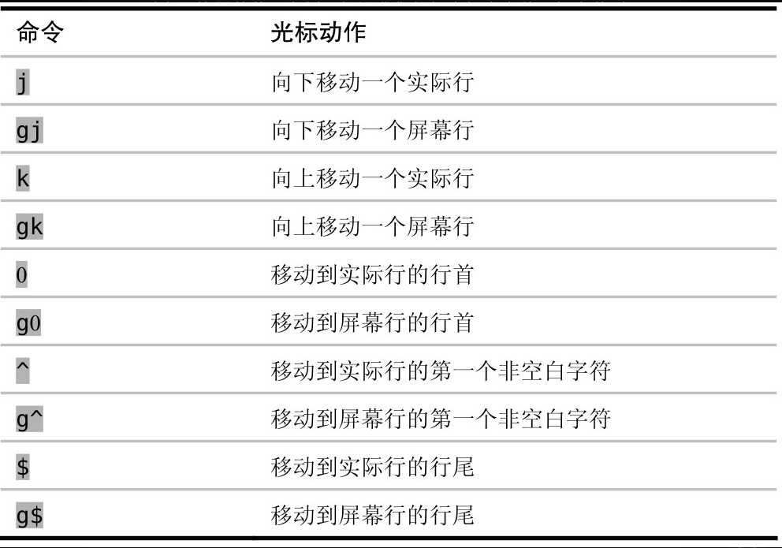
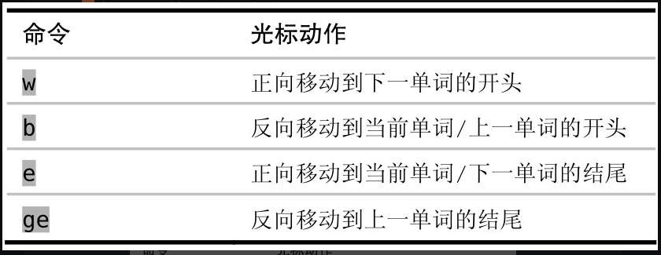
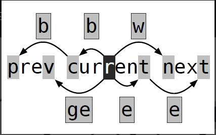
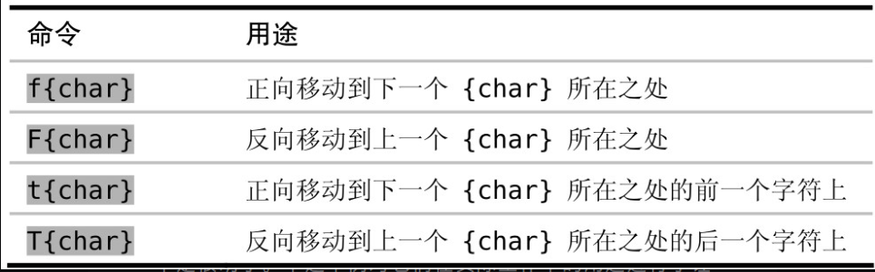
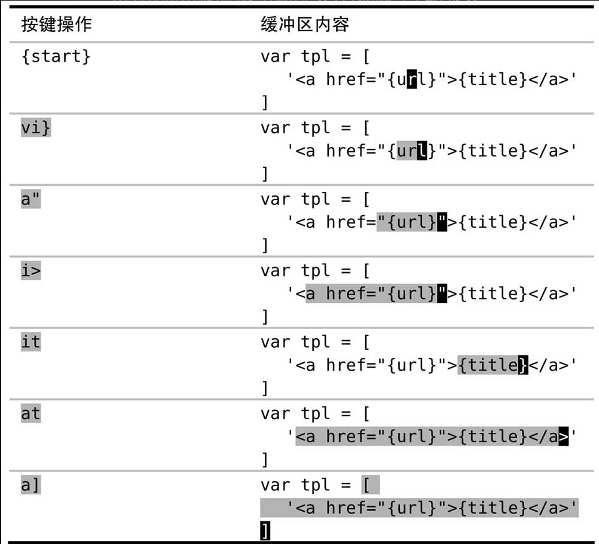
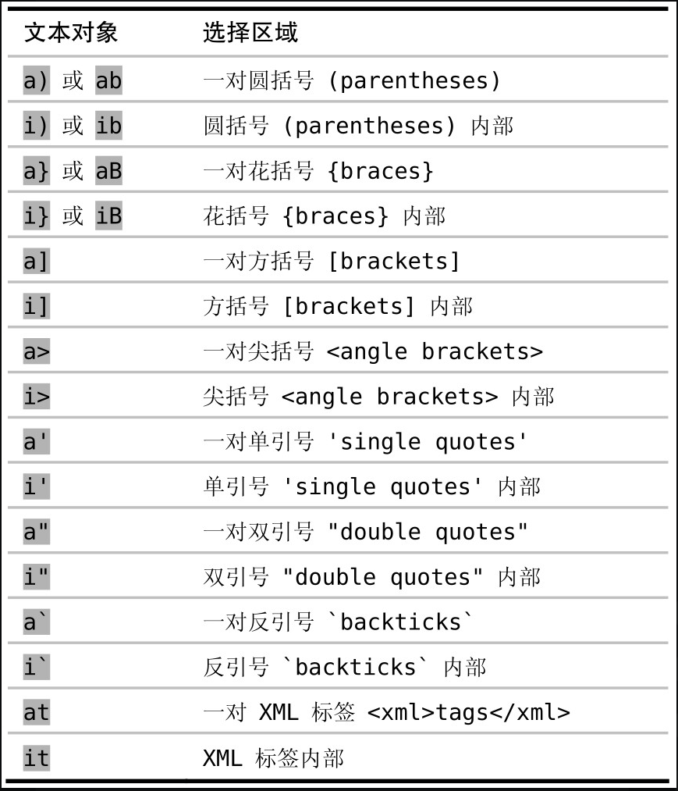
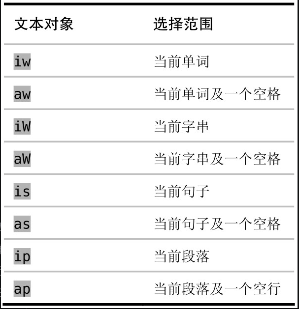
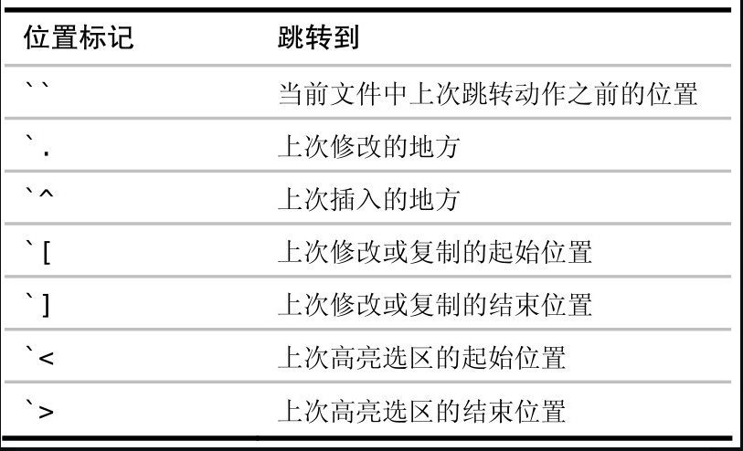

## 文件

缓冲区列表记录一次编辑会话中打开的所有文件

参数列表是缓冲区列表的强力补充，使用 `:args` 命令将缓冲区列表中的文件分组

### 管理多个文件

怎么说呢，在vscode中其实这一部分模拟的很差，所以建议就是自己可以在 win11系统使用其自带的安装子系统功能装一个 ubuntu 系统，然后体验原生的vim编辑功能

### 打开及保存文件

`:edit filePath`: 可以以新标签页的方式打开文件（filePath是相当于当前打开的文件的相对路径）<span style="color: pink;">咱们的vscode中，`<C-0>`移动到目录栏然后移动光标到指定位置通过`<C-alt-n>`新建文件，`<C-alt-c>`新建目录</span>

`:sp filePath`: 等宽的方式打开文件（新的窗口）

`:vsp filePath`: 等高的方式打开文件（新的窗口）

## <span style="color: pink;">更快的移动及跳转</span>

### 用动作命令在文档中移动

屏幕行与实际行，超过屏幕宽度的时候就会显示为多行（一般叫做屏幕行），然而实际行却为1



很简单，只需要理解 `j k 0 ^ $`命令即可，其余的都是在他们的基础上面操作屏幕行而已

#### 基于单词的移动





`ea`: 在当前单词结尾后insert
`gea`: 在上一单词结尾后添加insert

#### 基于字串和基于单词的移动

字串(W): `e.g.` `we're` `going` `too` `slow`

单词(w): `e` `.` `g` `.` `we` `'` `re` `going` `too` `slow`

```txt
e.g. we're going too slow
```

#### 对**当前行内的字符**进行查找



`f{char}`: 在光标位置与当前行行尾之间查找指定的字符，如果找到了，就会把光标移到此字符上；如果未找到，则保持光标不动

`;`: 找下一个

`,`: 回退到上一个

`fo;;,`: 寻找并跳到第三个字符o，之后再回退到第二个

为什么咱们需要`t T`命令? 请看如下示例

```txt
I've been expecting you, Mister Bond.
```

`f,`: 光标移动到字符逗号处

`dt.`: 删除到字符点前一个位置

<span style="color: pink;">普通模式使用 f F, 操作符待决模式时使用 t T（配合命令d{motion} c{motion}）</span>

#### 使用查找命令在文档内容中进行查找

`/vim<C-r>`: 文档中寻找vim并跳到第一个vim处，后续按 n正向跳，N反向跳

查找命令不仅仅局限于普通模式，也可以在可视模式中使用，以便于快速选中内容

学会将查找命令同 d{motion} 或 c{motion}结合在一起使用是很cool 的一件事！！

```txt
This phrase gets to the point.
```

`d/ge<CR>`: 删除到`gets`前
`c/ge<CR>`: 删除到gets前并进入插入模式

#### 用精确的文本对象选择选区

先进入v可视模式，之后可以通过按下 `a'` `a{` `a[` `at`选择所有的单引号内容（包括单引号），花括号内容，中括号内容以及整个标签（例如div标签，将a换成i意思就是 inside，也就是不包括！！





其实啊，操作符待决模式更能完美的与文本对象契合

```html
<a :href="url">{{title}}</a>
```

当光标在url上按下 `ci"#<Esc>`, url变为#，之后按下`citclick here`, `{{title}}` 变化为click here

#### 删除周边，修改内部

vim文本对象分为两类：

* 操作分隔符的文本对象，例如 `i} i" i' it`
* 操作文本块，如单词、句子和段落



一般说来，`d{motion}` 和 aw、as以及ap配合起来使用比较好，而`c{motion}`和iw及类似的文本对象一起用效果更好

#### 设置位置标记，以便快速跳回

使用`m{a-zA-Z}`进行标记，之后可以使用 `asd 进行跳转



#### 在匹配括号间跳转

% 命令允许我们在一组开、闭括号间跳转，它可作用于()、{}以及[]

看一个例子

```ruby
cities = %W{London Berlin New、 York}
          ⬇
cities = [London Berlin New\ York]
```

当光标位于 % 号时，先执行 `dt{`删除到光标位于{，执行 `%` 那么光标跳转到}，再执行 `r]`将当前光标所在字符替换为]，再敲击 `` 那么跳转到前一个{处，再执行 `r[`将其替换为[

vscode支持快捷键 `ctrl+shift+\` 括号间跳转，当然我建议你还是使用 % 进行括号跳转，因为可以配合 `d{motion}`以及 `c{motion}` 以及 `v%` 食用，即便不你不用vim，也可以使用一个vscode插件叫做 [`matchit`](https://github.com/redguardtoo/vscode-matchit) 进行选中，删除以及跳转

`vee`: 进入可视模式，同时选中到下个单词结尾！！

### 在文件间跳转
