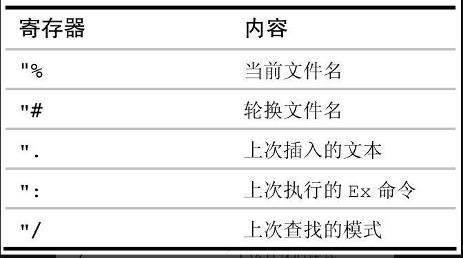

## 寄存器

### 复制与粘贴

#### 调换字符

`xp`: 调换字符，`x` 删除当前光标下的字符并存入无名寄存器，`p` 将无名寄存器中的字符粘贴到当前光标后

#### 调换文本行

`ddp`: 删除光标所在行并将内容存入无名寄存器，同时光标移动到下一行，再粘贴无名寄存器中内容到下一行

#### 创建文本行的副本

`yyp`: 复制光标所在当前行，并粘贴到光标下一行

练习：将somethingInTheWay替换为collection

```js
collection = getCollection()

process(somethingInTheWay, target)
```

* `vey`: 选中collection并复制到寄存器
* `jjww`: 到somethingInTheWay开头
* `vep`: 粘贴

#### 理解vim寄存器

`x` `s` `d{motion}` `c{motion}` `y{motion}` 命令都会覆盖无名寄存器中的内容

可以通过 `{register}` 的方式指定要操作内容到指定的寄存器，例如 `"_dd` 将光标所在当前行剪切到黑洞寄存器（删除了就无法恢复！！） `ayy` 将光标所在当前行复制到a寄存器（但是有一个问题啊，输入 a就直接进入插入模式了！！）

复制专用寄存器 `"0`，当咱们通过 `y{motion}` 进行的复制操作将会把内容存储到复制专用寄存器以及无名寄存器 `""` 中，当执行的 `d{motion}` 剪切的内容会覆盖无名寄存器 `""` 中的内容，不会影响 复制专用寄存器 `"0` 中内容

`"a - "z`: 一共26个有名寄存器可以让我们使用！！！

<span style="color: pink;">用小写字母引用有名寄存器，会覆盖该寄存器的原有内容，而换用大写字母的话，则会将新内容添加到该寄存器的原有内容之后</span> 

`"+` 以及 `"*` 虽然是两种概念，但是在 windows 以及 mac os系统中可以混用，两则都代表系统剪贴板，可以做到 vim 中的文本内容与其他应用内容进行双向的复制粘贴操作，对了咱们的vscode可以配置 vim use system clipboard，达到共享的效果

`"=` 表达式寄存器，当敲击会唤出命令行模式，然后输入表达式例如 `3*2` 然后回车后再 按 p 则会粘贴其中的数值 6 到光标后，但是 vscode 不支持啊！！

一些隐式赋值的寄存器。又被称为只读寄存器



对了，在命令行模式敲击 `:reg` 可以唤出所有的寄存器使用情况

#### 使用寄存器中的内容替换高亮选区的文本

其实就是咱们前面的操作，先可视模式选中内容，然后使用 p 将无名寄存器的内容粘贴到当前选中区域

<span style="color: pink;">使用 `p` 进行粘贴的时候默认拿取无名寄存器的内容，同时若此时你使用可视模式选中了高亮文本，那么高亮文本被无名寄存器中内容替换，同时高亮的文本内容会覆盖无名寄存器的内容！！</span>

下面是一个练习：交换两个词

```txt
I like fish and chips
```

`fc`: 查找到c字符处

`de`: 删除单词并存入无名寄存器，同时跳转到后面一个字符处

`mm`: 标记当前光标位置

`ww`: 正向跳转到第二个单词开头

`ve`: 可视模式选中到单词的结尾

`p`: 粘贴无名寄存器内容，并把选中内容覆盖无名寄存器中内容

<code>`m</code>: 跳转到标记 m 处

`P`: <span style="color: pink;">大写的p</span> 将会将无名寄存器内容粘贴到当前光标位置前！！

#### 把寄存器的内容粘贴出来

Vim也提供了（大写的）P命令用于将文本插入到光标之前

怎样才能知道 p 命令是把寄存器的文本粘贴到当前字符之后还是当前行之后呢？取决于这个指定的寄存器是怎样被赋值的。面向行的复制或者删除操作（例如：dd、yy或者dap），将创建面向行的寄存器；而面向字符的复制或者删除操作（例如：x、diw或者das），则创建面向字符的寄存器，由于p和P命令粘贴内容对光标的位置有依赖，所以，还有一种方式就是在插入模式 直接 `<C-r>{register}` 指定对应寄存器的内容粘贴到光标之前！！！

练习一个例子

```html
<table>
  
  <tr>
    <td>hello</td>
    <td>world</td>
  </tr>

</table>
```

`yap`: 复制一段文本，注意一段是按照空行进行分割的！！！所以一般复制后会多空行

`gP`: 当前光标所在位置上方粘贴无名寄存器内容，同时光标会移动到粘贴出来文本结尾而不是开头

对于字符的粘贴：建议使用`<C-r>{register}`

对于多行文本的粘贴：建议使用 `p` `P` `gp` `gP`

### 宏

为什么引入宏这一概念？

`.` 命令可以重复小的修改，但是对于大规模的修改还是得使用宏

使用宏将任意数目的按键操作录制到寄存器，后续咱们可以回放他

什么是串行方式回放以及并行方式回放

#### 宏的读取与执行

```js
foo = 1
bar = 'a'
foobar = foo + bar
```

`q{register}`: 开始录制宏，并将录制内容存入寄存器`register`

`qa`: 开启宏录制，并指明存储内容到寄存器a

`A;<Esc>`: 跳到当前行末尾并插入 `;`

`Ivar <Esc>`: 跳到当前行开头并插入 `var `

`q`: 结束宏录制

之后就可以使用命令 `j@a`执行寄存器中录制的命令了

#### 在连续的文本行上重复修改

原始文本

```txt
1) One
2) Two
3) Three
4) Four
5) Five
6) Six
7) Seven
8) Eleven
9) Nine
10) Ten
```

转换后文本

```txt
1. one
2. two
3. three
4. four
5. five
6. six
7. seven
8. eleven
9. nine
10. ten
```

使用命令如下

`qa`: 开启录制

`0f)`: 行首并寻找 `)`

`r.`: 替换 `)` 为 `.`

`w~`: 下个单词的开头字符，转换首字符大小写并光标移动到后面一个字符位

`j`: 光标下移

`q`: 结束宏录制

`9@a`: 宏执行9次

上述的执行是一种 <span style="color: pink;">串行方式</span> ，若哪一行出错，那么将会退出宏的执行，举个例子如下

```txt
1) One
2) Two
// break up
3) Three
4) Four
5) Five
6) Six
7) Seven
8) Eleven
9) Nine
10) Ten
```

当在以上文本执行 `10@a` 那么只会在 1、2行执行成功，第三行由于不满足修改条件，所以直接结束执行！！！于是乎引出下面的 <span style="color: pink;">并行方式</span>

`qa`: 开启录制

`0f)r.w~`: 当前行的修改操作

`q`: 结束录制

`jVG`: 可视模式选中下一行到结束行

`:`: 将会将高亮选区范围敲击在命令行模式中。后续在命令行模式执行 `'<,'>normal @a` 会为每一行单独执行宏（好的，`normal`在 vscode中未实现）。

#### 给宏追加命令

解决的问题就是录制最后忘记增加命令，可以使用这种方式追加，而不用重新录制

之前录制时，寄存器 `a` 小写，后续我们可以 `A` 进行录制，那么咱们就可以将命令追加到原本寄存器内容后。

例如咱们敲击了

`qa`

`0f)r.w~`

`q`

但是忘记增加 j ，那么咱们就可以用如下命令追加

`qA`

`j`

`q`

#### 一组文件中执行宏

这里可以借鉴一些命令，对于一组文件执行宏这个行为，本身其实比编码都还麻烦，首先你需要将共有操作抽象出来，同时录制为一个最小执行单元，后续在其余地方使用。我个人觉得在vscode中没必要使用这种操作！！！（当前文件缓冲区执行录制操作，之后使用 :edit! 放弃当前缓冲区文件的修改（还原）后续执行 `:argdo normal @a`为所有打开的缓冲区执行宏操作，这是并行的方式！！串行的实现就是追加 :next 命令到寄存器 a中，随后执行 22@a 就好了，遇到错误就直接停止）

`gg/class`: 跳转到匹配模式 为 `class` 的位置

`>G`: 当前光标直到最后一行都缩进一个tab

#### 迭代求值的方式给列表编号

* vim命令行定义变量 `:let i = 1`
* 插入模式 `<C-r>=` 调用表达式寄存器
* `:let i += 1` 进行计算

#### 编辑宏的内容

由于录制的宏是存放于寄存器中的，所以咱们可以<span style="color: pink;">使用命令 `:put a` 将a寄存器中的宏内容粘贴到 光标下一行</span> 普通的 `"ap` 将只会粘贴到当前行的光标之后！！后续将文本内容修改后再调用 `0"ay$` 将本行文本内容复制到 a 寄存器中，为什么不使用 `"add` 因为dd 命令会包含多余的换行符！！当然你也可以使用可视模式选中字符然后复制！！

对了还有一种更加 BT 的操作，直接命令行模式进行替换操作 `:let @a = substitude(@a, '\~', 'vU', 'g')`
